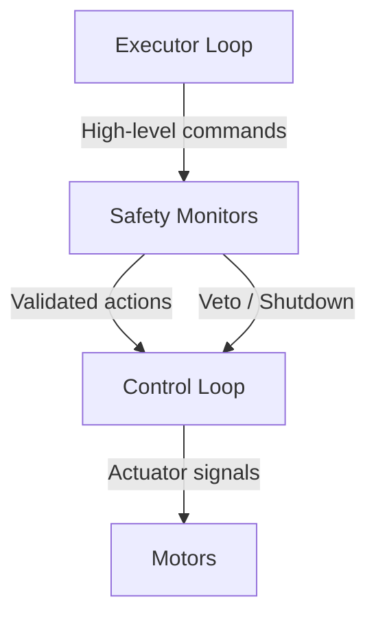
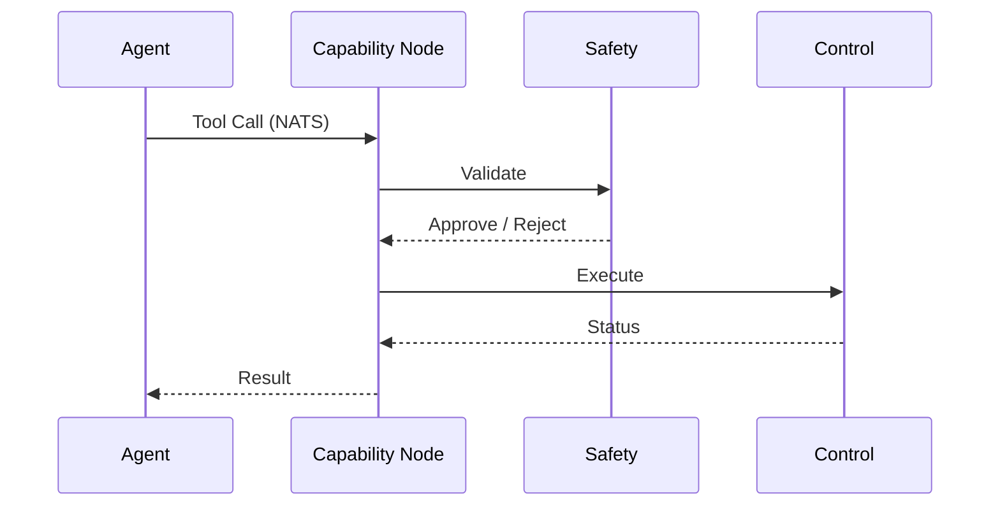
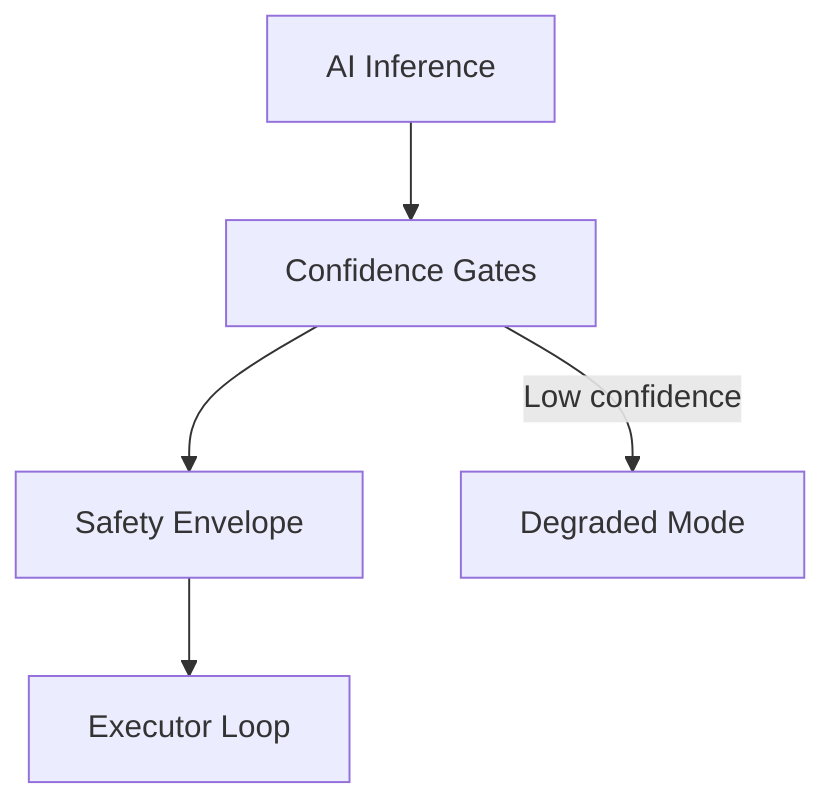
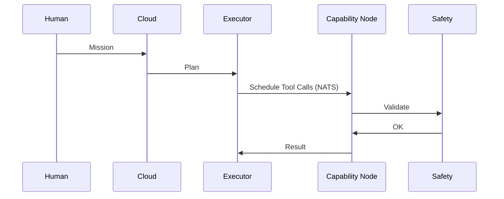
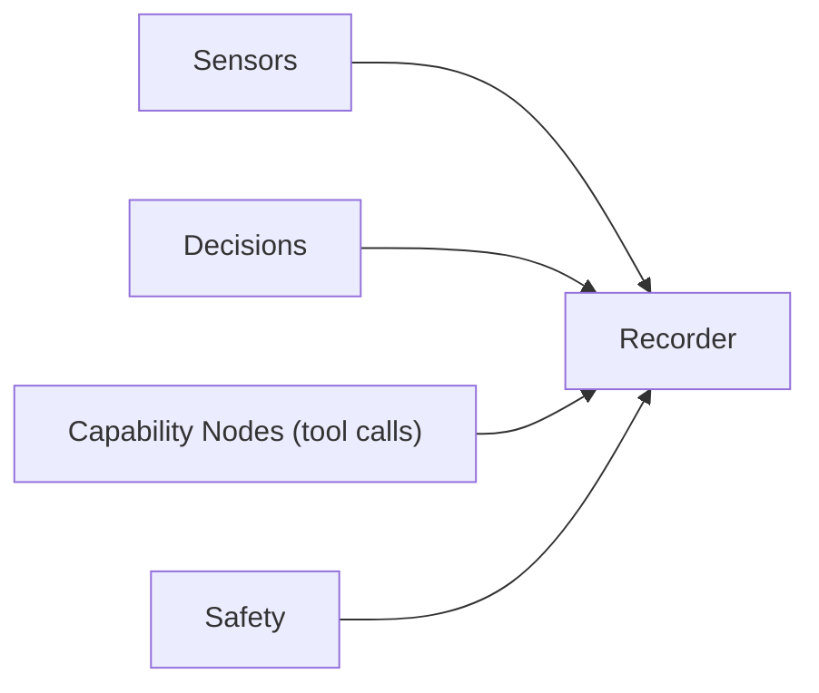

# AI-Driven Robot Safety & Governance Architecture

## 1. Overview

This document describes the **safety strategy, governance model, and execution architecture** for an AI-driven robotic system that supports:

* Cloud-based AI agents (when connectivity exists)
* Offline/onboard decision-making (Jetson-class compute)
* A unified **executor loop** that schedules robot actions as NCP tool calls over NATS — the MCP capability model delivered natively, with no MCP server in the path (see [VISION.md](../../../gorai/VISION.md))
* Hard real-time control loops that are strictly separated from AI-driven decision loops

The core design principle is **layered safety with explicit authority boundaries**: no AI system—cloud or local—ever directly controls actuators. All actions are mediated, gated, logged, and revocable.

---

## 2. Core Safety Philosophy

### 2.1 Separation of Concerns

| Layer              | Responsibility                       | Timing        | Safety Role               |
| ------------------ | ------------------------------------ | ------------- | ------------------------- |
| Control Loop (CL)  | Actuator control, PID, stabilization | Fixed, fast   | Immediate physical safety |
| Executor Loop (EL) | Decisions, task sequencing           | Variable      | Mission-level safety      |
| Safety Monitors    | Constraints, veto, shutdown          | Continuous    | Absolute authority        |
| AI Agents          | Planning & reasoning                 | Opportunistic | Advisory only             |

Key rule:

> **AI suggests. Safety enforces. Control executes.**

---

## 3. Safety Domains

### 3.1 Hardware Safety (Always Enforced)

* Physical emergency stop (hard power cut)
* Electrical shutdown paths
* Actuator limits (speed, torque, travel)
* Torque-controlled actuation support

These mechanisms do **not** depend on software correctness.

---

### 3.2 Software Safety

* Process watchdogs (hang detection, forced shutdown)
* Heartbeat monitors between subsystems
* Automatic fail-safe outputs on missed heartbeats

---

### 3.3 Runtime Safety Monitors (Always Present)

Runtime monitors operate independently of AI agents:

* Speed checks
* Geofencing
* Obstacle proximity checks
* Human presence detection
* Power and thermal limits

Violations result in:

* Command rejection
* Mode degradation
* Emergency stop (if required)

---

## 4. Control Loop vs Executor Loop

### 4.1 Control Loop (CL)

* Fixed-frequency
* Handles:

  * Motor control
  * PID loops
  * Emergency actuator shutdown
* Rejects any command violating safety config

### 4.2 Executor Loop (EL)

* Variable frequency
* Handles:

  * "Go here"
  * "Do this task"
  * "Stop all"
* Cannot issue low-level motor commands

Each loop enforces **different classes of safety**.

---

## 5. Capability-Based Action Governance

> This governance model is realized through NCP (see [VISION.md](../../../gorai/VISION.md)), not a hosted MCP server. The capability model survives; the MCP server does not. Each capability node speaks NATS directly, and safety is enforced *at the node that touches hardware* — never at the agent, and not at a single bridge that could bottleneck or fail.

### 5.1 Capability-Node Role

Each capability node on the mesh:

* Exposes **actions as tools** (`…<name>.command`)
* Exposes **state and resources as data** (`…<name>.state` / `…<name>.data`)
* Enforces, in the node handler itself:

  * Parameter bounds
  * Rate limits
  * Authority leases
  * Command TTLs

No agent (cloud or local) bypasses the node's enforcement — every tool call arrives as a typed NATS message that the node validates before acting.

---

### 5.2 Conditional Command Execution

All commands are:

1. Checked against safety configuration
2. Evaluated by runtime monitors
3. Logged
4. Executed only if tagged **safe**

---

## 6. AI / ML Governance

### 6.1 Known AI Failure Modes

* Non-determinism
* False confidence
* Sensitivity to lighting/clutter
* Hallucinated certainty

### 6.2 Mitigations

* Confidence gates on perception outputs
* Safety envelope above AI decisions
* Mandatory decision logging
* Deterministic fallback behaviors

---

## 7. Executor Loop Modes

### 7.1 Online (Cloud Agent)

* Large LLM
* Full mission context
* Produces tool-call schedules
* Executor Scheduler runs locally

### 7.2 Offline (Onboard / Jetson)

* Deterministic planners (FSM / behavior trees)
* Smaller LLMs (optional)
* Reduced context window
* Same scheduler, same NCP tools (NATS tool calls)

### 7.3 Hybrid

* Cloud handles long-horizon planning
* Jetson handles safety analysis & short-horizon decisions

---

## 8. Human-in-the-Loop (HITL)

Supported at multiple levels:

* Startup authorization
* High-risk action approval
* On-the-fly mode changes

Humans never directly control actuators—only **authority and intent**.

**Note**: Gorai supports a 'human-drive-only' mode that can be switched into on the fly, which completely bypasses all autonomous controls and allows for human control over actuators directly. 

---

## 9. Auditability & Flight Recorder

### 9.1 Logging Requirements

* Append-only logs
* All decisions traceable
* Hazard → Mitigation → Verification → Deploy chain

### 9.2 Flight Recorder

* Rolling buffer of last N minutes
* Sensor data
* Decisions
* Tool calls
* Safety events

---

## 10. Cybersecurity

* Secure comms
* Token-based authentication
* Verified senders
* Authority leasing

No command is trusted without identity.

---

## 11. Summary

This architecture ensures:

* AI is powerful but never authoritative
* Safety is layered, explicit, and enforceable
* Cloud and offline modes share the same execution contract
* Every action is auditable, bounded, and revocable

**The executor loop is the invariant.**
The AI is a replaceable advisor.
