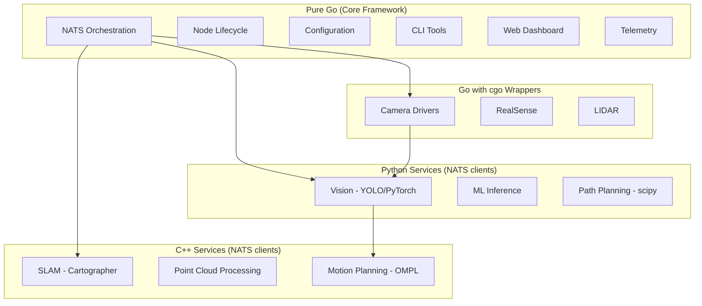

# GoRAI Vision Analysis: Technology Architecture and Market Strategy

**Date:** 2024-12-24
**Status:** Strategic Technology Assessment
**Scope:** Pure Go vs. Hybrid Architecture, ROS2 Positioning, Containerization Strategy

---

## Executive Summary

After deep analysis of the product strategy, technical architecture, and competitive landscape, the recommendation is:

**Strategic Direction: Pragmatic Hybrid, Not Pure Purism**

- **Core thesis remains valid**: Go-based robotics framework targeting prosumer market is viable and differentiated
- **Pure Go approach has merit BUT**: Rigid dogmatism will slow development and alienate ecosystem
- **ROS2 bridge is essential**: Not for core users, but for ecosystem compatibility and component reuse
- **Selective containerization recommended**: K3s for complex deployments, native for simple robots
- **Cloud-distributed patterns vs. ROS2**: GoRAI already incorporates superior patterns; this is a key differentiator

---

## Question 1: Is Pure Go Silly?

### TL;DR: No, But Don't Be Dogmatic

**Pure Go for core framework: Absolutely correct.**

The reasoning in your materials is sound:
- Native concurrency (goroutines) maps perfectly to robotics
- Single binary deployment eliminates dependency hell
- AI-assisted development dramatically better with Go than C++
- Cross-compilation trivial (`GOOS=linux GOARCH=arm64 go build`)
- Type safety without C++ complexity

**But pragmatic hybrid for ecosystem integration: Also correct.**

### Where Pure Go Makes Sense

| Component | Why Go | Alternative Cost |
|-----------|--------|------------------|
| NATS messaging layer | Go native, proven at scale | Rewriting NATS in C++: insane |
| Node lifecycle | Concurrency model fits | C++ threading: complexity explosion |
| Web dashboard | Go excels (stdlib http, templates) | Node.js: extra runtime dependency |
| Configuration system | JSON/YAML native support | C++ YAML libraries: painful |
| Telemetry/logging | Prometheus native client | Reimplementing metrics: wasted effort |
| CLI tooling | Cobra, Viper ecosystems mature | C++ CLI: reinventing wheels |

### Where Hybrid Makes Sense

| Use Case | Language | Justification |
|----------|----------|---------------|
| **Computer vision pipelines** | Python + Go orchestration | OpenCV, PyTorch, YOLO ecosystems too valuable to rewrite |
| **RealSense cameras** | C++ wrapper + Go interface | `librealsense2` is C++; Go wrapper via cgo acceptable |
| **Existing SLAM libraries** | C++ (Cartographer, ORB-SLAM) + Go bridge | Years of research; reimplementing in Go: years wasted |
| **Motor controllers with existing SDKs** | C/C++ library + Go wrapper | Dynamixel SDK, ODrive, etc. already work |
| **Heavy ML inference** | ONNX Runtime (C++) + Go | Proven inference engine, no need to rewrite |

### The Winning Formula

```
┌─────────────────────────────────────────┐
│   GoRAI Core (Pure Go)                  │
│   • NATS messaging                      │
│   • Node lifecycle                      │
│   • Configuration                       │
│   • Web UI                              │
│   • Orchestration                       │
└─────────────────┬───────────────────────┘
                  │
       ┌──────────┼──────────┐
       │                     │
┌──────▼─────┐        ┌──────▼──────────┐
│ Pure Go    │        │ Thin Wrappers   │
│ Components │        │ (cgo when needed│
│            │        │                 │
│ • GPIO     │        │ • Vision (Py)   │
│ • I2C      │        │ • SLAM (C++)    │
│ • IMU      │        │ • RealSense (C++)
│ • GPS      │        │ • TPU (C)       │
└────────────┘        └─────────────────┘
```

**Principle**: Go orchestrates; specialists execute. Don't rewrite OpenCV. Wrap it cleanly.

---

## Question 2: Is Inventing a New Framework Silly When ROS2 Exists?

### TL;DR: No — But Only If You Target The Right Market

### Why ROS2 Won't Work for Prosumer Market

Your analysis is **completely correct** for your target market:

| Problem | ROS2 Reality | Impact on Prosumers |
|---------|--------------|---------------------|
| **Learning curve** | CMake, colcon, ament, workspace overlays, launch files | Weeks to "Hello World"; months to productivity |
| **AI-hostile** | C++ templates confuse LLMs; debugging cryptic errors | Modern developers expect AI assist |
| **Deployment complexity** | Source workspaces, ROS_DOMAIN_ID, DDS configuration | "Works on my machine" hell |
| **Overkill architecture** | Designed for Boston Dynamics-scale problems | Citizen scientist monitoring lake doesn't need this |
| **Community intimidation** | Assumed expert knowledge in forums | Beginners abandoned |

### Where GoRAI Wins vs. ROS2

**1. Time to First Running Code**

```bash
# ROS2
sudo apt install ros-humble-desktop
source /opt/ros/humble/setup.bash
mkdir -p ~/ros2_ws/src && cd ~/ros2_ws/src
ros2 pkg create --build-type ament_cmake my_robot
# ... edit CMakeLists.txt, package.xml, write C++ ...
cd ~/ros2_ws
colcon build --symlink-install
source install/setup.bash
ros2 run my_robot my_node

# GoRAI (proposed)
go install github.com/gorai/gorai/cmd/gorai@latest
gorai new my_robot
cd my_robot && go run .
```

Winner: **GoRAI by ~2 hours**

**2. Concurrency Model**

```cpp
// ROS2 - Complex threading
#include <rclcpp/rclcpp.hpp>
#include <std_msgs/msg/string.hpp>
#include <mutex>

class MyNode : public rclcpp::Node {
  std::mutex data_mutex_;
  std::shared_ptr<Data> shared_data_;
  // Now worry about: race conditions, deadlocks, TSAN errors...
};
```

```go
// GoRAI - Native concurrency
func (n *Node) Run(ctx context.Context) {
    go n.pollGPS(ctx)      // Concurrent, safe
    go n.pollCompass(ctx)  // No mutexes needed
    go n.processCamera(ctx)

    for {
        select {
        case gps := <-n.gpsChan:
            n.updatePosition(gps)
        case heading := <-n.compassChan:
            n.updateHeading(heading)
        }
    }
}
```

Winner: **GoRAI — dramatically simpler**

**3. Deployment**

| Aspect | ROS2 | GoRAI |
|--------|------|-------|
| Binary size | Workspace with hundreds of MBs | Single 10-20MB binary |
| Dependencies | `rosdep install`, apt packages | None (static linking) |
| Configuration | Environment sourcing required | Config file, env vars optional |
| Updates | `apt upgrade`, rebuild workspace | Replace binary |

Winner: **GoRAI**

### But Don't Dismiss ROS2 Entirely

ROS2 has **real strengths** you shouldn't ignore:

**Strengths you should learn from:**
- **Message types**: Standardized (geometry_msgs, sensor_msgs, nav_msgs)
- **TF2 (transforms)**: Coordinate frame management is hard; they solved it
- **Navigation stack**: Years of path planning research
- **SLAM ecosystem**: Cartographer, SLAM Toolbox, ORB-SLAM3 integrations
- **Simulation**: Gazebo integration battle-tested
- **Perception**: Mature camera drivers, point cloud processing

**What GoRAI should do:**

1. **Steal the good ideas**
   - Use similar message type naming (`geometry.Twist`, `sensor.IMU`)
   - Implement transform tree (TF equivalent)
   - Adopt proven navigation concepts

2. **Provide ROS2 bridge**
   - Let ROS2 nodes publish to NATS
   - Let GoRAI nodes consume ROS2 topics
   - Reuse ROS2 drivers when no Go alternative exists

3. **Target different users**
   - GoRAI: Prosumers, makers, students, small orgs
   - ROS2: Research labs, enterprise, PhD students
   - Overlap is minimal; cooperation possible

### Is It Silly to Build GoRAI?

**No, if you:**
- ✅ Target prosumer market (not enterprise/research)
- ✅ Prioritize developer experience over feature completeness
- ✅ Provide escape hatches (ROS2 bridge, Python/C++ wrappers)
- ✅ Don't try to replace ROS2 for autonomous vehicles, warehouse robots, etc.

**Yes, if you:**
- ❌ Try to compete with ROS2 in research/enterprise
- ❌ Refuse to learn from ROS2's decades of experience
- ❌ Claim superiority in all use cases
- ❌ Build walled garden with no interop

---

## Question 3: GoRAI vs. ROS2 — Cloud-Distributed Systems Lens

### TL;DR: GoRAI Architecture Already Borrows Cloud Patterns; This Is A Strength

### ROS2 Architecture (Traditional Robotics Middleware)

```
┌────────────────────────────────────────┐
│         DDS (OMG Data Distribution)    │
│                                        │
│  Problem: Enterprise middleware from   │
│  2004, designed for financial trading  │
│  systems, telecoms — NOT cloud native  │
│                                        │
│  • Complex QoS tuning                  │
│  • Heavyweight discovery protocol      │
│  • Poor multi-robot networking         │
│  • No native Kubernetes integration    │
└────────────────────────────────────────┘
```

**ROS2's DDS is fundamentally pre-cloud architecture.**

Designed for:
- Single-subnet local networks
- Known participant lists
- Static infrastructure

**Struggles with:**
- Multi-robot systems across networks
- Dynamic scaling
- Cloud-edge hybrid deployments
- Container-native workflows

### GoRAI Architecture (Cloud-Native Patterns)

```
┌────────────────────────────────────────┐
│              NATS.io                   │
│                                        │
│  • Pub/Sub (NATS Core)                 │
│  • Request/Reply (services)            │
│  • JetStream (persistence, replay)     │
│  • KV Store (config, state)            │
│  • Object Store (large blobs)          │
│                                        │
│  Powers: Coinbase, MasterCard,         │
│  Ericsson, Siemens — proven at scale   │
└────────────────────────────────────────┘
```

**NATS is battle-tested cloud infrastructure** (written in Go).

| Pattern | ROS2 DDS | GoRAI NATS | Winner |
|---------|----------|------------|--------|
| **Discovery** | DDS RTPS (multicast, heavyweight) | NATS (cluster URLs, DNS) | NATS — simpler, firewall-friendly |
| **Multi-robot** | ROS_DOMAIN_ID hacks | NATS subject namespacing | NATS — designed for multi-tenant |
| **Persistence** | None (must add database) | JetStream built-in | NATS — replay sensor streams |
| **Edge-cloud** | Not designed for this | NATS leaf nodes, superclusters | NATS — cloud-native |
| **Monitoring** | ros2topic, custom tools | Prometheus /metrics endpoints | NATS — industry standard |
| **Security** | DDS Security (complex) | NATS auth, TLS, JWT | NATS — simpler |

### Cloud Patterns GoRAI Already Uses

#### 1. Message Brokers (Kafka/RabbitMQ equivalent)

**ROS2**: Direct peer-to-peer DDS (no broker)
**GoRAI**: NATS server as message broker

**Advantage**:
- Decouples publishers from subscribers
- One sensor can publish to unknown number of consumers
- Easy to add logging/monitoring by subscribing

#### 2. Service Mesh (Istio/Linkerd equivalent)

**ROS2**: ROS2 services (request/reply) via DDS
**GoRAI**: NATS request/reply with automatic failover

**Advantage**:
- NATS queue groups = automatic load balancing
- Multiple vision service instances? NATS routes requests automatically
- No manual service discovery

#### 3. Event Sourcing (CQRS pattern)

**ROS2**: rosbag records messages; no native replay
**GoRAI**: JetStream persists streams, supports replay

**Advantage**:
- Replay sensor streams for testing
- Audit trail of robot actions
- Time-travel debugging

#### 4. Configuration Management (etcd/Consul equivalent)

**ROS2**: ROS2 parameters (per-node, not global)
**GoRAI**: NATS KV store

**Advantage**:
- Global configuration visible to all nodes
- Hot reconfiguration without restart
- Version history of config changes

#### 5. Observability (Prometheus/OpenTelemetry)

**ROS2**: Custom diagnostics system
**GoRAI**: Native Prometheus `/metrics` endpoints

**Advantage**:
- Integrates with Grafana, alerting
- No custom dashboards needed
- Industry-standard tooling

### Why This Matters

**ROS2 users struggle with problems that cloud engineers solved years ago:**

| Robotics Problem | Cloud Solution | GoRAI Approach |
|------------------|----------------|----------------|
| "How do I monitor robot fleet?" | Prometheus + Grafana | Built-in metrics |
| "How do I replay sensor data?" | Kafka/event sourcing | JetStream |
| "How do I do multi-robot?" | Kubernetes namespaces | NATS subjects |
| "How do I secure robot comms?" | TLS, JWT, mTLS | NATS security |
| "How do I handle network splits?" | Resilient message queues | NATS reconnect logic |

**GoRAI's advantage: Modern distributed systems thinking from day one.**

---

## Question 4: Hybrid Approach — Some Services in Go, Some in C++/Python?

### TL;DR: Yes — Pragmatic Language Choices Per Component

### Recommended Language Allocation



### Language Decision Matrix

| Component Type | Language | Rationale |
|----------------|----------|-----------|
| **Framework core** | Pure Go | Concurrency, deployment, maintainability |
| **Simple sensors** | Pure Go | GPS, IMU, magnetometer — protocol parsing in Go |
| **GPIO/I2C/SPI** | Pure Go | `periph.io` library mature |
| **Vision preprocessing** | Python | OpenCV, scikit-image ecosystem |
| **ML inference** | Python or ONNX Runtime (C++) | PyTorch/TensorFlow for training; ONNX for deployment |
| **SLAM** | C++ with Go wrapper | Cartographer, ORB-SLAM3 too valuable to rewrite |
| **Camera drivers** | cgo wrappers | V4L2, RealSense SDKs in C/C++ |
| **Motor controllers** | Go or cgo | If SDK exists (Dynamixel), wrap it; else pure Go |
| **Web UI** | Go templates + HTMX | Avoid separate JS frontend complexity |

### Implementation Pattern: Language-Agnostic Services

**Key insight**: NATS has clients for 40+ languages. Any language can be a GoRAI service.

#### Example: Vision Service in Python

```python
# vision_service.py - Runs as separate process
import nats
from ultralytics import YOLO

async def main():
    nc = await nats.connect("nats://localhost:4222")
    model = YOLO('yolov8n.pt')

    async def detect(msg):
        # Decode image from NATS message
        image = decode_image(msg.data)
        results = model(image)

        # Publish detections back to NATS
        await nc.publish("vision.detections", encode(results))

    await nc.subscribe("sensor.camera.image", cb=detect)

if __name__ == "__main__":
    asyncio.run(main())
```

**Benefits:**
- Full Python ML ecosystem
- Runs in separate process (crashes don't kill robot)
- Go core doesn't care it's Python
- Easy to swap Python for C++ later

#### Example: SLAM Service in C++

```cpp
// slam_service.cpp
#include <nats/nats.h>
#include <cartographer/mapping/map_builder.h>

int main() {
    natsConnection *conn;
    natsConnection_ConnectTo(&conn, "nats://localhost:4222");

    MapBuilder map_builder;

    // Subscribe to sensor data
    natsConnection_Subscribe(conn, "sensor.lidar.scan",
        [](void* closure, natsMsg* msg) {
            // Process LIDAR scan with Cartographer
            // Publish updated map to NATS
        }, nullptr);

    natsConnection_ProcessMessages(conn);
}
```

### When to Use Each Language

#### Pure Go

**When:**
- You're building orchestration/coordination
- Performance is "good enough" (most robotics isn't hard realtime)
- You want simple deployment
- Component is core to framework

**Example components:**
- Navigation waypoint manager
- Mission planner
- Behavior trees
- Logging aggregator

#### Python via NATS

**When:**
- Rich ecosystem exists (vision, ML, path planning)
- Rapid prototyping needed
- CPU cost acceptable (vision runs at 10-30 FPS, not 1000 Hz)
- Easy to replace with optimized version later

**Example components:**
- YOLO object detection
- Image preprocessing
- Kalman filter sensor fusion
- Path planning (RRT*, A*)

#### C++ via NATS or cgo

**When:**
- Existing library too valuable to rewrite (SLAM, point clouds)
- Performance critical (real-time control loops)
- Hardware SDK only available in C/C++ (camera drivers)

**Example components:**
- Cartographer SLAM
- RealSense camera driver
- Motor PID controllers (if <1ms latency needed)

#### TinyGo for Microcontrollers

**When:**
- Ultra-low-power needed
- Hard real-time (motor commutation)
- Hardware can't run Linux

**Example components:**
- Brushless motor ESC
- Servo PID loops
- Safety cutoff circuits

---

## Question 5: Should We Consider a ROS2 Bridge?

### TL;DR: Yes — Essential for Ecosystem Compatibility, Not Core Users

### Why ROS2 Bridge Is Important

#### 1. Component Reuse

**Problem without bridge:**
- Oak-D camera has ROS2 driver (depthai-ros)
- No GoRAI driver exists
- Choice: Write driver from scratch OR use ROS2

**Solution with bridge:**
```bash
# Run ROS2 camera driver
ros2 run depthai_ros rgbd_node

# GoRAI bridge subscribes to ROS2 topics, republishes to NATS
gorai-ros2-bridge --ros-topic /camera/depth --nats-subject sensor.camera.depth
```

Now GoRAI nodes consume depth data without rewriting driver.

#### 2. Simulation (Gazebo)

Gazebo is **the** robotics simulator. It has deep ROS2 integration.

**Without bridge**: Must build custom Gazebo-NATS integration
**With bridge**: Gazebo publishes sensor data to ROS2 → bridge → NATS → GoRAI nodes

This lets users test GoRAI code in simulation before deploying to hardware.

#### 3. Migration Path

Students who learned ROS2 in university can:
1. Keep using ROS2 packages they know
2. Gradually adopt GoRAI for new components
3. Run hybrid systems

**Example:**
- ROS2 Cartographer SLAM (mature, battle-tested)
- GoRAI navigation planner (cleaner Go code)
- Bridge connects them

#### 4. Ecosystem Perception

**Without bridge:** "GoRAI is incompatible with everything; I'm locked in"
**With bridge:** "GoRAI plays nice with ROS2; I can use both"

Even if few users need it, **perception of vendor lock-in hurts adoption**.

### Bridge Architecture

```
┌──────────────────────┐         ┌──────────────────────┐
│   ROS2 Ecosystem     │         │   GoRAI Ecosystem    │
│                      │         │                      │
│  ┌────────────────┐  │         │  ┌────────────────┐  │
│  │ ROS2 Camera    │  │         │  │ GoRAI Vision   │  │
│  │ Driver         │  │         │  │ Service        │  │
│  └───────┬────────┘  │         │  └────────▲───────┘  │
│          │           │         │           │          │
│      /camera/image   │         │  sensor.camera.image │
│          │           │         │           │          │
│  ┌───────▼────────┐  │         │  ┌────────┴───────┐  │
│  │ ROS2 DDS       │◄─┼────┼────┼─►│ NATS           │  │
│  │                │  │    │    │  │                │  │
│  └────────────────┘  │    │    │  └────────────────┘  │
└──────────────────────┘    │    └──────────────────────┘
                            │
                    ┌───────▼────────┐
                    │  gorai-ros2    │
                    │  -bridge       │
                    │                │
                    │  Translates:   │
                    │  • ROS2→NATS   │
                    │  • NATS→ROS2   │
                    │  • Transform   │
                    │    frames      │
                    └────────────────┘
```

### Bridge Implementation

**Phase 1: One-Way (ROS2 → NATS)**

```go
// Minimal viable bridge
package main

import (
    "github.com/gorai/gorai/pkg/nats"
    "github.com/tiiuae/rclgo/pkg/rclgo"
)

func main() {
    // Connect to NATS
    nc := nats.Connect("nats://localhost:4222")

    // Connect to ROS2
    ctx := rclgo.NewContext()
    node := ctx.NewNode("gorai_bridge")

    // Subscribe to ROS2 topic
    sub := node.NewSubscription("/camera/image", func(msg sensor_msgs.Image) {
        // Convert ROS2 message to Protobuf
        pbMsg := convertImageMsg(msg)

        // Publish to NATS
        nc.Publish("sensor.camera.image", pbMsg)
    })

    rclgo.Spin(ctx)
}
```

**Phase 2: Bidirectional**

Add NATS → ROS2 direction for:
- Publishing GoRAI motor commands to ROS2 simulation
- Integrating GoRAI vision with ROS2 navigation

**Phase 3: Transform Frames**

Translate between ROS2 TF2 and GoRAI transform tree.

### Effort Estimate

| Phase | Complexity | Time Estimate |
|-------|------------|---------------|
| ROS2 → NATS (image, laser scan, IMU) | Low | 2-3 weeks |
| NATS → ROS2 (cmd_vel, goals) | Low | 1-2 weeks |
| Transform frame bridge | Medium | 3-4 weeks |
| Full message type coverage | High | Ongoing (as needed) |

**Total MVP: ~6-8 weeks** for 80% of use cases.

### When to Build It

**Not immediately.** Build bridge when:

1. ✅ GoRAI core is stable
2. ✅ 2-3 robots working end-to-end in GoRAI
3. ✅ Users start asking "Can I use ROS2 package X?"
4. ✅ Simulation integration becomes priority

**Priority order:**
1. **Phase 1**: GoRAI core, basic sensors/actuators (months 1-6)
2. **Phase 2**: First robot (an autonomous surface vessel) working end-to-end (months 6-12)
3. **Phase 3**: ROS2 bridge MVP (months 12-18)

---

## Question 6: Should Everything Be in Containers (K3s)?

### TL;DR: Selectively — Containers for Complex Deployments, Native for Simple Robots

### The Container Spectrum

```
Simple Robot              Medium Robot            Complex Robot
──────────────           ──────────────          ──────────────
Native binaries          Podman pods             K3s cluster

• Surface vessel         • Multi-sensor          • Robot swarm
• Wheeled robot            research platform     • Edge-cloud ML
• Single SBC             • Vision + SLAM +       • Multi-robot
• <10 processes            navigation              coordination
                         • 2-3 SBCs              • Fleet management
```

### When Containers Make Sense

#### Use Case 1: Complex Service Dependencies

**Problem:**
- Vision service needs: PyTorch, CUDA, cuDNN, OpenCV
- SLAM needs: Cartographer, protobuf, Eigen, Ceres
- Dependency conflicts inevitable

**Solution:**
```yaml
# docker-compose.yml or Podman pod
services:
  vision:
    image: gorai/vision-yolo:latest
    devices:
      - /dev/video0
    volumes:
      - /tmp/nats:/nats

  slam:
    image: gorai/slam-cartographer:latest
    volumes:
      - /tmp/nats:/nats

  core:
    image: gorai/core:latest
    network_mode: host
```

**Benefits:**
- Isolated dependencies
- Reproducible environments
- Easy version management
- Simplified updates

#### Use Case 2: Development Workflow

**Problem:** Developers on Mac/Windows can't run Linux-only drivers

**Solution:**
```bash
# Developer on Mac runs:
docker run -it gorai/dev:latest
# Full GoRAI environment, NATS server, fake sensors
# Develop against simulated robot
```

#### Use Case 3: Edge-Cloud Hybrid

**Problem:** Some ML models too large for edge; need cloud inference

**Solution:** K3s cluster spanning edge + cloud
```
┌─────────────────────┐      ┌─────────────────────┐
│  Robot (Edge)       │      │  Cloud (AWS/GCP)    │
│  K3s node           │◄─────┤  K3s node           │
│                     │ NATS │                     │
│  • Camera           │ Leaf │  • Heavy ML models  │
│  • SLAM             │ Node │  • Fleet management │
│  • Navigation       │      │  • Data warehouse   │
└─────────────────────┘      └─────────────────────┘
```

### When Containers DON'T Make Sense

#### Simple Single-Purpose Robots

**Autonomous surface vessel (marine monitoring):**
- 1 Raspberry Pi CM4
- 3-5 GoRAI processes (GPS, compass, motors, mission planner, web UI)
- Everything talks via NATS on localhost

**No value from containers:**
- Deployment: `scp gorai-boat robot@boat.local:/usr/local/bin/`
- Update: `ssh robot@boat.local "systemctl restart gorai"`
- Simpler than Docker daemon, image registry, etc.

**Why native is better here:**
- Boot time: Systemd launches binary in 0.5s; container adds 2-5s
- Disk space: 20MB binary vs. 200MB+ container image
- Memory: No Docker daemon overhead
- Debugging: `journalctl -u gorai` simpler than `docker logs`

#### Resource-Constrained Devices

**Raspberry Pi Zero 2 W** (512MB RAM):
- Docker daemon: ~100MB RAM
- K3s: 150-200MB RAM
- That's 20-40% of total memory gone

**Native binary**: ~5MB RAM overhead (just the Go runtime)

### Recommended Approach: Podman First, K3s Optional

#### Why Podman Over Docker

| Feature | Docker | Podman | Why Podman Better |
|---------|--------|--------|-------------------|
| Daemon | Required | Daemonless | Simpler, fewer processes |
| Root | Required (normally) | Rootless capable | Better security |
| Systemd | Poor integration | Native | Use systemd to manage pods |
| Pods | Via Compose | Native | Multi-container coordination |
| OCI compliance | Yes | Yes | Both work |

#### Simple Podman Deployment

```bash
# On robot (Raspberry Pi)
sudo apt install podman

# Generate systemd unit from pod definition
podman generate systemd --new --name gorai-robot > /etc/systemd/system/gorai.service

# Start on boot
sudo systemctl enable gorai
sudo systemctl start gorai
```

No daemon, no complexity, systemd integration.

#### When to Adopt K3s

**Triggers:**
1. ✅ Fleet of 10+ robots needing centralized management
2. ✅ Edge-cloud hybrid deployments
3. ✅ Complex service orchestration (>10 services per robot)
4. ✅ Multi-robot coordination

**For initial simple robots (surface and land): SKIP K3s.**

Use:
- Native binaries for core GoRAI
- Optional Podman pods for vision/ML services
- Systemd for lifecycle management

### Architecture Recommendation

#### Tier 1: Simple Robots (surface vessels, land robots)

```
Raspberry Pi 5
├── systemd
│   ├── gorai-core.service (native binary)
│   ├── gorai-vision.service (podman container, optional)
│   └── nats-server.service (native binary)
└── Storage
    ├── /etc/gorai/robot.yaml (config)
    └── /var/lib/gorai/data/ (logs, telemetry)
```

**Deployment:** `scp + systemctl restart`

#### Tier 2: Research Platforms

```
Multi-SBC Setup
├── Main SBC (Jetson Orin)
│   └── Podman pod
│       ├── gorai-core
│       ├── vision (CUDA)
│       ├── slam
│       └── nats-server
└── Sensor SBCs (Pi Zero 2 W)
    └── Native binaries
        ├── gorai-lidar-node
        └── nats-client
```

**Deployment:** `podman-compose up`

#### Tier 3: Fleet / Edge-Cloud

```
K3s Cluster
├── Robot nodes (edge)
│   ├── Core services
│   └── Lightweight ML
└── Cloud nodes (AWS/GCP)
    ├── Heavy ML inference
    ├── Fleet management
    └── Data warehouse
```

**Deployment:** GitOps (ArgoCD, Flux)

---

## Strategic Recommendations

### 1. Core Architecture

**Recommendation: Go Core + Pragmatic Polyglot Services**

```
✅ DO:
- Build GoRAI core in pure Go (NATS, node lifecycle, config)
- Use Go for simple sensors/actuators (GPIO, I2C, GPS, IMU)
- Provide cgo wrappers for critical C/C++ libraries (RealSense)
- Support Python/C++ services via NATS clients
- Document language boundaries clearly

❌ DON'T:
- Force everything into Go when better libraries exist
- Rewrite OpenCV, SLAM, ML frameworks
- Make Go purity a religion
```

**Why this wins:**
- Fast development (reuse proven libraries)
- Better developer experience (use best tool for job)
- Easier adoption (polyglot is familiar to cloud devs)
- Lower risk (don't depend on Go ecosystem gaps)

### 2. ROS2 Positioning

**Recommendation: Coopetition, Not Competition**

```
✅ DO:
- Build ROS2 bridge (Phase 3, after core stable)
- Position as "ROS2 for prosumers" not "ROS2 killer"
- Reuse ROS2 message type designs (proven)
- Document ROS2 migration paths
- Collaborate with ROS2 community where possible

❌ DON'T:
- Try to replace ROS2 in research/enterprise
- Ignore ROS2 ecosystem (too valuable)
- Start religious language wars
- Lock users into GoRAI-only world
```

**Why this wins:**
- Access to ROS2 ecosystem (drivers, SLAM, simulation)
- Perceived as pragmatic, not ideological
- Migration path from academia to prosumer market
- Lower development cost (reuse vs. rewrite)

### 3. Containerization Strategy

**Recommendation: Tiered Approach**

```
Tier 1 (Simple Robots):
- Native Go binaries
- Systemd lifecycle management
- Optional Podman for vision/ML
- Target: surface vessels, land robots, simple kits

Tier 2 (Research Platforms):
- Podman pods for complex dependencies
- Multi-SBC coordination
- Target: University labs, advanced makers

Tier 3 (Fleet Management):
- K3s for edge-cloud hybrid
- GitOps deployment
- Target: Commercial deployments, multi-robot

Start Tier 1, evolve to Tier 2/3 as needed.
```

**Why this wins:**
- Complexity matches use case
- Simple robots stay simple
- Clear upgrade path
- No premature optimization

### 4. Development Priorities

**Phase 1: Proof of Concept (Months 1-6)**
1. ✅ GoRAI core (NATS, nodes, pub/sub) in pure Go
2. ✅ Basic sensors (GPS, IMU, compass) in pure Go
3. ✅ Motor control (via I2C/PWM) in pure Go
4. ✅ Simple vision (webcam, basic detection) in Python
5. ✅ Web dashboard in Go (stdlib http)
6. ✅ Deploy to PiCar-X as validation platform

**Phase 2: First Product (Months 6-12)**
1. ✅ Surface vessel hardware design finalized
2. ✅ Marine-specific sensors (GPS, compass, depth)
3. ✅ Waypoint navigation
4. ✅ Mission planner
5. ✅ LoRa telemetry
6. ❌ ROS2 bridge (defer)
7. ❌ K3s (defer)
8. ❌ Full SLAM (defer — GPS sufficient for marine)

**Phase 3: Ecosystem (Months 12-18)**
1. ✅ ROS2 bridge MVP
2. ✅ Gazebo simulation integration
3. ✅ Drive (wheeled robot) hardware
4. ✅ Community drivers (cameras, LIDAR)
5. ✅ Podman deployment templates

**Phase 4: Advanced (Months 18-24)**
1. ✅ SLAM integration (Cartographer via C++)
2. ✅ K3s edge-cloud deployment
3. ✅ Fleet management dashboard
4. ✅ Advanced ML (object tracking, SLAM)

### 5. Competitive Positioning

**Target Market:**

```
┌────────────────────────────────────────┐
│          Our Sweet Spot                │
│                                        │
│  • Citizen scientists                  │
│  • Makers with programming skills      │
│  • Small environmental orgs            │
│  • University teaching labs            │
│  • Hobbyist roboticists                │
│  • Small consulting firms              │
│                                        │
│  Needs:                                │
│  ✅ Real autonomy (not toys)           │
│  ✅ Approachable software              │
│  ✅ Affordable hardware (<$1500)       │
│  ✅ Modern developer experience        │
│  ❌ Don't need ROS2 complexity         │
└────────────────────────────────────────┘
```

**NOT Target Market:**

```
❌ Enterprise warehouse robotics (use ROS2 + AMR vendors)
❌ Autonomous vehicle research (use ROS2 + Autoware)
❌ PhD robotics research (use ROS2, YARP)
❌ Defense/aerospace (use certified systems)
❌ Medical robotics (use certified systems)
```

**Messaging:**

- **Not:** "GoRAI is better than ROS2"
- **Yes:** "GoRAI makes professional robotics accessible to prosumers"

- **Not:** "Pure Go or nothing"
- **Yes:** "Go core, best tool for each job"

- **Not:** "We reinvented everything"
- **Yes:** "We learned from cloud-native distributed systems"

### 6. Risk Mitigation

**Risk 1: Go Ecosystem Gaps**

**Mitigation:**
- Support polyglot services (Python/C++ via NATS)
- Provide cgo wrappers for critical libraries
- Build community driver ecosystem
- Document escape hatches clearly

**Risk 2: "Not Invented Here" Perception**

**Mitigation:**
- Build ROS2 bridge early (Phase 3)
- Collaborate with ROS2 community
- Credit ROS2 for design inspiration
- Show pragmatism over purity

**Risk 3: Complexity Creep**

**Mitigation:**
- Start with native binaries (no containers)
- Resist Kubernetes unless fleet >10 robots
- Keep simple surface and land robots dead simple
- Document when to upgrade to Tier 2/3

**Risk 4: Limited Adoption**

**Mitigation:**
- Free tutorials on cheap hardware (PiCar-X)
- Clear upgrade path to ER hardware
- Open source core (Apache 2.0)
- No vendor lock-in (NATS = open protocol)

---

## Conclusion

### Is Pure Go Silly?

**No — but don't be dogmatic.**

Go for core is brilliant. Go for everything is stubborn.

### Is Inventing a Framework Silly?

**No — if you target the right market.**

ROS2 is overkill for prosumers. GoRAI fills a real gap.

### GoRAI vs. ROS2 Architecture?

**GoRAI already uses superior cloud-native patterns.**

NATS, Prometheus, JetStream — proven at scale. This is a strength.

### Hybrid Approach?

**Yes — pragmatic polyglot is the right call.**

Go core, Python vision, C++ SLAM, all via NATS.

### ROS2 Bridge?

**Yes — essential for ecosystem compatibility.**

Build in Phase 3, after core stable. Not for core users, but for perception and component reuse.

### Everything in Containers?

**No — tiered approach.**

- Simple robots: Native binaries
- Research platforms: Podman pods
- Fleet management: K3s

Start simple, add complexity only when needed.

---

## Final Verdict

**The vision is sound. The execution strategy needs nuance.**

✅ **Keep:** Go core, NATS messaging, prosumer market focus
✅ **Add:** Polyglot services, ROS2 bridge, tiered containerization
✅ **Avoid:** Language purity, "ROS2 killer" messaging, premature K3s

**GoRAI can succeed by being pragmatic, not purist.**

Learn from ROS2's decades of experience. Borrow cloud-native patterns. Support multiple languages. Make it easy, not dogmatic.

The prosumer robotics market is real. The gap is genuine. Go is the right choice for the core.

Execute with humility and pragmatism, and GoRAI can become the platform you envision.

---

PROMPT: Analyze if pure Go approach is silly, if inventing new framework makes sense vs ROS2, evaluate hybrid architecture with C++/Python, assess ROS2 bridge need, and consider containerization strategies.
