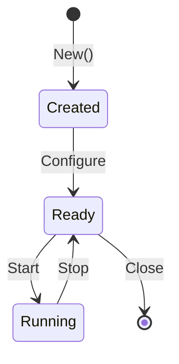

# Publication Implementation Plan

**Implements:** `specs/publication.md`
**Created:** 2024-12-08
**Updated:** 2024-12-08

This plan details the implementation steps for the Gorai publication infrastructure, with a focus on creating both "lean-back" (book) and "lean-forward" (website) experiences from the same content.

---

## Executive Summary

Gorai documentation will be published in two formats optimized for different consumption modes:

| Format | Tool | Experience | Use Case |
|--------|------|------------|----------|
| **Book** | mdBook | Lean-back | Reading on tablet/e-reader, PDF print, sequential learning |
| **Website** | Material for MkDocs | Lean-forward | Quick reference, copy-paste code, search, cross-navigation |

**Key Insight:** Both formats contain the **same depth of information**, but structured differently for their consumption mode. This is achieved through a **single-source architecture** where content is authored once and transformed for each output.

---

## Part 1: Understanding the Two Experiences

### 1.1 Lean-Back Experience (Book) — Deep Dive

The book is optimized for **sequential reading** and **deep understanding**. Think of a reader on a couch with a tablet, commuting on a train, or studying at a desk with a printed copy.

#### Core Characteristics

| Characteristic | What It Means | Implementation |
|---------------|---------------|----------------|
| **Linear narrative** | Chapters flow logically from introduction to advanced | Chapter ordering assumes prior chapters read |
| **Complete context** | Each section is self-contained with surrounding explanation | Embed all necessary context, don't rely on hyperlinks |
| **Prose-heavy** | Written for reading, not scanning | Full paragraphs explaining concepts |
| **Embedded examples** | Code shown with explanation | Code blocks with surrounding narrative |
| **Offline-friendly** | Works without internet | PDF/ePub exports, no external dependencies |
| **Printable** | Good typography for paper | Page breaks, print-optimized CSS |
| **E-reader compatible** | Works on Kindle, Kobo, etc. | ePub format, reflowable text |

#### Reader Personas for Book

1. **"The Studier"** — Reading systematically to learn Gorai from scratch
2. **"The Commuter"** — Reading on tablet during travel, can't copy-paste
3. **"The Reference-Keeper"** — Prints chapters for desk reference
4. **"The Offline Learner"** — Working without reliable internet

#### Book-Specific Design Decisions

```
┌──────────────────────────────────────────────────────────────────┐
│                    BOOK OPTIMIZATION PRIORITIES                   │
├──────────────────────────────────────────────────────────────────┤
│  1. Flow: Chapter N builds on Chapter N-1                        │
│  2. Completeness: Everything needed is in the text               │
│  3. Narrative: Prose explains the "why" before the "how"         │
│  4. Diagrams: Static diagrams that print well                    │
│  5. Code: Complete, runnable examples with line numbers          │
│  6. Cross-refs: "See Chapter 5" not hyperlinks                   │
│  7. Index: Comprehensive index for printed version               │
│  8. Summaries: Chapter summaries and key takeaways               │
└──────────────────────────────────────────────────────────────────┘
```

#### What Makes a Great Lean-Back Experience

1. **Chapter Introductions**: Each chapter opens with what you'll learn and why it matters
2. **Progressive Complexity**: Start simple, add complexity gradually
3. **Concept → Code → Explanation**: Introduce the concept, show the code, explain what happened
4. **Recall Helpers**: Periodic summaries, "remember from Chapter 3" bridges
5. **Print-Friendly Diagrams**: Mermaid diagrams that render well in grayscale
6. **Margin Notes**: Supplementary information that doesn't break flow (mdBook callouts)
7. **End-of-Chapter Exercises**: Optional hands-on exercises to reinforce learning

### 1.2 Lean-Forward Experience (Website) — Deep Dive

The website is optimized for **task completion** and **quick reference**. Think of a developer at their desk, building a robot, needing a specific piece of information NOW.

#### Core Characteristics

| Characteristic | What It Means | Implementation |
|---------------|---------------|----------------|
| **Non-linear navigation** | Jump directly to any topic | Deep linking, breadcrumbs, sidebar nav |
| **Scannable** | Find information in seconds | Headers, bullets, tables, TL;DR boxes |
| **Copy-paste ready** | Code works when pasted | Copy buttons, tested snippets |
| **Heavy cross-linking** | Related topics linked inline | Inline hyperlinks, "See also" boxes |
| **Search-first** | Find by keyword | Full-text search with previews |
| **Interactive** | Engage with content | Tabs, expandable sections, toggles |
| **Always current** | Latest information | Edit links, version indicators |
| **API-connected** | Direct links to code | Links to pkgsite, GitHub source |

#### Reader Personas for Website

1. **"The Problem Solver"** — Debugging an issue, needs specific answer fast
2. **"The Builder"** — Implementing a feature, needs code to copy
3. **"The Researcher"** — Evaluating Gorai, comparing to alternatives
4. **"The Checker"** — Knows Gorai, needs to verify a detail
5. **"The Contributor"** — Wants to fix or improve documentation

#### Website-Specific Design Decisions

```
┌──────────────────────────────────────────────────────────────────┐
│                  WEBSITE OPTIMIZATION PRIORITIES                  │
├──────────────────────────────────────────────────────────────────┤
│  1. Speed: Answer visible in < 3 seconds                         │
│  2. Copy-Paste: Code works when pasted                           │
│  3. Navigation: 2 clicks max to any content                      │
│  4. Search: Finds relevant content by keyword                    │
│  5. Cross-links: Related topics connected                        │
│  6. Currency: Edit dates, version info visible                   │
│  7. Mobile: Works on phone/tablet (responsive)                   │
│  8. Actions: Clear CTAs (install, try, copy)                     │
└──────────────────────────────────────────────────────────────────┘
```

#### What Makes a Great Lean-Forward Experience

1. **TL;DR Boxes**: Quick answer at the top of every page
2. **Copy Buttons**: One-click code copying on all code blocks
3. **Tabbed Examples**: Show same concept in different contexts (Linux/macOS/container)
4. **Expandable Details**: Hide complexity until requested
5. **"See Also" Sections**: Related topics grouped together
6. **Search Integration**: Pages structured for good search results
7. **Version Indicators**: Clear which Gorai version docs cover
8. **Edit Links**: Direct path to improve documentation
9. **Keyboard Navigation**: Power users can navigate without mouse
10. **Breadcrumbs**: Always know where you are in the hierarchy

---

## Part 2: The Single-Source Architecture

### 2.1 The Problem

Maintaining two separate documentation sets leads to:
- **Content drift**: Book says one thing, website says another
- **Double work**: Every update must be made twice
- **Inconsistent examples**: Code in book differs from website
- **Version skew**: Book is v1.2, website is v1.3

### 2.2 The Solution: Canonical Source with Format-Specific Presentation

All content lives in ONE place (`publish/content/`). Both outputs draw from this source but present it optimally for their medium.

```
┌─────────────────────────────────────────────────────────────────┐
│                    CANONICAL SOURCE                              │
│                   publish/content/                               │
│                                                                  │
│  ┌──────────────────────────────────────────────────────────┐   │
│  │  Content Files (Markdown)                                 │   │
│  │  - Written ONCE                                           │   │
│  │  - Contains ALL information for both outputs              │   │
│  │  - Uses format markers for conditional content            │   │
│  │  - Includes complete code examples                        │   │
│  └──────────────────────────────────────────────────────────┘   │
└─────────────────────────────────────────────────────────────────┘
                              │
                              │ Build Process
                              ▼
         ┌────────────────────┴────────────────────┐
         │                                         │
         ▼                                         ▼
┌─────────────────────────┐           ┌─────────────────────────┐
│        BOOK             │           │        WEBSITE          │
│   publish/book/         │           │   publish/website/      │
│                         │           │                         │
│ Transformation:         │           │ Transformation:         │
│ • Linear ordering       │           │ • Add navigation tabs   │
│ • Add chapter breaks    │           │ • Enable copy buttons   │
│ • Include print CSS     │           │ • Add search indexing   │
│ • Generate index        │           │ • Add cross-links       │
│ • Generate PDF/ePub     │           │ • Add expandable blocks │
│                         │           │ • Add version selector  │
│ Output:                 │           │                         │
│ • HTML book             │           │ Output:                 │
│ • PDF                   │           │ • Interactive website   │
│ • ePub                  │           │                         │
└─────────────────────────┘           └─────────────────────────┘
```

### 2.3 Content Authoring Strategy

Every content file is written to serve BOTH audiences. The key is writing "complete" content that can be:
- Read sequentially (book)
- Scanned quickly (website)
- Copied for immediate use (website)
- Understood deeply (book)

#### The "Complete Page" Pattern

Each content file follows this structure:

```markdown
# Topic Title

<!-- TL;DR for website scanners -->
> **Quick Answer:** [One sentence answer for the impatient reader]

## Overview

[2-3 paragraphs introducing the topic. Book readers start here,
website scanners might skip to the code.]

## The Concept

[Deeper explanation of the "why" - important for book narrative,
but structured with headers so website readers can scan]

### Key Point 1

[Explanation with example]

### Key Point 2

[Explanation with example]

## Implementation

[The "how" - code-heavy section that website readers want]

```go
// Complete, runnable example
// Book readers learn from reading
// Website readers copy and paste
```

### Explanation of the Code

[Line-by-line walkthrough for book readers]

## Common Patterns

[Tabular or bulleted - scannable for website, reference for book]

| Pattern | When to Use | Example |
|---------|-------------|---------|
| ... | ... | ... |

## See Also

<!-- website-only -->
- [Related Topic 1](../other/topic1.md)
- [Related Topic 2](../other/topic2.md)
<!-- /website-only -->

<!-- book-only -->
*For more on this topic, see Chapter 7: Services.*
<!-- /book-only -->

## Summary

[Key takeaways - chapter-end summary for book, quick refresh for website]

- Point 1
- Point 2
- Point 3
```

### 2.4 Format-Specific Content Markers

Some content genuinely differs between formats. Use HTML comments as markers:

```markdown
<!-- book-only -->
This content only appears in the book.
As a reminder from Chapter 3, NATS provides...
<!-- /book-only -->

<!-- website-only -->
!!! tip "Copy-Paste Ready"
    The code below can be copied directly into your project.
<!-- /website-only -->
```

A build-time preprocessor strips the inappropriate sections.

### 2.5 Code Example Strategy

Code examples must serve BOTH purposes:

| Need | Book | Website | Solution |
|------|------|---------|----------|
| Complete | Yes | Yes | Always show full, runnable code |
| Line numbers | Yes | Optional | Enable in mdBook, optional in MkDocs |
| Copy button | No | Yes | MkDocs adds automatically |
| Syntax highlighting | Yes | Yes | Both tools support |
| Filename shown | Yes | Yes | Use fenced code with title |

```go title="sensor/temperature.go"
package sensor

import "context"

// Temperature implements the Sensor interface for thermal readings.
type Temperature struct {
    reader Reader
}

// Readings returns the current temperature data.
func (t *Temperature) Readings(ctx context.Context) (map[string]any, error) {
    reading, err := t.reader.Read(ctx, "cpu")
    if err != nil {
        return nil, err
    }
    return map[string]any{
        "temperature_c": reading.Celsius,
        "zone":          reading.Zone,
        "timestamp":     reading.Timestamp,
    }, nil
}
```

---

## Part 3: Directory Structure

### 3.1 Complete Directory Tree

```
publish/
├── content/                        # CANONICAL SOURCE - all content lives here
│   │
│   ├── introduction.md             # Book intro / Website "about" content
│   │
│   ├── part1-getting-started/      # Part 1: Getting Started
│   │   ├── _index.md               # Part overview
│   │   ├── ch01-why-gorai/
│   │   │   ├── _index.md           # Chapter intro
│   │   │   ├── landscape.md        # The robotics landscape
│   │   │   ├── philosophy.md       # Design philosophy
│   │   │   ├── audience.md         # Target audience
│   │   │   ├── whatyoullbuild.md   # What you'll build
│   │   │   └── prerequisites.md    # Prerequisites
│   │   └── ch02-architecture/
│   │       ├── _index.md           # Chapter intro
│   │       ├── bigpicture.md       # The big picture
│   │       ├── coreconcepts.md     # Core concepts
│   │       ├── distributed.md      # Distributed architecture
│   │       ├── config.md           # Configuration
│   │       └── nwsnwc.md           # NWS/NWC pattern
│   │
│   ├── part2-core-framework/       # Part 2: Core Framework
│   │   ├── _index.md
│   │   ├── ch03-nats/
│   │   │   ├── _index.md
│   │   │   ├── whynats.md
│   │   │   ├── fundamentals.md
│   │   │   ├── patterns.md
│   │   │   ├── qos.md
│   │   │   ├── jetstream.md
│   │   │   └── cli.md
│   │   ├── ch04-sensors/
│   │   │   ├── _index.md
│   │   │   ├── interface.md
│   │   │   ├── builtin.md
│   │   │   ├── datatypes.md
│   │   │   └── fakes.md
│   │   ├── ch05-actuators/
│   │   │   ├── _index.md
│   │   │   ├── actuator.md
│   │   │   ├── motor.md
│   │   │   ├── motortypes.md
│   │   │   ├── control.md
│   │   │   ├── servo.md
│   │   │   └── base_arm.md
│   │   ├── ch06-vision/
│   │   │   ├── _index.md
│   │   │   ├── camera.md
│   │   │   ├── types.md
│   │   │   ├── dataflow.md
│   │   │   └── cv.md
│   │   ├── ch07-services/
│   │   │   └── _index.md
│   │   ├── ch08-behaviors/         # NEW: Robot decision making
│   │   │   └── _index.md
│   │   └── ch09-coordinators/      # NEW: Mission orchestration
│   │       └── _index.md
│   │
│   ├── part3-development/          # Part 3: Development
│   │   ├── _index.md
│   │   ├── ch10-devenv/
│   │   │   └── _index.md
│   │   ├── ch11-hello-sensor/
│   │   │   ├── _index.md
│   │   │   ├── overview.md
│   │   │   ├── reader.md
│   │   │   ├── sensor.md
│   │   │   └── main.md
│   │   ├── ch12-custom/
│   │   │   └── _index.md
│   │   └── ch13-testing/
│   │       └── _index.md
│   │
│   ├── part4-advanced/             # Part 4: Advanced Topics
│   │   ├── _index.md
│   │   ├── ch14-ai-ml/
│   │   │   └── _index.md
│   │   ├── ch15-organization/
│   │   │   └── _index.md
│   │   ├── ch16-ai-dev/
│   │   │   └── _index.md
│   │   └── ch17-conclusion/
│   │       └── _index.md
│   │
│   ├── appendices/
│   │   ├── _index.md
│   │   ├── topics.md               # NATS topic reference
│   │   ├── protobuf.md             # Proto definitions
│   │   ├── hardware.md             # Hardware compatibility
│   │   ├── troubleshooting.md      # Common issues
│   │   └── glossary.md             # Terms and definitions
│   │
│   ├── examples/                   # Shared example documentation
│   │   ├── _index.md
│   │   ├── hello-sensor/
│   │   │   ├── _index.md
│   │   │   └── code/               # Actual source files
│   │   │       ├── main.go
│   │   │       ├── reader/
│   │   │       └── sensor/
│   │   ├── pan-tilt/
│   │   │   └── _index.md
│   │   └── skimmer/
│   │       └── _index.md
│   │
│   └── reference/                  # Shared reference documentation
│       ├── _index.md
│       ├── cli.md
│       ├── configuration.md
│       └── topic-naming.md
│
├── book/                           # mdBook configuration
│   ├── book.toml                   # mdBook config
│   ├── src/                        # mdBook source (symlinks to content/)
│   │   ├── SUMMARY.md              # Book table of contents
│   │   └── [symlinks]              # Links to content/ files
│   ├── theme/                      # Custom theme overrides
│   │   └── book.css                # Print-optimized styles
│   ├── mermaid.min.js
│   └── mermaid-init.js
│
├── website/                        # MkDocs configuration
│   ├── mkdocs.yml                  # MkDocs config
│   ├── docs/                       # MkDocs source
│   │   ├── index.md                # Website landing page (website-specific)
│   │   ├── getting-started/        # Website-specific quick start
│   │   │   ├── installation.md     # Quick install guide
│   │   │   ├── quickstart.md       # 5-minute intro
│   │   │   └── concepts.md         # Core concepts summary
│   │   ├── book/                   # Symlinks to full book content
│   │   │   └── [symlinks]
│   │   ├── guides/                 # Task-oriented guides (website-specific)
│   │   │   ├── components.md       # How to work with components
│   │   │   ├── services.md         # How to work with services
│   │   │   ├── nats.md             # NATS quick reference
│   │   │   ├── configuration.md    # Config quick reference
│   │   │   └── testing.md          # Testing quick reference
│   │   ├── examples/               # Symlinks to content/examples/
│   │   │   └── [symlinks]
│   │   ├── reference/              # Symlinks to content/reference/
│   │   │   └── [symlinks]
│   │   └── community/              # Website-specific
│   │       ├── contributing.md
│   │       └── support.md
│   └── overrides/                  # Theme customizations
│       └── main.html
│
├── scripts/                        # Build and maintenance scripts
│   ├── setup.sh                    # One-time setup
│   ├── setup-book-links.sh         # Create book symlinks
│   ├── setup-website-links.sh      # Create website symlinks
│   ├── migrate-content.sh          # Migrate from book/tmp/
│   ├── build-book.sh               # Build book
│   ├── build-website.sh            # Build website
│   ├── preprocess.sh               # Strip format-specific markers
│   └── check-links.sh              # Verify internal links
│
├── container/                      # Publishing container
│   ├── Containerfile
│   └── entrypoint.sh
│
└── dist/                           # Build output (gitignored)
    ├── book/                       # mdBook HTML output
    ├── book.pdf                    # PDF export
    ├── book.epub                   # ePub export
    └── website/                    # MkDocs output
```

---

## Part 4: Detailed Implementation Steps

### Phase 1: Infrastructure Setup (COMPLETED)

- [x] Create `publish/` directory structure
- [x] Create `publish/container/Containerfile`
- [x] Create `publish/container/entrypoint.sh`
- [x] Create `publish/.gitignore`
- [x] Build and test container
- [x] Add Makefile targets
- [x] Create basic website structure
- [x] Create basic book structure

### Phase 2: Canonical Content Structure

**Goal:** Establish the single-source content directory.

#### Step 2.1: Create Content Directory Hierarchy

```bash
# Create the full directory structure
mkdir -p publish/content/{part1-getting-started,part2-core-framework,part3-development,part4-advanced,appendices,examples,reference}

# Create chapter directories
mkdir -p publish/content/part1-getting-started/{ch01-why-gorai,ch02-architecture}
mkdir -p publish/content/part2-core-framework/{ch03-nats,ch04-sensors,ch05-actuators,ch06-vision,ch07-services,ch08-behaviors,ch09-coordinators}
mkdir -p publish/content/part3-development/{ch10-devenv,ch11-hello-sensor,ch12-custom,ch13-testing}
mkdir -p publish/content/part4-advanced/{ch14-ai-ml,ch15-organization,ch16-ai-dev,ch17-conclusion}

# Create example directories
mkdir -p publish/content/examples/{hello-sensor/code,pan-tilt,skimmer}
```

#### Step 2.2: Create Chapter Index Files

Each chapter needs an `_index.md` that serves as:
- **Book**: Chapter introduction, sets up the narrative
- **Website**: Section landing page, provides overview and links

**Template: `_index.md`**

```markdown
# Chapter Title

> **In This Chapter:** One-sentence summary of what readers will learn.

## Overview

[2-3 paragraphs introducing the chapter's topic, why it matters,
and how it fits into the larger picture.]

## What You'll Learn

After reading this chapter, you'll understand:

- Learning outcome 1
- Learning outcome 2
- Learning outcome 3
- Learning outcome 4

## Chapter Contents

| Section | Description |
|---------|-------------|
| [Section 1](section1.md) | Brief description |
| [Section 2](section2.md) | Brief description |
| [Section 3](section3.md) | Brief description |

## Prerequisites

This chapter assumes you've read:

- [Chapter X: Topic](../chX/README.md)
- Familiarity with [concept]

<!-- book-only -->
*This chapter builds directly on the concepts from Chapter X.
If you skipped ahead, consider reviewing that material first.*
<!-- /book-only -->
```

#### Step 2.3: Migrate Existing Content

Move content from `book/tmp/` to `publish/content/`:

| Source (book/tmp/) | Destination (publish/content/) |
|-------------------|-------------------------------|
| `ch00_introduction.md` | `introduction.md` |
| `ch01_s1_landscape.md` | `part1-getting-started/ch01-why-gorai/landscape.md` |
| `ch01_s2_philosophy.md` | `part1-getting-started/ch01-why-gorai/philosophy.md` |
| `ch01_s3_audience.md` | `part1-getting-started/ch01-why-gorai/audience.md` |
| `ch01_s4_whatyoullbuild.md` | `part1-getting-started/ch01-why-gorai/whatyoullbuild.md` |
| `ch01_s5_prerequisites.md` | `part1-getting-started/ch01-why-gorai/prerequisites.md` |
| ... | ... |
| `appendices.md` | `appendices/_index.md` |

(Full mapping in migration script)

#### Step 2.4: Enhance Content for Dual-Purpose

Each migrated file needs enhancement:

1. **Add TL;DR box** at top for website scanners
2. **Add "See Also" section** with cross-links (website)
3. **Add chapter references** in prose (book)
4. **Add copy-friendly code titles**
5. **Add Summary section** at end

### Phase 3: Book Configuration (mdBook)

**Goal:** Configure mdBook to consume canonical content and produce excellent lean-back output.

#### Step 3.1: Update book.toml

```toml
[book]
title = "Gorai: Building Modern Robots with Go and NATS"
authors = ["Greg Herlein", "Luca Herlein"]
description = "A comprehensive guide to building robots with the Gorai framework"
language = "en"
src = "src"

[build]
build-dir = "../dist/book"
create-missing = false

[output.html]
default-theme = "light"
preferred-dark-theme = "ayu"
git-repository-url = "https://github.com/gorai/gorai"
edit-url-template = "https://github.com/gorai/gorai/edit/main/publish/content/{path}"
site-url = "/book/"
additional-js = ["mermaid.min.js", "mermaid-init.js"]

[output.html.fold]
enable = true
level = 1

[output.html.playground]
editable = false
copyable = true
line-numbers = true

[output.html.search]
enable = true
limit-results = 30

[output.html.print]
enable = true
page-break-chapter = "always"

[preprocessor.mermaid]
command = "mdbook-mermaid"

# Future: PDF and ePub
# [output.pdf]
# [output.epub]
```

#### Step 3.2: Create Complete SUMMARY.md

```markdown
# Summary

[Introduction](introduction.md)

---

# Part I: Getting Started

- [Why Gorai?](part1-getting-started/ch01-why-gorai/_index.md)
    - [The Robotics Landscape](part1-getting-started/ch01-why-gorai/landscape.md)
    - [Design Philosophy](part1-getting-started/ch01-why-gorai/philosophy.md)
    - [Target Audience](part1-getting-started/ch01-why-gorai/audience.md)
    - [What You'll Build](part1-getting-started/ch01-why-gorai/whatyoullbuild.md)
    - [Prerequisites](part1-getting-started/ch01-why-gorai/prerequisites.md)

- [Architecture & Mental Model](part1-getting-started/ch02-architecture/_index.md)
    - [The Big Picture](part1-getting-started/ch02-architecture/bigpicture.md)
    - [Core Concepts](part1-getting-started/ch02-architecture/coreconcepts.md)
    - [Distributed Systems](part1-getting-started/ch02-architecture/distributed.md)
    - [Configuration](part1-getting-started/ch02-architecture/config.md)
    - [NWS/NWC Pattern](part1-getting-started/ch02-architecture/nwsnwc.md)

---

# Part II: Core Framework

- [NATS Messaging](part2-core-framework/ch03-nats/_index.md)
    - [Why NATS?](part2-core-framework/ch03-nats/whynats.md)
    - [Fundamentals](part2-core-framework/ch03-nats/fundamentals.md)
    - [Messaging Patterns](part2-core-framework/ch03-nats/patterns.md)
    - [Quality of Service](part2-core-framework/ch03-nats/qos.md)
    - [JetStream](part2-core-framework/ch03-nats/jetstream.md)
    - [NATS CLI](part2-core-framework/ch03-nats/cli.md)

- [Sensors](part2-core-framework/ch04-sensors/_index.md)
    - [The Sensor Interface](part2-core-framework/ch04-sensors/interface.md)
    - [Built-in Sensors](part2-core-framework/ch04-sensors/builtin.md)
    - [Data Types](part2-core-framework/ch04-sensors/datatypes.md)
    - [Fake Sensors](part2-core-framework/ch04-sensors/fakes.md)

- [Actuators](part2-core-framework/ch05-actuators/_index.md)
    - [The Actuator Interface](part2-core-framework/ch05-actuators/actuator.md)
    - [Motors](part2-core-framework/ch05-actuators/motor.md)
    - [Motor Types](part2-core-framework/ch05-actuators/motortypes.md)
    - [Control Patterns](part2-core-framework/ch05-actuators/control.md)
    - [Servos](part2-core-framework/ch05-actuators/servo.md)
    - [Bases & Arms](part2-core-framework/ch05-actuators/base_arm.md)

- [Vision](part2-core-framework/ch06-vision/_index.md)
    - [Camera Interface](part2-core-framework/ch06-vision/camera.md)
    - [Camera Types](part2-core-framework/ch06-vision/types.md)
    - [Data Flow](part2-core-framework/ch06-vision/dataflow.md)
    - [Computer Vision](part2-core-framework/ch06-vision/cv.md)

- [Services](part2-core-framework/ch07-services/_index.md)

- [Behaviors](part2-core-framework/ch08-behaviors/_index.md)

- [Coordinators](part2-core-framework/ch09-coordinators/_index.md)

---

# Part III: Development

- [Development Environment](part3-development/ch10-devenv/_index.md)

- [Hello Sensor Tutorial](part3-development/ch11-hello-sensor/_index.md)
    - [Overview](part3-development/ch11-hello-sensor/overview.md)
    - [The Reader](part3-development/ch11-hello-sensor/reader.md)
    - [The Sensor](part3-development/ch11-hello-sensor/sensor.md)
    - [Main Program](part3-development/ch11-hello-sensor/main.md)

- [Custom Components](part3-development/ch12-custom/_index.md)

- [Testing](part3-development/ch13-testing/_index.md)

---

# Part IV: Advanced Topics

- [AI/ML Integration](part4-advanced/ch14-ai-ml/_index.md)

- [Project Organization](part4-advanced/ch15-organization/_index.md)

- [AI-Assisted Development](part4-advanced/ch16-ai-dev/_index.md)

- [Conclusion](part4-advanced/ch17-conclusion/_index.md)

---

# Appendices

- [Appendix Overview](appendices/_index.md)
- [NATS Topics Reference](appendices/topics.md)
- [Protocol Buffers Reference](appendices/protobuf.md)
- [Hardware Compatibility](appendices/hardware.md)
- [Troubleshooting](appendices/troubleshooting.md)
- [Glossary](appendices/glossary.md)
```

#### Step 3.3: Create Symbolic Links Script

**File: `publish/scripts/setup-book-links.sh`**

```bash
#!/bin/bash
set -e

SCRIPT_DIR="$(cd "$(dirname "${BASH_SOURCE[0]}")" && pwd)"
PUBLISH_DIR="$(dirname "$SCRIPT_DIR")"
BOOK_SRC="$PUBLISH_DIR/book/src"
CONTENT="$PUBLISH_DIR/content"

echo "Setting up book symbolic links..."

# Clear existing links
find "$BOOK_SRC" -type l -delete 2>/dev/null || true

# Link introduction
ln -sf "../../content/introduction.md" "$BOOK_SRC/introduction.md"

# Link part directories
for part in part1-getting-started part2-core-framework part3-development part4-advanced; do
    ln -sf "../../content/$part" "$BOOK_SRC/$part"
done

# Link appendices
ln -sf "../../content/appendices" "$BOOK_SRC/appendices"

# Link examples (for reference from chapters)
ln -sf "../../content/examples" "$BOOK_SRC/examples"

echo "Book symbolic links created successfully"
```

#### Step 3.4: Book Theme Customizations

**File: `publish/book/theme/book.css`**

```css
/* Print optimization */
@media print {
    .nav-wrapper, .menu-bar, .nav-chapters {
        display: none !important;
    }

    .page {
        max-width: 100% !important;
        margin: 0 !important;
        padding: 20px !important;
    }

    pre {
        white-space: pre-wrap !important;
        word-wrap: break-word !important;
    }

    /* Page breaks */
    h1 {
        page-break-before: always;
    }

    h2, h3 {
        page-break-after: avoid;
    }

    pre, blockquote, table {
        page-break-inside: avoid;
    }
}

/* Enhanced code blocks */
pre {
    border-radius: 6px;
    border: 1px solid var(--quote-border);
}

/* Book-only content visibility (website-only is stripped) */
/* Format markers are handled by preprocessor */
```

### Phase 4: Website Configuration (MkDocs)

**Goal:** Configure MkDocs for excellent lean-forward experience.

#### Step 4.1: Enhanced mkdocs.yml

```yaml
site_name: Gorai
site_url: https://gorai.dev
site_description: A lightweight, Go-based robotics framework built on NATS.io
site_author: Greg Herlein, Luca Herlein

repo_name: gorai/gorai
repo_url: https://github.com/gorai/gorai
edit_uri: edit/main/publish/content/

theme:
  name: material
  language: en

  palette:
    - media: "(prefers-color-scheme: light)"
      scheme: default
      primary: deep purple
      accent: amber
      toggle:
        icon: material/brightness-7
        name: Switch to dark mode
    - media: "(prefers-color-scheme: dark)"
      scheme: slate
      primary: deep purple
      accent: amber
      toggle:
        icon: material/brightness-4
        name: Switch to light mode

  font:
    text: Inter
    code: JetBrains Mono

  features:
    # Navigation
    - navigation.instant
    - navigation.instant.progress
    - navigation.tracking
    - navigation.tabs
    - navigation.tabs.sticky
    - navigation.sections
    - navigation.expand
    - navigation.indexes
    - navigation.top
    - navigation.footer

    # Search
    - search.suggest
    - search.highlight
    - search.share

    # Content
    - content.code.copy
    - content.code.annotate
    - content.action.edit
    - content.action.view
    - content.tabs.link

    # TOC
    - toc.follow

  icon:
    repo: fontawesome/brands/github
    logo: material/robot

  custom_dir: overrides

plugins:
  - search:
      separator: '[\s\-,:!=\[\]()"/]+|(?!\b)(?=[A-Z][a-z])|\.(?!\d)|&[lg]t;'
  - tags:
      tags_file: tags.md

markdown_extensions:
  # Code highlighting
  - pymdownx.highlight:
      anchor_linenums: true
      line_spans: __span
      pygments_lang_class: true
      auto_title: true
  - pymdownx.inlinehilite

  # Code snippets from files
  - pymdownx.snippets:
      base_path:
        - publish/content
        - .
      check_paths: true

  # Super fences for code blocks and mermaid
  - pymdownx.superfences:
      custom_fences:
        - name: mermaid
          class: mermaid
          format: !!python/name:pymdownx.superfences.fence_code_format

  # Tabbed content
  - pymdownx.tabbed:
      alternate_style: true
      combine_header_slug: true

  # Details/expandable sections
  - pymdownx.details

  # Admonitions (note, warning, tip boxes)
  - admonition

  # Keyboard keys
  - pymdownx.keys

  # Mark/highlight text
  - pymdownx.mark
  - pymdownx.caret
  - pymdownx.tilde

  # Task lists
  - pymdownx.tasklist:
      custom_checkbox: true

  # Tables
  - tables

  # Attributes and HTML
  - attr_list
  - md_in_html

  # Definition lists
  - def_list

  # Footnotes
  - footnotes

  # Table of contents
  - toc:
      permalink: true
      toc_depth: 3

nav:
  - Home: index.md

  - Getting Started:
    - getting-started/index.md
    - Installation: getting-started/installation.md
    - Quick Start: getting-started/quickstart.md
    - Core Concepts: getting-started/concepts.md

  - Guides:
    - guides/index.md
    - Working with Components: guides/components.md
    - Working with Services: guides/services.md
    - NATS Messaging: guides/nats.md
    - Configuration: guides/configuration.md
    - Testing: guides/testing.md

  - The Book:
    - book/index.md
    - "Part 1: Getting Started":
      - Why Gorai?: book/part1-getting-started/ch01-why-gorai/
      - Architecture: book/part1-getting-started/ch02-architecture/
    - "Part 2: Core Framework":
      - NATS Messaging: book/part2-core-framework/ch03-nats/
      - Sensors: book/part2-core-framework/ch04-sensors/
      - Actuators: book/part2-core-framework/ch05-actuators/
      - Vision: book/part2-core-framework/ch06-vision/
      - Services: book/part2-core-framework/ch07-services/
      - Behaviors: book/part2-core-framework/ch08-behaviors/
      - Coordinators: book/part2-core-framework/ch09-coordinators/
    - "Part 3: Development":
      - Dev Environment: book/part3-development/ch10-devenv/
      - Hello Sensor: book/part3-development/ch11-hello-sensor/
      - Custom Components: book/part3-development/ch12-custom/
      - Testing: book/part3-development/ch13-testing/
    - "Part 4: Advanced":
      - AI/ML: book/part4-advanced/ch14-ai-ml/
      - Organization: book/part4-advanced/ch15-organization/
      - AI-Assisted Dev: book/part4-advanced/ch16-ai-dev/
      - Conclusion: book/part4-advanced/ch17-conclusion/
    - Appendices: book/appendices/

  - Examples:
    - examples/index.md
    - Hello Sensor: examples/hello-sensor/
    - Pan-Tilt Platform: examples/pan-tilt/
    - Surface Vehicle: examples/skimmer/

  - Reference:
    - reference/index.md
    - CLI Reference: reference/cli.md
    - Configuration: reference/configuration.md
    - Topic Naming: reference/topic-naming.md

  - Community:
    - Contributing: community/contributing.md
    - Support: community/support.md

extra:
  version:
    provider: mike
    default: stable

  social:
    - icon: fontawesome/brands/github
      link: https://github.com/gorai/gorai

  analytics:
    provider: google
    property: G-XXXXXXXXXX  # Add when ready

extra_css:
  - stylesheets/extra.css

copyright: Copyright &copy; 2024-2025 Greg Herlein & Luca Herlein. Apache 2.0 License.
```

#### Step 4.2: Website-Specific Landing Page

The website landing page is **website-specific** - optimized for discovery and quick action.

**File: `publish/website/docs/index.md`**

```markdown
---
hide:
  - navigation
  - toc
---

# Gorai

**A lightweight, Go-based robotics framework built on NATS.io**

*Pronounced "go-ray" (like "sting-ray")*

<div class="grid cards" markdown>

-   :material-rocket-launch:{ .lg .middle } **Quick Start**

    ---

    Get Gorai running and build your first node in 5 minutes

    [:octicons-arrow-right-24: Get Started](getting-started/quickstart.md)

-   :material-book-open-variant:{ .lg .middle } **Read the Book**

    ---

    Comprehensive guide from fundamentals to advanced topics

    [:octicons-arrow-right-24: Start Reading](book/)

-   :material-puzzle:{ .lg .middle } **Examples**

    ---

    Complete working projects you can build and learn from

    [:octicons-arrow-right-24: Browse Examples](examples/)

-   :material-api:{ .lg .middle } **API Reference**

    ---

    Complete CLI and configuration reference

    [:octicons-arrow-right-24: Reference Docs](reference/)

</div>

---

## Why Gorai?

<div class="grid" markdown>

| Feature | Gorai | ROS 2 | Viam |
|---------|:-----:|:-----:|:----:|
| **Language** | Go + TinyGo | C++/Python | Go |
| **Middleware** | NATS | DDS | gRPC |
| **Build System** | Go modules | CMake + colcon | Go modules |
| **Learning Curve** | Low | High | Medium |
| **MCU Support** | TinyGo | micro-ROS | None |
| **AI/ML** | First-class | Ecosystem | First-class |

</div>

## Quick Example

```go
package main

import (
    "context"
    "github.com/gorai/gorai/pkg/node"
    "github.com/gorai/gorai/pkg/pub"
)

func main() {
    ctx := context.Background()

    // Create a node
    n, _ := node.New("my_robot", node.WithNATS("nats://localhost:4222"))
    defer n.Close()

    // Publish sensor data
    pub := pub.New[SensorData](n, "sensors.temperature")
    pub.Publish(ctx, &SensorData{Temperature: 25.5})

    // Run the node
    n.Spin(ctx)
}
```

[:octicons-copy-24: Copy](#){ .md-button data-clipboard-target="code" }

## Example Projects

<div class="grid cards" markdown>

-   **Gorai-Sentinel**

    ---

    Pan-tilt sensor platform with camera, ToF depth, and servos

    **Cost:** ~$150-350 | **Level:** Beginner

    [:octicons-arrow-right-24: Build It](examples/pan-tilt/)

-   **Gorai-Skimmer**

    ---

    Autonomous surface vehicle for water monitoring

    **Cost:** ~$530 | **Level:** Intermediate

    [:octicons-arrow-right-24: Build It](examples/skimmer/)

</div>
```

#### Step 4.3: Website-Specific Guides

The Guides section contains **task-oriented, lean-forward content** that links to the book for deep dives.

**Example: `publish/website/docs/guides/components.md`**

```markdown
# Working with Components

> **TL;DR:** Components are hardware abstractions. Create them, get readings or send commands, close when done.

## Quick Reference

=== "Sensor"

    ```go
    readings, err := sensor.Readings(ctx)
    temp := readings["temperature_c"].(float64)
    ```

=== "Motor"

    ```go
    motor.SetPower(ctx, 0.5)  // 50% power
    motor.GoTo(ctx, 1000)     // Move to position
    motor.Stop(ctx)
    ```

=== "Camera"

    ```go
    img, err := camera.Image(ctx)
    // img is image.Image
    ```

## Creating Components

```go
// From configuration
robot, _ := robot.New(ctx, "config.json")
sensor := robot.Sensor("temperature")

// Manually
sensor := temperature.New(config)
```

## Component Lifecycle



## Common Tasks

??? example "Read All Sensors"

    ```go
    for name, sensor := range robot.Sensors() {
        readings, _ := sensor.Readings(ctx)
        log.Printf("%s: %v", name, readings)
    }
    ```

??? example "Emergency Stop All Motors"

    ```go
    for _, motor := range robot.Motors() {
        motor.Stop(ctx)
    }
    ```

## Deep Dive

For complete understanding of the component system:

- [Chapter 4: Sensors](../book/part2-core-framework/ch04-sensors/) - Full sensor documentation
- [Chapter 5: Actuators](../book/part2-core-framework/ch05-actuators/) - Full actuator documentation
- [Chapter 6: Vision](../book/part2-core-framework/ch06-vision/) - Camera and vision components

## See Also

- [Services Guide](services.md) - Higher-level abstractions
- [Testing Guide](testing.md) - Testing components with fakes
- [Configuration Guide](configuration.md) - Configuring components
```

#### Step 4.4: Create Website Symbolic Links Script

**File: `publish/scripts/setup-website-links.sh`**

```bash
#!/bin/bash
set -e

SCRIPT_DIR="$(cd "$(dirname "${BASH_SOURCE[0]}")" && pwd)"
PUBLISH_DIR="$(dirname "$SCRIPT_DIR")"
WEBSITE_DOCS="$PUBLISH_DIR/website/docs"
CONTENT="$PUBLISH_DIR/content"

echo "Setting up website symbolic links..."

# Clear existing links in book/ directory
rm -rf "$WEBSITE_DOCS/book" 2>/dev/null || true
mkdir -p "$WEBSITE_DOCS/book"

# Create book landing page
cat > "$WEBSITE_DOCS/book/index.md" << 'EOF'
# The Gorai Book

Complete guide to building robots with Go and NATS.

**Reading Options:**

- :material-web: Read online below
- :material-file-pdf-box: [Download PDF](/book.pdf)
- :material-book-open-page-variant: [Download ePub](/book.epub)

---

Start with [Chapter 1: Why Gorai?](part1-getting-started/ch01-why-gorai/) or browse the chapters in the sidebar.
EOF

# Link part directories to book/
for part in part1-getting-started part2-core-framework part3-development part4-advanced; do
    ln -sf "../../../content/$part" "$WEBSITE_DOCS/book/$part"
done

# Link appendices to book/
ln -sf "../../../content/appendices" "$WEBSITE_DOCS/book/appendices"

# Link examples
rm -rf "$WEBSITE_DOCS/examples" 2>/dev/null || true
ln -sf "../../content/examples" "$WEBSITE_DOCS/examples"

# Link reference (merge with website-specific reference)
# Note: We keep website reference separate and link specific files
for ref in cli.md configuration.md topic-naming.md; do
    if [ -f "$CONTENT/reference/$ref" ]; then
        ln -sf "../../../content/reference/$ref" "$WEBSITE_DOCS/reference/$ref"
    fi
done

echo "Website symbolic links created successfully"
```

### Phase 5: Build Process

**Goal:** Create robust build scripts that handle format-specific transformations.

#### Step 5.1: Content Preprocessor

**File: `publish/scripts/preprocess.sh`**

```bash
#!/bin/bash
# Preprocess content for target format
# Usage: preprocess.sh <source_dir> <target_dir> <format>
# Format: "book" or "website"

set -e

SOURCE_DIR="$1"
TARGET_DIR="$2"
FORMAT="$3"

if [ -z "$SOURCE_DIR" ] || [ -z "$TARGET_DIR" ] || [ -z "$FORMAT" ]; then
    echo "Usage: preprocess.sh <source_dir> <target_dir> <format>"
    exit 1
fi

mkdir -p "$TARGET_DIR"

# Process each markdown file
find "$SOURCE_DIR" -name "*.md" | while read -r file; do
    relative="${file#$SOURCE_DIR/}"
    target="$TARGET_DIR/$relative"
    mkdir -p "$(dirname "$target")"

    if [ "$FORMAT" = "book" ]; then
        # Strip website-only content
        sed '/<!-- website-only -->/,/<!-- \/website-only -->/d' "$file" > "$target"
    elif [ "$FORMAT" = "website" ]; then
        # Strip book-only content
        sed '/<!-- book-only -->/,/<!-- \/book-only -->/d' "$file" > "$target"
    else
        cp "$file" "$target"
    fi
done

echo "Preprocessed $FORMAT content to $TARGET_DIR"
```

#### Step 5.2: Main Build Script

**File: `publish/scripts/build.sh`**

```bash
#!/bin/bash
set -e

SCRIPT_DIR="$(cd "$(dirname "${BASH_SOURCE[0]}")" && pwd)"
PUBLISH_DIR="$(dirname "$SCRIPT_DIR")"

usage() {
    echo "Usage: build.sh [book|website|all] [--pdf] [--epub]"
    echo ""
    echo "Commands:"
    echo "  book     Build the mdBook"
    echo "  website  Build the MkDocs website"
    echo "  all      Build both"
    echo ""
    echo "Options:"
    echo "  --pdf    Also generate PDF (requires mdbook-pdf)"
    echo "  --epub   Also generate ePub (requires mdbook-epub)"
}

build_book() {
    echo "Building book..."

    # Setup links
    "$SCRIPT_DIR/setup-book-links.sh"

    # Build with mdbook
    cd "$PUBLISH_DIR/book"
    mdbook-mermaid install .
    mdbook build --dest-dir "$PUBLISH_DIR/dist/book"

    echo "Book built to publish/dist/book/"
}

build_website() {
    echo "Building website..."

    # Setup links
    "$SCRIPT_DIR/setup-website-links.sh"

    # Build with mkdocs
    cd "$PUBLISH_DIR/website"
    mkdocs build --site-dir "$PUBLISH_DIR/dist/website"

    echo "Website built to publish/dist/website/"
}

# Parse arguments
BUILD_PDF=false
BUILD_EPUB=false
TARGET=""

while [[ $# -gt 0 ]]; do
    case $1 in
        book|website|all)
            TARGET="$1"
            ;;
        --pdf)
            BUILD_PDF=true
            ;;
        --epub)
            BUILD_EPUB=true
            ;;
        -h|--help)
            usage
            exit 0
            ;;
        *)
            echo "Unknown option: $1"
            usage
            exit 1
            ;;
    esac
    shift
done

if [ -z "$TARGET" ]; then
    usage
    exit 1
fi

case $TARGET in
    book)
        build_book
        ;;
    website)
        build_website
        ;;
    all)
        build_book
        build_website
        ;;
esac

echo "Build complete!"
```

#### Step 5.3: Update Container Entrypoint

**File: `publish/container/entrypoint.sh`**

```bash
#!/bin/bash
set -e

WORKSPACE="/workspace"
SCRIPTS="$WORKSPACE/publish/scripts"

case "$1" in
    setup)
        echo "Setting up symbolic links..."
        "$SCRIPTS/setup-book-links.sh"
        "$SCRIPTS/setup-website-links.sh"
        echo "Setup complete"
        ;;

    book)
        echo "Building book..."
        "$SCRIPTS/setup-book-links.sh"
        cd "$WORKSPACE/publish/book"
        mdbook-mermaid install .
        mdbook build --dest-dir "$WORKSPACE/publish/dist/book"
        echo "Book built to publish/dist/book/"
        ;;

    book-pdf)
        echo "Building book PDF..."
        "$SCRIPTS/setup-book-links.sh"
        cd "$WORKSPACE/publish/book"
        mdbook-mermaid install .
        mdbook build --dest-dir "$WORKSPACE/publish/dist/book"
        # PDF generation (requires additional tools)
        echo "PDF generation not yet implemented"
        ;;

    website)
        echo "Building website..."
        "$SCRIPTS/setup-website-links.sh"
        cd "$WORKSPACE/publish/website"
        mkdocs build --site-dir "$WORKSPACE/publish/dist/website"
        echo "Website built to publish/dist/website/"
        ;;

    all)
        "$0" book
        "$0" website
        ;;

    serve-book)
        "$SCRIPTS/setup-book-links.sh"
        cd "$WORKSPACE/publish/book"
        mdbook-mermaid install .
        mdbook serve --hostname 0.0.0.0 --port 3000
        ;;

    serve-website)
        "$SCRIPTS/setup-website-links.sh"
        cd "$WORKSPACE/publish/website"
        mkdocs serve --dev-addr 0.0.0.0:8000
        ;;

    clean)
        rm -rf "$WORKSPACE/publish/dist"
        echo "Cleaned publish/dist/"
        ;;

    shell)
        exec /bin/bash
        ;;

    *)
        echo "Usage: $0 {setup|book|book-pdf|website|all|serve-book|serve-website|clean|shell}"
        exit 1
        ;;
esac
```

### Phase 6: Content Migration

**Goal:** Move existing content to canonical location.

#### Step 6.1: Migration Script

**File: `publish/scripts/migrate-content.sh`**

```bash
#!/bin/bash
set -e

SCRIPT_DIR="$(cd "$(dirname "${BASH_SOURCE[0]}")" && pwd)"
PROJECT_ROOT="$(dirname "$(dirname "$SCRIPT_DIR")")"
SOURCE="$PROJECT_ROOT/book/tmp"
DEST="$PROJECT_ROOT/publish/content"

echo "Migrating content from book/tmp to publish/content..."

# Create directory structure
mkdir -p "$DEST"/{part1-getting-started/{ch01-why-gorai,ch02-architecture},part2-core-framework/{ch03-nats,ch04-sensors,ch05-actuators,ch06-vision,ch07-services,ch08-behaviors,ch09-coordinators},part3-development/{ch10-devenv,ch11-hello-sensor,ch12-custom,ch13-testing},part4-advanced/{ch14-ai-ml,ch15-organization,ch16-ai-dev,ch17-conclusion},appendices,examples/{hello-sensor/code,pan-tilt,skimmer},reference}

# Migration mapping
migrate() {
    local src="$1"
    local dst="$2"
    if [ -f "$SOURCE/$src" ]; then
        cp "$SOURCE/$src" "$DEST/$dst"
        echo "  $src -> $dst"
    else
        echo "  WARNING: $src not found"
    fi
}

echo "Migrating files..."

# Introduction
migrate "ch00_introduction.md" "introduction.md"

# Chapter 1
migrate "ch01_s1_landscape.md" "part1-getting-started/ch01-why-gorai/landscape.md"
migrate "ch01_s2_philosophy.md" "part1-getting-started/ch01-why-gorai/philosophy.md"
migrate "ch01_s3_audience.md" "part1-getting-started/ch01-why-gorai/audience.md"
migrate "ch01_s4_whatyoullbuild.md" "part1-getting-started/ch01-why-gorai/whatyoullbuild.md"
migrate "ch01_s5_prerequisites.md" "part1-getting-started/ch01-why-gorai/prerequisites.md"

# Chapter 2
migrate "ch02_s1_bigpicture.md" "part1-getting-started/ch02-architecture/bigpicture.md"
migrate "ch02_s2_coreconcepts.md" "part1-getting-started/ch02-architecture/coreconcepts.md"
migrate "ch02_s3_distributed.md" "part1-getting-started/ch02-architecture/distributed.md"
migrate "ch02_s4_config.md" "part1-getting-started/ch02-architecture/config.md"
migrate "ch02_s5_nwsnwc.md" "part1-getting-started/ch02-architecture/nwsnwc.md"

# Chapter 3
migrate "ch03_s1_whynats.md" "part2-core-framework/ch03-nats/whynats.md"
migrate "ch03_s2_fundamentals.md" "part2-core-framework/ch03-nats/fundamentals.md"
migrate "ch03_s3_patterns.md" "part2-core-framework/ch03-nats/patterns.md"
migrate "ch03_s4_qos.md" "part2-core-framework/ch03-nats/qos.md"
migrate "ch03_s5_jetstream.md" "part2-core-framework/ch03-nats/jetstream.md"
migrate "ch03_s6_cli.md" "part2-core-framework/ch03-nats/cli.md"

# Chapter 4
migrate "ch04_s1_interface.md" "part2-core-framework/ch04-sensors/interface.md"
migrate "ch04_s2_builtin.md" "part2-core-framework/ch04-sensors/builtin.md"
migrate "ch04_s3_datatypes.md" "part2-core-framework/ch04-sensors/datatypes.md"
migrate "ch04_s4_fakes.md" "part2-core-framework/ch04-sensors/fakes.md"

# Chapter 5
migrate "ch05_s1_actuator.md" "part2-core-framework/ch05-actuators/actuator.md"
migrate "ch05_s2_motor.md" "part2-core-framework/ch05-actuators/motor.md"
migrate "ch05_s3_motortypes.md" "part2-core-framework/ch05-actuators/motortypes.md"
migrate "ch05_s4_control.md" "part2-core-framework/ch05-actuators/control.md"
migrate "ch05_s5_servo.md" "part2-core-framework/ch05-actuators/servo.md"
migrate "ch05_s6_base_arm.md" "part2-core-framework/ch05-actuators/base_arm.md"

# Chapter 6
migrate "ch06_s1_camera.md" "part2-core-framework/ch06-vision/camera.md"
migrate "ch06_s2_types.md" "part2-core-framework/ch06-vision/types.md"
migrate "ch06_s3_dataflow.md" "part2-core-framework/ch06-vision/dataflow.md"
migrate "ch06_s4_cv.md" "part2-core-framework/ch06-vision/cv.md"

# Chapter 7-9 (single files or new)
migrate "ch07_services.md" "part2-core-framework/ch07-services/_index.md"

# Chapter 10-13 (new numbering)
migrate "ch08_devenv.md" "part3-development/ch10-devenv/_index.md"
migrate "ch09_s1_overview.md" "part3-development/ch11-hello-sensor/overview.md"
migrate "ch09_s2_reader.md" "part3-development/ch11-hello-sensor/reader.md"
migrate "ch09_s3_sensor.md" "part3-development/ch11-hello-sensor/sensor.md"
migrate "ch09_s4_main.md" "part3-development/ch11-hello-sensor/main.md"
migrate "ch10_custom.md" "part3-development/ch12-custom/_index.md"
migrate "ch11_testing.md" "part3-development/ch13-testing/_index.md"

# Chapter 14-17
migrate "ch12_ml.md" "part4-advanced/ch14-ai-ml/_index.md"
migrate "ch13_organization.md" "part4-advanced/ch15-organization/_index.md"
migrate "ch14_ai_dev.md" "part4-advanced/ch16-ai-dev/_index.md"
migrate "ch15_conclusion.md" "part4-advanced/ch17-conclusion/_index.md"

# Appendices
migrate "appendices.md" "appendices/_index.md"

echo ""
echo "Migration complete!"
echo ""
echo "Next steps:"
echo "1. Create _index.md files for chapters without them"
echo "2. Add TL;DR boxes to each file"
echo "3. Add See Also sections"
echo "4. Test builds: make publish-book && make publish-website"
```

### Phase 7: Verification and Testing

#### Step 7.1: Link Checker Script

**File: `publish/scripts/check-links.sh`**

```bash
#!/bin/bash
set -e

SCRIPT_DIR="$(cd "$(dirname "${BASH_SOURCE[0]}")" && pwd)"
PUBLISH_DIR="$(dirname "$SCRIPT_DIR")"

echo "Checking internal links..."

# Check markdown links in content/
find "$PUBLISH_DIR/content" -name "*.md" -exec grep -l '\[.*\](.*\.md)' {} \; | while read -r file; do
    # Extract relative links
    grep -oP '\[.*?\]\(\K[^)]+\.md' "$file" | while read -r link; do
        # Skip external links
        if [[ "$link" == http* ]]; then
            continue
        fi

        # Resolve relative path
        dir=$(dirname "$file")
        target=$(realpath -m "$dir/$link" 2>/dev/null || echo "")

        if [ ! -f "$target" ]; then
            echo "BROKEN: $file -> $link"
        fi
    done
done

echo "Link check complete"
```

#### Step 7.2: Build Verification

```bash
# Full verification process
make publish-clean
make publish-setup
make publish-book
make publish-website

# Check outputs
ls -la publish/dist/book/index.html
ls -la publish/dist/website/index.html

# Verify content parity (same chapters in both)
diff <(ls publish/dist/book/ | sort) <(ls publish/dist/website/book/ | sort)
```

### Phase 8: CI/CD Integration

**File: `.github/workflows/publish.yml`**

```yaml
name: Build Documentation

on:
  push:
    branches: [main]
    paths:
      - 'publish/**'
      - 'book/**'
  pull_request:
    paths:
      - 'publish/**'
      - 'book/**'

jobs:
  build:
    runs-on: ubuntu-latest

    steps:
      - uses: actions/checkout@v4

      - name: Build publishing container
        run: podman build -t gorai-publish publish/container/

      - name: Setup links
        run: podman run --rm -v ${PWD}:/workspace:Z gorai-publish setup

      - name: Build book
        run: podman run --rm -v ${PWD}:/workspace:Z gorai-publish book

      - name: Build website
        run: podman run --rm -v ${PWD}:/workspace:Z gorai-publish website

      - name: Check for broken links
        run: ./publish/scripts/check-links.sh

      - name: Combine outputs for deployment
        run: |
          mkdir -p publish/dist/combined
          cp -r publish/dist/website/* publish/dist/combined/
          mkdir -p publish/dist/combined/book
          cp -r publish/dist/book/* publish/dist/combined/book/

      - name: Upload artifact
        uses: actions/upload-pages-artifact@v3
        with:
          path: publish/dist/combined/

  deploy:
    if: github.ref == 'refs/heads/main'
    needs: build
    runs-on: ubuntu-latest

    permissions:
      pages: write
      id-token: write

    environment:
      name: github-pages
      url: ${{ steps.deployment.outputs.page_url }}

    steps:
      - name: Deploy to GitHub Pages
        id: deployment
        uses: actions/deploy-pages@v4
```

---

## Part 5: Implementation Checklist

### Phase 2: Canonical Content Structure
- [x] Create `publish/content/` directory tree
- [x] Create part directory structure
- [x] Create chapter directory structure
- [x] Create chapter `_index.md` files (17 chapters)
- [x] Create part `_index.md` files (4 parts)
- [x] Create examples directory structure
- [x] Create reference directory structure

### Phase 3: Book Configuration
- [x] Update `publish/book/book.toml`
- [x] Create complete `SUMMARY.md`
- [x] Create `setup-book-links.sh`
- [ ] Create book theme customizations
- [x] Test book build with links (structure verified)

### Phase 4: Website Configuration
- [x] Update `publish/website/mkdocs.yml`
- [x] Create website landing page
- [x] Create getting-started pages
- [x] Create guides pages
- [x] Create `setup-website-links.sh`
- [ ] Create theme customizations
- [x] Test website build with links (structure verified)

### Phase 5: Build Process
- [ ] Create `preprocess.sh` script
- [x] Create `build.sh` scripts (build-book.sh, build-website.sh, build-all.sh)
- [ ] Update `entrypoint.sh`
- [x] Update Makefile targets
- [x] Test full build process (structure verified)

### Phase 6: Content Migration
- [x] Create migration script
- [x] Run migration
- [x] Create missing `_index.md` files
- [ ] Add TL;DR boxes to all content
- [ ] Add See Also sections
- [ ] Add chapter cross-references
- [ ] Update internal links

### Phase 7: Verification
- [x] Create verification script (`verify-structure.sh`)
- [x] Test book structure
- [x] Test website structure
- [ ] Verify link integrity
- [ ] Check content parity
- [ ] Test on mobile (website)
- [ ] Test print output (book)

### Phase 8: CI/CD
- [x] Create GitHub Actions workflow
- [ ] Test deployment pipeline
- [ ] Configure GitHub Pages

---

## Part 6: Success Criteria

### Lean-Back Experience (Book)

| Criterion | Measurement |
|-----------|-------------|
| Sequential readability | Can read chapters 1-17 in order without confusion |
| Self-contained | No hyperlinks required to understand content |
| Print quality | PDF renders correctly, prints well |
| E-reader compatible | ePub validates and renders on common e-readers |
| Search works | mdBook search finds relevant content |
| Diagrams print | Mermaid diagrams readable in grayscale |

### Lean-Forward Experience (Website)

| Criterion | Measurement |
|-----------|-------------|
| Quick answers | TL;DR visible within 3 seconds of page load |
| Copy-paste works | Code snippets copy correctly and run |
| Navigation efficient | Any topic reachable in ≤3 clicks |
| Search effective | Relevant results for common queries |
| Mobile friendly | Readable and navigable on phone |
| Cross-links work | "See Also" links lead to relevant pages |

### Single-Source Architecture

| Criterion | Measurement |
|-----------|-------------|
| Content parity | Same information in both outputs |
| Single edit point | Change in content/ appears in both outputs |
| No content drift | No contradictions between book and website |
| Maintainable | New content easily added to both |

---

## Part 7: Timeline and Milestones

**Note:** This plan describes WHAT needs to be done, not WHEN. Implementation timing is flexible based on priorities.

### Milestone 1: Infrastructure Complete
- Directory structure established
- Build scripts working
- Both outputs build (even if empty)

### Milestone 2: Content Migrated
- All existing content in canonical location
- All internal links working
- Basic formatting correct

### Milestone 3: Book Experience Polished
- All chapter intros written
- PDF/ePub generation working
- Print styles optimized

### Milestone 4: Website Experience Polished
- All guides written
- Search optimized
- Mobile layout tested

### Milestone 5: CI/CD Complete
- Automated builds
- Automated deployment
- Link checking automated
