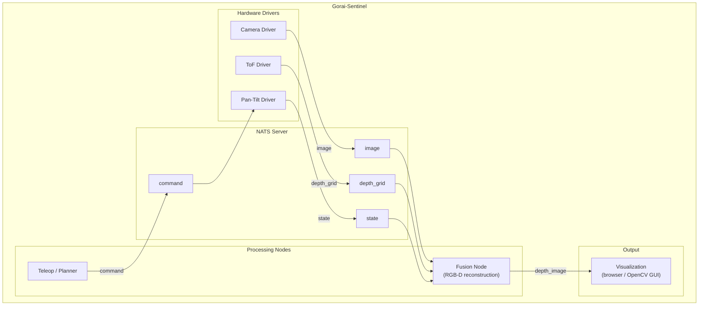
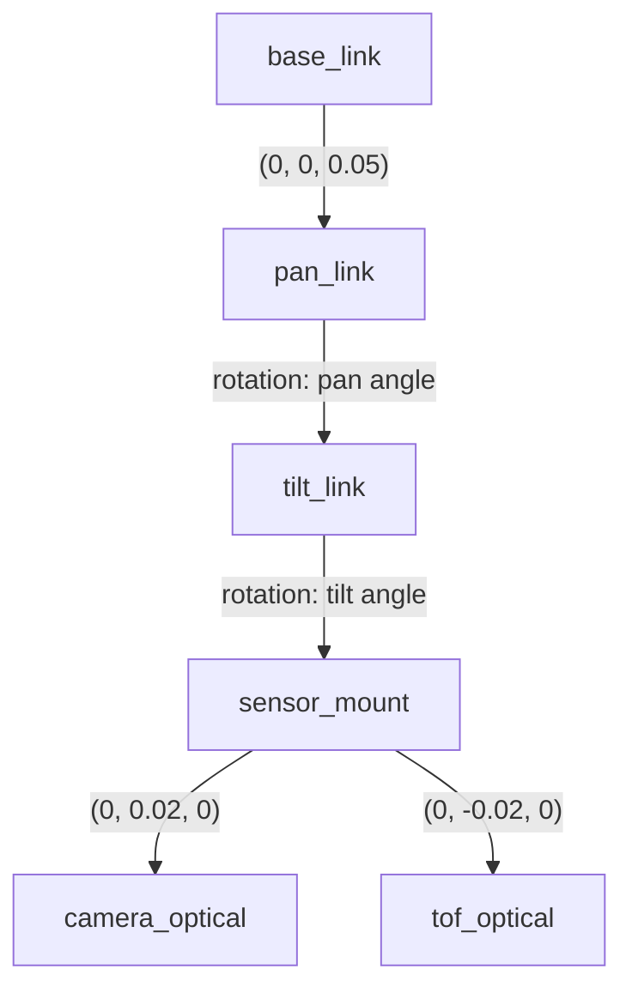
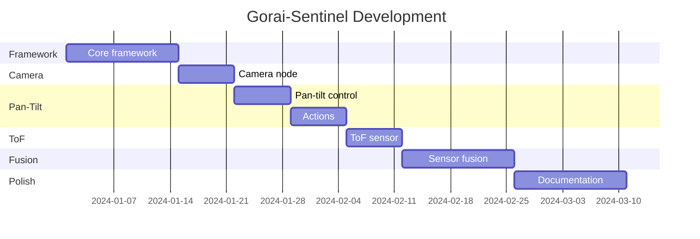

# Gorai-Sentinel: Pan-Tilt Sensor Fusion Platform

**First reference implementation for the Gorai robotics framework**

---

## Overview

Gorai-Sentinel is a pan-tilt sensor fusion platform that combines:

- **Camera**: RGB imaging (USB webcam or CSI camera)
- **ToF Sensor**: Time-of-Flight depth measurement (VL53L5CX 8x8 array)
- **Pan-Tilt Mount**: Two-axis servo control (hobby servos or Dynamixel)

The platform provides a constrained but complete robotics problem: synchronized multi-sensor data acquisition, real-time motor control, and sensor fusion—all core challenges that validate the Gorai framework.

---

## Table of Contents

1. [Why This Project?](#why-this-project)
2. [System Architecture](#system-architecture)
3. [Hardware](#hardware)
4. [Node Specifications](#node-specifications)
5. [Transform Tree](#transform-tree)
6. [Development Milestones](#development-milestones)
7. [Development Roadmap](#development-roadmap)
8. [Hardware Setup Notes](#hardware-setup-notes)

---

## Why This Project?

| Aspect | Validation |
|--------|------------|
| **Multi-sensor fusion** | Tests timestamping, synchronization, transforms |
| **Real-time control** | Tests low-latency command/state loops |
| **Multiple node types** | Camera driver, ToF driver, motor driver, fusion node |
| **Actions** | Pan-tilt movement is a natural action (goal, feedback, completion) |
| **Services** | Homing, calibration are natural service calls |
| **Parameters** | Camera exposure, servo PID gains, fusion weights |
| **Visualization** | Combined RGB+depth output is immediately understandable |

---

## System Architecture



---

## Hardware

### Bill of Materials

| Component | Suggested Part | Approx. Cost | Notes |
|-----------|----------------|--------------|-------|
| **Camera** | Logitech C920 or Raspberry Pi Camera v3 | $30-50 | 1080p, good Linux support |
| **ToF Sensor** | VL53L5CX breakout (Adafruit, Pololu, or SparkFun) | $25 | 8x8 depth grid, 4m range |
| **Servos** | 2x MG996R or Dynamixel XL330 | $20-80 | Hobby servos for prototype, Dynamixel for production |
| **Pan-Tilt Bracket** | Generic aluminum bracket | $15 | Or 3D print custom |
| **Microcontroller** | Raspberry Pi 4/5 or Jetson Nano | $50-150 | Runs NATS + all nodes |
| **Servo Controller** | PCA9685 (hobby) or U2D2 (Dynamixel) | $10-40 | I2C for hobby servos |

**Total: ~$150-350** depending on component choices.

---

## Node Specifications

### Camera Node

**Purpose**: Capture RGB images from camera hardware

**Published Topics**:

| Topic | Type | Rate | Description |
|-------|------|------|-------------|
| `camera.image` | `sensor.Image` | 30 Hz | Raw RGB image |
| `camera.image/compressed` | `sensor.CompressedImage` | 30 Hz | JPEG compressed |
| `camera.info` | `sensor.CameraInfo` | 1 Hz | Intrinsics, distortion |

**Parameters**:

| Parameter | Type | Default | Description |
|-----------|------|---------|-------------|
| `camera.device` | string | `/dev/video0` | Video device path |
| `camera.width` | int | 640 | Frame width |
| `camera.height` | int | 480 | Frame height |
| `camera.fps` | int | 30 | Frames per second |
| `camera.exposure` | int | -1 | Exposure (-1 = auto) |

**Implementation Notes**:
- Use V4L2 for Linux camera access (github.com/blackjack/webcam or custom)
- Timestamp at moment of capture, not publication
- Support both raw and compressed output (skip compression if no subscribers)

```go
// Skeleton implementation
type CameraNode struct {
    node   *node.Node
    pub    *pub.Publisher[sensor.Image]
    pubCmp *pub.Publisher[sensor.CompressedImage]
    device *v4l2.Device
}

func (c *CameraNode) Run(ctx context.Context) error {
    ticker := time.NewTicker(time.Second / 30)
    for {
        select {
        case <-ctx.Done():
            return nil
        case <-ticker.C:
            frame, ts := c.device.Capture()
            img := &sensor.Image{
                Header:   std.NewHeaderAt("camera_optical", ts),
                Width:    uint32(frame.Width),
                Height:   uint32(frame.Height),
                Encoding: "rgb8",
                Data:     frame.Data,
            }
            c.pub.Publish(ctx, img)
        }
    }
}
```

### ToF Node

**Purpose**: Read depth data from VL53L5CX time-of-flight sensor

**Published Topics**:

| Topic | Type | Rate | Description |
|-------|------|------|-------------|
| `tof.depth_grid` | `sensor.DepthGrid` | 15 Hz | 8x8 depth array |
| `tof.pointcloud` | `sensor.PointCloud2` | 15 Hz | 3D points from depth |

**Custom Message Type**:

```protobuf
// sensor.proto (addition)
message DepthGrid {
    gorai.std.Header header = 1;
    uint32 rows = 2;           // 8 for VL53L5CX
    uint32 cols = 3;           // 8 for VL53L5CX
    float field_of_view = 4;   // radians (45° for VL53L5CX)
    repeated float distances = 5;  // mm, row-major
    repeated uint32 status = 6;    // per-zone status
}
```

**Parameters**:

| Parameter | Type | Default | Description |
|-----------|------|---------|-------------|
| `tof.i2c_bus` | int | 1 | I2C bus number |
| `tof.i2c_addr` | int | 0x29 | I2C address |
| `tof.ranging_freq` | int | 15 | Hz (1-60) |
| `tof.integration_time` | int | 20 | ms |

**Implementation Notes**:
- Use periph.io or go-i2c for I2C access
- VL53L5CX requires firmware upload on boot (~80KB)
- Handle sensor status codes (valid, sigma fail, wrap-around, etc.)

### Pan-Tilt Node

**Purpose**: Control pan and tilt servo motors

**Published Topics**:

| Topic | Type | Rate | Description |
|-------|------|------|-------------|
| `pantilt.state` | `control.PanTiltState` | 50 Hz | Current pan/tilt angles |
| `pantilt.joint_state` | `sensor.JointState` | 50 Hz | ROS-compatible format |

**Subscribed Topics**:

| Topic | Type | Description |
|-------|------|-------------|
| `pantilt.command` | `control.PanTiltCommand` | Direct angle command |

**Services**:

| Service | Request | Response | Description |
|---------|---------|----------|-------------|
| `pantilt.home` | `Empty` | `Success` | Move to home position |
| `pantilt.set_limits` | `PanTiltLimits` | `Success` | Set software limits |

**Actions**:

| Action | Goal | Feedback | Result | Description |
|--------|------|----------|--------|-------------|
| `pantilt.move_to` | `PanTiltGoal` | `PanTiltFeedback` | `PanTiltResult` | Move to target position |
| `pantilt.scan` | `ScanGoal` | `ScanFeedback` | `ScanResult` | Execute scan pattern |

**Custom Message Types**:

```protobuf
// control.proto (additions)
message PanTiltGoal {
    double pan = 1;            // target pan (radians)
    double tilt = 2;           // target tilt (radians)
    double max_velocity = 3;   // rad/s, 0 = default
}

message PanTiltFeedback {
    double current_pan = 1;
    double current_tilt = 2;
    double error_pan = 3;
    double error_tilt = 4;
}

message PanTiltResult {
    bool success = 1;
    double final_pan = 2;
    double final_tilt = 3;
}

message ScanGoal {
    double pan_min = 1;
    double pan_max = 2;
    double tilt_min = 3;
    double tilt_max = 4;
    double step = 5;           // radians between positions
    double dwell_time = 6;     // seconds at each position
}

message ScanFeedback {
    uint32 current_step = 1;
    uint32 total_steps = 2;
    double current_pan = 3;
    double current_tilt = 4;
}

message ScanResult {
    bool success = 1;
    uint32 positions_visited = 2;
}
```

**Parameters**:

| Parameter | Type | Default | Description |
|-----------|------|---------|-------------|
| `pantilt.pan.channel` | int | 0 | PWM channel for pan servo |
| `pantilt.tilt.channel` | int | 1 | PWM channel for tilt servo |
| `pantilt.pan.min_angle` | float | -1.57 | Minimum pan (radians) |
| `pantilt.pan.max_angle` | float | 1.57 | Maximum pan (radians) |
| `pantilt.tilt.min_angle` | float | -0.78 | Minimum tilt (radians) |
| `pantilt.tilt.max_angle` | float | 0.78 | Maximum tilt (radians) |
| `pantilt.pan.home` | float | 0.0 | Home position |
| `pantilt.tilt.home` | float | 0.0 | Home position |

**Implementation Notes**:
- PCA9685 via I2C for hobby servos (12-bit PWM, 50Hz)
- Dynamixel Protocol 2.0 for smart servos
- Implement smooth motion profiles (trapezoidal velocity)
- Track commanded vs actual position (open-loop for hobby servos)

### Fusion Node

**Purpose**: Combine camera and ToF data into depth-enhanced images

**Subscribed Topics**:

| Topic | Type | Description |
|-------|------|-------------|
| `camera.image` | `sensor.Image` | RGB image |
| `tof.depth_grid` | `sensor.DepthGrid` | 8x8 depth |
| `pantilt.state` | `control.PanTiltState` | Current pose |

**Published Topics**:

| Topic | Type | Rate | Description |
|-------|------|------|-------------|
| `fusion.depth_image` | `sensor.Image` | 30 Hz | Depth-colorized RGB |
| `fusion.pointcloud` | `sensor.PointCloud2` | 15 Hz | Colored 3D points |
| `fusion.rgbd` | `sensor.RGBD` | 15 Hz | Aligned RGB-D |

**Custom Message Type**:

```protobuf
// sensor.proto (addition)
message RGBD {
    gorai.std.Header header = 1;
    Image rgb = 2;
    Image depth = 3;         // 16-bit depth in mm
    CameraInfo camera_info = 4;
}
```

**Algorithm**:
1. **Temporal synchronization**: Use approximate time synchronization (within 33ms)
2. **Spatial alignment**: Project ToF zones into camera frame using extrinsic calibration
3. **Depth upsampling**: Interpolate 8x8 ToF grid to camera resolution
4. **Visualization**: Colorize depth using jet colormap, blend with RGB

**Parameters**:

| Parameter | Type | Default | Description |
|-----------|------|---------|-------------|
| `fusion.sync_tolerance_ms` | int | 50 | Max time difference for pairing |
| `fusion.extrinsic.tx` | float | 0.0 | ToF→Camera X offset (m) |
| `fusion.extrinsic.ty` | float | 0.0 | ToF→Camera Y offset (m) |
| `fusion.extrinsic.tz` | float | 0.02 | ToF→Camera Z offset (m) |
| `fusion.depth_colormap` | string | "jet" | Colormap for visualization |

---

## Transform Tree

Gorai-Sentinel uses a simple static transform tree:



**Implementation**: For Phase 1, implement a simple static transform publisher. Full TF tree support deferred to Phase 2.

```go
// Simple transform publisher
type StaticTransformPublisher struct {
    pub *pub.Publisher[geometry.TransformStamped]
    transforms []geometry.TransformStamped
}

func (s *StaticTransformPublisher) Run(ctx context.Context) error {
    ticker := time.NewTicker(100 * time.Millisecond)
    for {
        select {
        case <-ctx.Done():
            return nil
        case <-ticker.C:
            for _, tf := range s.transforms {
                tf.Header = std.NewHeader(tf.Header.FrameId)
                s.pub.Publish(ctx, &tf)
            }
        }
    }
}
```

---

## Project Directory Structure

```
gorai/
├── cmd/
│   └── sentinel/                # Sentinel nodes
│       ├── camera/
│       │   └── main.go
│       ├── tof/
│       │   └── main.go
│       ├── pantilt/
│       │   └── main.go
│       └── fusion/
│           └── main.go
│
├── examples/
│   └── sentinel/
│       ├── README.md
│       ├── docker-compose.json
│       └── launch.sh
│
└── docs/
    └── tutorials/
        └── sentinel.md
```

---

## Development Milestones

### Milestone 1: Core Framework

**Goal**: Basic pub/sub working with one node

- [ ] Project scaffolding (go.mod, directory structure)
- [ ] Protocol buffer definitions (std, geometry, sensor)
- [ ] `pkg/node`: Node lifecycle, NATS connection
- [ ] `pkg/pub`: Generic publisher
- [ ] `pkg/sub`: Generic subscriber with callbacks
- [ ] Basic test: Two nodes exchanging messages

**Deliverable**: `examples/hello/` with publisher and subscriber

### Milestone 2: Camera Node

**Goal**: Streaming camera images over NATS

- [ ] `driver/camera`: Camera interface
- [ ] `drivers/v4l2`: V4L2 implementation
- [ ] `cmd/sentinel/camera`: Camera node
- [ ] `cmd/gorai`: Basic CLI with `topic list`, `topic echo`
- [ ] Verify ~30 fps image streaming

**Deliverable**: Camera node running, viewable via CLI

### Milestone 3: Pan-Tilt Control

**Goal**: Servo control with command/state topics

- [ ] `driver/servo`: Servo interface
- [ ] `drivers/pca9685`: PCA9685 PWM driver
- [ ] `cmd/sentinel/pantilt`: Pan-tilt node
- [ ] `pkg/srv`: Service client/server
- [ ] `pantilt.home` service working

**Deliverable**: Pan-tilt responds to commands, reports state

### Milestone 4: Actions

**Goal**: Long-running pan-tilt movements with feedback

- [ ] `pkg/action`: Action client/server
- [ ] `pantilt.move_to` action implemented
- [ ] Smooth motion profiles
- [ ] Cancellation support

**Deliverable**: Action demo moving pan-tilt with progress feedback

### Milestone 5: ToF Sensor

**Goal**: VL53L5CX depth data streaming

- [ ] `driver/tof`: ToF interface
- [ ] `drivers/vl53l5cx`: VL53L5CX I2C driver
- [ ] Firmware upload on initialization
- [ ] `cmd/sentinel/tof`: ToF node
- [ ] Verify ~15 fps depth grid streaming

**Deliverable**: ToF node running, depth data visible via CLI

### Milestone 6: Sensor Fusion

**Goal**: Combined RGB-D output

- [ ] `cmd/sentinel/fusion`: Fusion node
- [ ] Temporal synchronization
- [ ] Extrinsic calibration (manual for now)
- [ ] Depth upsampling (bilinear interpolation)
- [ ] Depth visualization (colormap overlay)
- [ ] `pkg/param`: Parameter store with NATS KV

**Deliverable**: Fusion node producing colorized depth images

### Milestone 7: Polish

**Goal**: Documentation, testing, demo

- [ ] Unit tests for all packages (>70% coverage)
- [ ] Integration test with mock hardware
- [ ] `docs/getting-started.md`
- [ ] `docs/tutorials/sentinel.md`
- [ ] Demo video / GIF
- [ ] Clean up CLI (`gorai topic pub`, `gorai service call`, `gorai param`)

**Deliverable**: Public-ready repository

---

## Development Roadmap

### Phase 1: Gorai-Sentinel

Prove the concept with a working robot.



| Phase | Focus | Deliverable |
|-------|-------|-------------|
| 1-2 | Core framework | Pub/sub working |
| 2-3 | Camera node | Streaming images |
| 3-4 | Pan-tilt control | Command/state loop |
| 4-5 | Actions | move_to with feedback |
| 5-6 | ToF sensor | Depth streaming |
| 6-8 | Fusion | RGB-D output |
| 8-10 | Polish | Docs, tests, demo |

### Phase 2: Framework Hardening

Generalize and extend.

- [ ] Full transform tree (TF equivalent)
- [ ] Bag recording/playback (JetStream)
- [ ] Shared memory transport for local nodes
- [ ] WebSocket bridge for browser visualization
- [ ] Launch system (JSON-based node graph)
- [ ] More drivers (IMU, LIDAR, Dynamixel)
- [ ] Python bindings (optional)

### Phase 3: Community Release

Open source and grow.

- [ ] Public GitHub repository
- [ ] Documentation site
- [ ] Example robots
- [ ] Community drivers
- [ ] Conference talk / blog posts

---

## Hardware Setup Notes

### VL53L5CX I2C Connection

```
Raspberry Pi          VL53L5CX
-----------          ---------
3.3V (pin 1)   -->   VIN
GND (pin 6)    -->   GND
SDA (pin 3)    -->   SDA
SCL (pin 5)    -->   SCL
GPIO17 (pin 11) -->  LPn (optional, for reset)
```

Enable I2C: `sudo raspi-config` → Interfacing Options → I2C

Verify: `i2cdetect -y 1` should show device at 0x29

### PCA9685 Servo Connection

```
Raspberry Pi          PCA9685           Servos
-----------          -------           ------
3.3V (pin 1)   -->   VCC
GND (pin 6)    -->   GND
SDA (pin 3)    -->   SDA
SCL (pin 5)    -->   SCL
                     V+ (5-6V) <------ External power
                     CH0 -------------> Pan servo signal
                     CH1 -------------> Tilt servo signal
```

**Important**: Servos need external 5-6V power supply. Do not power from Pi.

---

## References

- [VL53L5CX Datasheet](https://www.st.com/resource/en/datasheet/vl53l5cx.pdf)
- [PCA9685 Datasheet](https://www.nxp.com/docs/en/data-sheet/PCA9685.pdf)
- [Gorai Framework Specification](gorai-framework-specification.md)
- [Distributed Architecture Options](project-pan-tilt-distributed-option.md)
