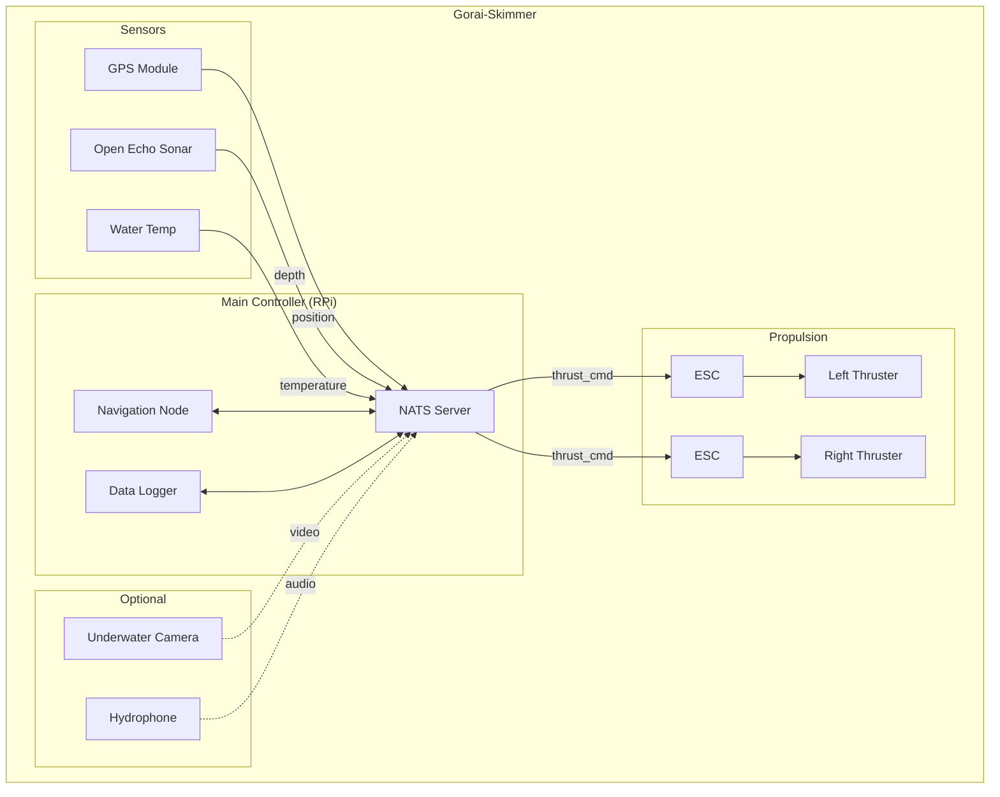
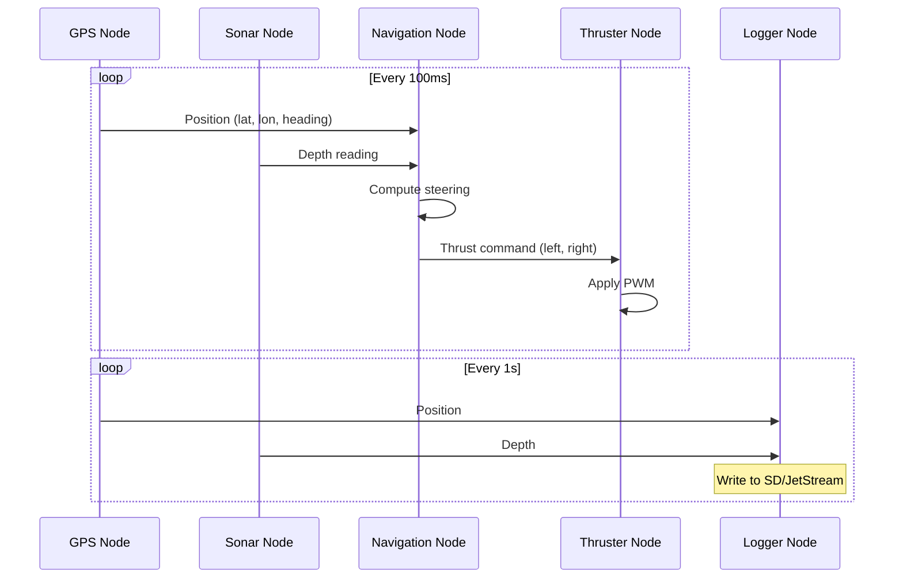
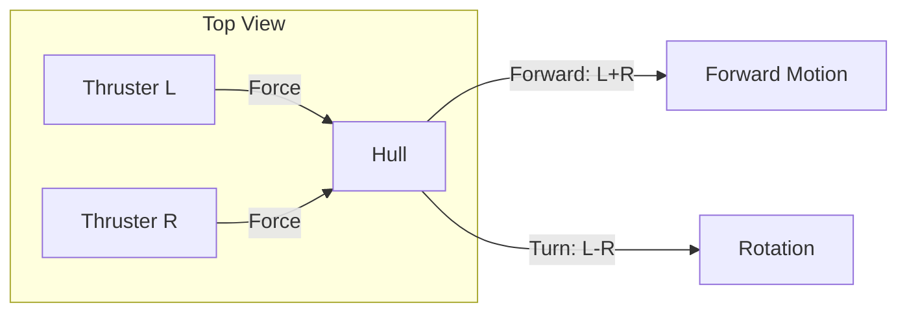
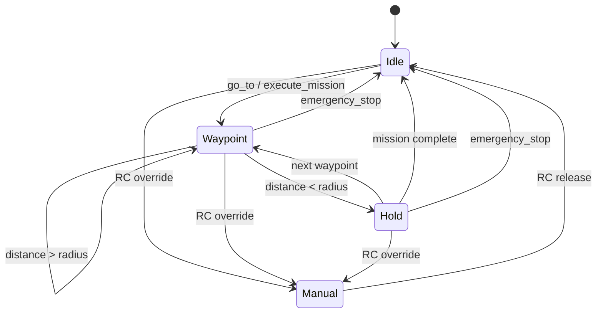
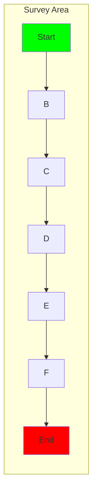

# Gorai-Skimmer: Autonomous Surface Vehicle

**A boogie-board sized surface craft for bathymetry, water monitoring, and aquatic research**

---

## Overview

Gorai-Skimmer is a small autonomous surface vehicle (ASV) built on a boogie-board sized platform. It uses differential thrust for propulsion and steering, with integrated sonar for depth measurement, GPS for navigation, and water temperature sensing for environmental monitoring.

**Key Features:**
- **Differential thrust**: Two brushless thrusters for propulsion and steering
- **Depth sonar**: Open Echo-based bathymetry (0.5-50m depth)
- **Environmental sensors**: Water temperature, GPS positioning
- **Optional**: Underwater camera, hydrophone for ambient audio recording

The platform validates Gorai's ability to handle:
- Real-time motor control with feedback
- Multi-sensor fusion (GPS + sonar + temperature)
- Waypoint navigation and path planning
- Data logging for scientific applications

---

## Table of Contents

1. [Design Goals](#design-goals)
2. [System Architecture](#system-architecture)
3. [Hardware](#hardware)
4. [Node Specifications](#node-specifications)
5. [Navigation & Control](#navigation--control)
6. [Optional Subsystems](#optional-subsystems)
7. [Development Milestones](#development-milestones)
8. [References](#references)

---

## Design Goals

| Goal | Rationale |
|------|-----------|
| **Low cost** | Target <$500 total BOM for base configuration |
| **Portable** | One person can carry and deploy from shore |
| **Modular** | Optional sensors can be added without redesign |
| **Open source** | All hardware and software freely available |
| **Safe** | Low speed, lightweight, no hazard to swimmers |
| **Robust** | Operates in lakes, ponds, slow rivers |

**Not in scope (Phase 1):**
- Ocean/salt water operation
- High-speed operation (>5 knots)
- Autonomous obstacle avoidance
- Multi-vehicle coordination

---

## System Architecture



### Data Flow



---

## Hardware

### Hull & Frame

| Component | Specification | Est. Cost | Notes |
|-----------|---------------|-----------|-------|
| **Hull** | Boogie board (~40" x 20") | $30 | Foam core, buoyant |
| **Waterproof enclosure** | Pelican 1150 or similar | $40 | Electronics housing |
| **Thruster mounts** | 3D printed or aluminum | $20 | Attach to hull sides |
| **Antenna mast** | PVC pipe or fiberglass | $10 | GPS/radio antenna |

### Electronics - Core

| Component | Part | Est. Cost | Notes |
|-----------|------|-----------|-------|
| **Main computer** | Raspberry Pi 4/5 | $60 | Runs NATS + all nodes |
| **GPS** | u-blox NEO-M8N or BN-880 | $25 | UART, 10Hz update |
| **Sonar** | Open Echo TUSS4470 shield | $50 | Arduino Uno + shield |
| **Water temp** | DS18B20 waterproof probe | $8 | 1-Wire, ±0.5°C |
| **Thrusters** | 2x BlueRobotics T100/T200 | $200 | Or bilge pump motors |
| **ESCs** | 2x 30A brushless ESC | $30 | PWM control |
| **Battery** | 4S LiPo 5000mAh | $50 | ~1hr runtime |
| **Power distribution** | BEC + voltage regulators | $20 | 5V for Pi, 12V for thrusters |
| **RC receiver** | FrSky XM+ or similar | $20 | Manual override |

**Base Total: ~$530**

### Electronics - Optional

| Component | Part | Est. Cost | Notes |
|-----------|------|-----------|-------|
| **Underwater camera** | Raspberry Pi Camera + waterproof housing | $60 | Downward facing |
| **Hydrophone** | Aquarian H2a or DIY piezo | $50-200 | Ambient audio recording |
| **Audio ADC** | I2S microphone board | $15 | For hydrophone input |
| **Telemetry radio** | SiK 915MHz or LoRa | $40 | Long-range control |

### Open Echo Sonar Details

The [Open Echo](https://github.com/Neumi/open_echo) project provides open-source bathymetry:

| Spec | Value |
|------|-------|
| **Frequency** | 40 kHz - 1 MHz (transducer dependent) |
| **Range** | 0.5m - 50m+ tested |
| **Resolution** | 8-bit, 1800 samples @ 12μs/sample |
| **Output** | NMEA0183 depth sentences |
| **Interface** | UART (serial) to Pi |
| **Transducers** | Compatible with car parking sensors to Lowrance transducers |

---

## Node Specifications

### GPS Node

**Purpose**: Provide position, velocity, and heading from GNSS receiver

**Published Topics**:

| Topic | Type | Rate | Description |
|-------|------|------|-------------|
| `gps.fix` | `sensor.NavSatFix` | 10 Hz | Lat/lon/alt position |
| `gps.velocity` | `geometry.TwistStamped` | 10 Hz | Ground speed and heading |
| `gps.satellites` | `sensor.NavSatStatus` | 1 Hz | Fix quality, satellite count |

**Custom Message Types**:

```protobuf
// sensor.proto (additions)
message NavSatFix {
    gorai.std.Header header = 1;
    uint32 status = 2;         // STATUS_NO_FIX=0, FIX=1, SBAS=2, DGPS=3
    double latitude = 3;       // degrees
    double longitude = 4;      // degrees
    double altitude = 5;       // meters above ellipsoid
    repeated double position_covariance = 6;  // 3x3 row-major
    uint32 position_covariance_type = 7;
}

message NavSatStatus {
    uint32 status = 1;
    uint32 satellites_visible = 2;
    uint32 satellites_used = 3;
    double hdop = 4;
    double vdop = 5;
}
```

**Parameters**:

| Parameter | Type | Default | Description |
|-----------|------|---------|-------------|
| `gps.device` | string | `/dev/ttyUSB0` | Serial port |
| `gps.baud` | int | 115200 | Baud rate |
| `gps.frame_id` | string | `gps_link` | TF frame |

**Implementation Notes**:
- Parse NMEA sentences (GGA, RMC, VTG)
- Consider u-blox binary protocol for higher rate
- Handle fix loss gracefully

```go
type GPSNode struct {
    node   *node.Node
    pub    *pub.Publisher[sensor.NavSatFix]
    velPub *pub.Publisher[geometry.TwistStamped]
    serial *serial.Port
}

func (g *GPSNode) Run(ctx context.Context) error {
    reader := bufio.NewReader(g.serial)
    for {
        select {
        case <-ctx.Done():
            return nil
        default:
            line, err := reader.ReadString('\n')
            if err != nil {
                continue
            }
            if fix := parseGGA(line); fix != nil {
                g.pub.Publish(ctx, fix)
            }
            if vel := parseVTG(line); vel != nil {
                g.velPub.Publish(ctx, vel)
            }
        }
    }
}
```

### Sonar Node

**Purpose**: Interface with Open Echo sonar for depth measurement

**Published Topics**:

| Topic | Type | Rate | Description |
|-------|------|------|-------------|
| `sonar.depth` | `sensor.Range` | 5-10 Hz | Water depth |
| `sonar.echo` | `sensor.EchoData` | 5 Hz | Raw echo profile (optional) |

**Custom Message Types**:

```protobuf
// sensor.proto (additions)
message EchoData {
    gorai.std.Header header = 1;
    uint32 sample_count = 2;
    uint32 sample_interval_us = 3;  // microseconds per sample
    float speed_of_sound = 4;       // m/s (temperature compensated)
    bytes samples = 5;              // 8-bit echo amplitude
}
```

**Parameters**:

| Parameter | Type | Default | Description |
|-----------|------|---------|-------------|
| `sonar.device` | string | `/dev/ttyACM0` | Arduino serial port |
| `sonar.baud` | int | 115200 | Baud rate |
| `sonar.speed_of_sound` | float | 1480.0 | m/s in water |
| `sonar.min_depth` | float | 0.5 | Minimum valid depth (m) |
| `sonar.max_depth` | float | 50.0 | Maximum valid depth (m) |

**Implementation Notes**:
- Open Echo outputs NMEA0183 `$SDDPT` (depth) sentences
- Can also request raw echo data for bottom classification
- Temperature compensation for speed of sound: `c = 1449.2 + 4.6T - 0.055T² + 0.00029T³`

```go
type SonarNode struct {
    node   *node.Node
    pub    *pub.Publisher[sensor.Range]
    serial *serial.Port
    sos    float64  // speed of sound
}

func (s *SonarNode) Run(ctx context.Context) error {
    reader := bufio.NewReader(s.serial)
    for {
        select {
        case <-ctx.Done():
            return nil
        default:
            line, err := reader.ReadString('\n')
            if err != nil {
                continue
            }
            // Parse NMEA: $SDDPT,12.5,0.0*XX
            if depth := parseDepth(line); depth > 0 {
                s.pub.Publish(ctx, &sensor.Range{
                    Header:        std.NewHeader("sonar_link"),
                    RadiationType: sensor.ULTRASOUND,
                    FieldOfView:   0.26, // ~15° cone
                    MinRange:      0.5,
                    MaxRange:      50.0,
                    Range:         float32(depth),
                })
            }
        }
    }
}
```

### Temperature Node

**Purpose**: Read water temperature from DS18B20 probe

**Published Topics**:

| Topic | Type | Rate | Description |
|-------|------|------|-------------|
| `water.temperature` | `sensor.Temperature` | 1 Hz | Water temperature |

**Custom Message Types**:

```protobuf
// sensor.proto (additions)
message Temperature {
    gorai.std.Header header = 1;
    double temperature = 2;    // Celsius
    double variance = 3;       // uncertainty
}
```

**Parameters**:

| Parameter | Type | Default | Description |
|-----------|------|---------|-------------|
| `temp.device` | string | `/sys/bus/w1/devices/28-*/w1_slave` | 1-Wire path |
| `temp.offset` | float | 0.0 | Calibration offset (°C) |

**Implementation Notes**:
- DS18B20 uses 1-Wire protocol, accessible via sysfs on Pi
- Reading takes ~750ms at 12-bit resolution
- Consider running in goroutine to not block

### Thruster Node

**Purpose**: Control differential thrust for propulsion and steering

**Subscribed Topics**:

| Topic | Type | Description |
|-------|------|-------------|
| `thrust.command` | `control.ThrustCommand` | Commanded thrust |

**Published Topics**:

| Topic | Type | Rate | Description |
|-------|------|------|-------------|
| `thrust.state` | `control.ThrustState` | 20 Hz | Current thrust levels |

**Custom Message Types**:

```protobuf
// control.proto (additions)
message ThrustCommand {
    gorai.std.Header header = 1;
    float left = 2;            // -1.0 to 1.0
    float right = 3;           // -1.0 to 1.0
}

message ThrustState {
    gorai.std.Header header = 1;
    float left = 2;
    float right = 3;
    float battery_voltage = 4;
    float current_draw = 5;    // amps (if sensed)
}

message DifferentialDrive {
    gorai.std.Header header = 1;
    float throttle = 2;        // -1.0 to 1.0 (forward/reverse)
    float steering = 3;        // -1.0 to 1.0 (left/right)
}
```

**Services**:

| Service | Request | Response | Description |
|---------|---------|----------|-------------|
| `thrust.arm` | `Empty` | `Success` | Arm ESCs |
| `thrust.disarm` | `Empty` | `Success` | Disarm ESCs |
| `thrust.emergency_stop` | `Empty` | `Success` | Immediate stop |

**Parameters**:

| Parameter | Type | Default | Description |
|-----------|------|---------|-------------|
| `thrust.left.pin` | int | 18 | GPIO pin for left ESC |
| `thrust.right.pin` | int | 19 | GPIO pin for right ESC |
| `thrust.pwm_freq` | int | 50 | PWM frequency (Hz) |
| `thrust.min_pulse` | int | 1100 | Minimum pulse width (μs) |
| `thrust.max_pulse` | int | 1900 | Maximum pulse width (μs) |
| `thrust.deadband` | float | 0.05 | Ignore commands below this |

**Implementation Notes**:
- ESCs typically want 50Hz PWM with 1000-2000μs pulses
- Implement soft ramping to avoid current spikes
- RC override should bypass software control

```go
type ThrusterNode struct {
    node     *node.Node
    leftPWM  *pwm.PWM
    rightPWM *pwm.PWM
    armed    bool
}

func (t *ThrusterNode) handleCommand(cmd *control.ThrustCommand) {
    if !t.armed {
        return
    }

    // Clamp and apply deadband
    left := clamp(cmd.Left, -1.0, 1.0)
    right := clamp(cmd.Right, -1.0, 1.0)

    if abs(left) < t.deadband {
        left = 0
    }
    if abs(right) < t.deadband {
        right = 0
    }

    // Convert to PWM pulse width
    t.leftPWM.SetDuty(thrustToPulse(left))
    t.rightPWM.SetDuty(thrustToPulse(right))
}

func thrustToPulse(thrust float64) int {
    // Map [-1, 1] to [1100, 1900] μs
    return int(1500 + thrust*400)
}
```

### Navigation Node

**Purpose**: Waypoint following and path execution

**Subscribed Topics**:

| Topic | Type | Description |
|-------|------|-------------|
| `gps.fix` | `sensor.NavSatFix` | Current position |
| `gps.velocity` | `geometry.TwistStamped` | Current velocity |

**Published Topics**:

| Topic | Type | Rate | Description |
|-------|------|------|-------------|
| `thrust.command` | `control.ThrustCommand` | Computed thrust |
| `nav.status` | `nav.NavigationStatus` | Current navigation state |

**Services**:

| Service | Request | Response | Description |
|---------|---------|----------|-------------|
| `nav.go_to` | `NavSatFix` | `Success` | Go to single waypoint |
| `nav.hold_position` | `Empty` | `Success` | Station keeping |
| `nav.return_home` | `Empty` | `Success` | Return to launch point |

**Actions**:

| Action | Goal | Feedback | Result | Description |
|--------|------|----------|--------|-------------|
| `nav.execute_mission` | `Mission` | `MissionFeedback` | `MissionResult` | Execute waypoint list |
| `nav.survey_area` | `SurveyGoal` | `SurveyFeedback` | `SurveyResult` | Lawnmower survey pattern |

**Custom Message Types**:

```protobuf
// nav.proto
syntax = "proto3";
package gorai.nav;

import "std.proto";
import "sensor.proto";

message Waypoint {
    double latitude = 1;
    double longitude = 2;
    float speed = 3;           // m/s, 0 = default
    float acceptance_radius = 4;  // meters
    uint32 hold_time = 5;      // seconds to hold at waypoint
}

message Mission {
    repeated Waypoint waypoints = 1;
    bool loop = 2;             // repeat mission
}

message MissionFeedback {
    uint32 current_waypoint = 1;
    uint32 total_waypoints = 2;
    float distance_to_waypoint = 3;
    float bearing_to_waypoint = 4;
}

message MissionResult {
    bool success = 1;
    uint32 waypoints_completed = 2;
    string error_message = 3;
}

message SurveyGoal {
    double lat_min = 1;
    double lat_max = 2;
    double lon_min = 3;
    double lon_max = 4;
    float line_spacing = 5;    // meters between survey lines
    float speed = 6;
}

message SurveyFeedback {
    uint32 current_line = 1;
    uint32 total_lines = 2;
    float percent_complete = 3;
}

message SurveyResult {
    bool success = 1;
    float area_covered = 2;    // square meters
    uint32 depth_samples = 3;
}

message NavigationStatus {
    gorai.std.Header header = 1;
    uint32 state = 2;          // IDLE=0, WAYPOINT=1, HOLD=2, MANUAL=3
    float cross_track_error = 3;
    float distance_to_goal = 4;
    float bearing_to_goal = 5;
    float current_speed = 6;
}
```

**Parameters**:

| Parameter | Type | Default | Description |
|-----------|------|---------|-------------|
| `nav.default_speed` | float | 1.0 | Default cruise speed (m/s) |
| `nav.acceptance_radius` | float | 3.0 | Waypoint reached threshold (m) |
| `nav.kp_heading` | float | 0.5 | Heading P gain |
| `nav.kp_crosstrack` | float | 0.3 | Cross-track P gain |
| `nav.max_turn_rate` | float | 0.5 | Max differential thrust |

**Control Algorithm**:

```go
func (n *NavNode) computeThrust(current, target *NavSatFix, heading float64) *ThrustCommand {
    // Calculate bearing and distance to target
    bearing := calculateBearing(current, target)
    distance := calculateDistance(current, target)

    // Heading error (normalize to [-π, π])
    headingError := normalizeAngle(bearing - heading)

    // Cross-track error for line following
    crossTrack := n.calculateCrossTrackError(current)

    // Simple proportional control
    steer := n.kpHeading*headingError + n.kpCrosstrack*crossTrack
    steer = clamp(steer, -n.maxTurnRate, n.maxTurnRate)

    // Throttle based on distance (slow down near waypoint)
    throttle := n.defaultSpeed
    if distance < 10.0 {
        throttle *= distance / 10.0
    }

    // Convert to differential thrust
    return &ThrustCommand{
        Left:  float32(throttle + steer),
        Right: float32(throttle - steer),
    }
}
```

### Logger Node

**Purpose**: Record all sensor data for post-processing

**Subscribed Topics**:
- `gps.fix`
- `sonar.depth`
- `water.temperature`
- `thrust.state`
- `nav.status`

**Parameters**:

| Parameter | Type | Default | Description |
|-----------|------|---------|-------------|
| `logger.path` | string | `/data/logs` | Log file directory |
| `logger.format` | string | `csv` | Output format (csv, json, bag) |
| `logger.flush_interval` | int | 5 | Seconds between flushes |

**Output Formats**:

CSV (simple):
```csv
timestamp,lat,lon,depth,temperature,thrust_l,thrust_r
1699574932.123,45.12345,-122.54321,12.5,15.2,0.5,0.5
```

JetStream bag (NATS native):
- All messages stored with original timestamps
- Replay capability for debugging

---

## Navigation & Control

### Differential Thrust Model



| Command | Left Thrust | Right Thrust | Result |
|---------|-------------|--------------|--------|
| Forward | +0.5 | +0.5 | Straight ahead |
| Reverse | -0.5 | -0.5 | Straight back |
| Turn left | +0.3 | +0.7 | Arc left |
| Turn right | +0.7 | +0.3 | Arc right |
| Spin left | -0.5 | +0.5 | Rotate in place |
| Spin right | +0.5 | -0.5 | Rotate in place |

### Waypoint Navigation



### Survey Patterns

**Lawnmower Pattern** for bathymetric survey:



```go
func generateLawnmowerPath(bounds SurveyGoal) []Waypoint {
    var waypoints []Waypoint

    lines := int((bounds.LatMax - bounds.LatMin) / metersToLat(bounds.LineSpacing))
    direction := 1.0

    for i := 0; i <= lines; i++ {
        lat := bounds.LatMin + float64(i)*metersToLat(bounds.LineSpacing)

        if direction > 0 {
            waypoints = append(waypoints,
                Waypoint{Latitude: lat, Longitude: bounds.LonMin},
                Waypoint{Latitude: lat, Longitude: bounds.LonMax},
            )
        } else {
            waypoints = append(waypoints,
                Waypoint{Latitude: lat, Longitude: bounds.LonMax},
                Waypoint{Latitude: lat, Longitude: bounds.LonMin},
            )
        }
        direction *= -1
    }

    return waypoints
}
```

---

## Optional Subsystems

### Underwater Camera

**Purpose**: Visual inspection of bottom, aquatic life observation

**Hardware**:
- Raspberry Pi Camera Module v3
- Waterproof housing (custom or commercial dive housing)
- LED ring for illumination (optional)

**Published Topics**:

| Topic | Type | Rate | Description |
|-------|------|------|-------------|
| `camera.image` | `sensor.CompressedImage` | 5-15 Hz | JPEG frames |
| `camera.video` | `sensor.CompressedImage` | 30 Hz | H.264 stream |

**Parameters**:

| Parameter | Type | Default | Description |
|-----------|------|---------|-------------|
| `camera.resolution` | string | `1080p` | Video resolution |
| `camera.fps` | int | 15 | Frame rate |
| `camera.recording` | bool | false | Enable local recording |

**Implementation Notes**:
- Use rpicam-vid for H.264 encoding
- Store locally and stream thumbnails over NATS
- Sync with depth/position for geotagging

### Hydrophone (Underwater Microphone)

**Purpose**: Record ambient underwater audio for research

**Hardware Options**:

| Option | Price | Frequency Response | Notes |
|--------|-------|-------------------|-------|
| Aquarian H2a | $200 | 10 Hz - 100 kHz | Professional quality |
| Contact mic + waterproofing | $30 | 20 Hz - 20 kHz | DIY option |
| Piezo element in epoxy | $10 | Variable | Experimental |

**Audio Capture**:
- I2S ADC (e.g., INMP441 or PCM1808)
- Sample rate: 48 kHz typical, up to 192 kHz for ultrasonic
- Store as WAV files synced with GPS timestamps

**Published Topics**:

| Topic | Type | Rate | Description |
|-------|------|------|-------------|
| `hydrophone.audio` | `sensor.Audio` | Continuous | Audio stream |
| `hydrophone.spectrum` | `sensor.Spectrum` | 1 Hz | FFT spectrum |

**Custom Message Types**:

```protobuf
// sensor.proto (additions)
message Audio {
    gorai.std.Header header = 1;
    uint32 sample_rate = 2;
    uint32 channels = 3;
    uint32 bits_per_sample = 4;
    bytes data = 5;
}

message Spectrum {
    gorai.std.Header header = 1;
    float frequency_min = 2;
    float frequency_max = 3;
    uint32 bins = 4;
    repeated float magnitudes = 5;  // dB
}
```

**Applications**:
- Fish activity detection
- Boat traffic monitoring
- Environmental noise assessment
- Cetacean research

---

## Development Milestones

### Milestone 1: Basic Teleoperation

**Goal**: RC-controlled boat with telemetry

- [ ] Hull preparation and thruster mounting
- [ ] Power system (battery, BEC, wiring)
- [ ] Thruster node with RC input
- [ ] Basic telemetry (voltage, GPS position)

**Deliverable**: Boat drives under RC control, position logged

### Milestone 2: GPS Navigation

**Goal**: Waypoint following

- [ ] GPS node with NMEA parsing
- [ ] Navigation node with waypoint logic
- [ ] Simple web UI for waypoint entry
- [ ] Return-to-home on signal loss

**Deliverable**: Boat navigates to single waypoint and holds

### Milestone 3: Sonar Integration

**Goal**: Depth measurement while moving

- [ ] Open Echo hardware assembly
- [ ] Sonar node with NMEA depth parsing
- [ ] Depth logging with GPS position
- [ ] Temperature compensation

**Deliverable**: Bathymetric data collection working

### Milestone 4: Survey Mode

**Goal**: Autonomous survey patterns

- [ ] Lawnmower pattern generation
- [ ] Mission execution action
- [ ] Survey progress feedback
- [ ] Post-processing tools (depth map generation)

**Deliverable**: Autonomous bathymetric survey of small pond

### Milestone 5: Optional Sensors

**Goal**: Camera and hydrophone integration

- [ ] Underwater camera housing
- [ ] Camera node with recording
- [ ] Hydrophone integration
- [ ] Synchronized data logging

**Deliverable**: Multi-modal data collection platform

---

## Project Directory Structure

```
gorai/
├── cmd/
│   └── skimmer/
│       ├── gps/
│       │   └── main.go
│       ├── sonar/
│       │   └── main.go
│       ├── temperature/
│       │   └── main.go
│       ├── thruster/
│       │   └── main.go
│       ├── navigation/
│       │   └── main.go
│       ├── logger/
│       │   └── main.go
│       ├── camera/           # optional
│       │   └── main.go
│       └── hydrophone/       # optional
│           └── main.go
│
├── api/proto/gorai/
│   └── nav/
│       └── nav.proto
│
├── tools/
│   └── skimmer/
│       ├── mission_planner/  # web UI for waypoints
│       ├── depth_mapper/     # post-processing
│       └── audio_viewer/     # spectrogram display
│
└── docs/
    └── tutorials/
        └── skimmer.md
```

---

## Safety Considerations

### Hardware Safety

- **Kill switch**: Physical RC-activated motor cutoff
- **Buoyancy**: Ensure positive buoyancy even when flooded
- **Visibility**: Bright colors, flag for visibility
- **Battery**: Waterproof battery compartment with venting
- **Propeller guards**: Prevent injury to swimmers/wildlife

### Software Safety

```go
// Watchdog: Stop if no commands received
func (t *ThrusterNode) watchdog(ctx context.Context) {
    timeout := 500 * time.Millisecond
    timer := time.NewTimer(timeout)

    for {
        select {
        case <-ctx.Done():
            return
        case <-t.commandReceived:
            timer.Reset(timeout)
        case <-timer.C:
            t.emergencyStop()
            t.node.Logger().Warn("watchdog timeout, motors stopped")
            timer.Reset(timeout)
        }
    }
}
```

### Operational Safety

- Never operate near swimmers
- Maintain visual line of sight
- Check weather (wind, waves) before deployment
- Test RC override before each mission
- Carry retrieval plan (rope, kayak)

---

## References

- [Open Echo Sonar](https://github.com/Neumi/open_echo)
- [BlueRobotics T100/T200 Thrusters](https://bluerobotics.com/store/thrusters/)
- [u-blox NEO-M8 GPS](https://www.u-blox.com/en/product/neo-m8-series)
- [DS18B20 Temperature Sensor](https://www.analog.com/media/en/technical-documentation/data-sheets/DS18B20.pdf)
- [Gorai Framework Specification](gorai-framework-specification.md)
- [Distributed Architecture Options](project-pan-tilt-distributed-option.md)
