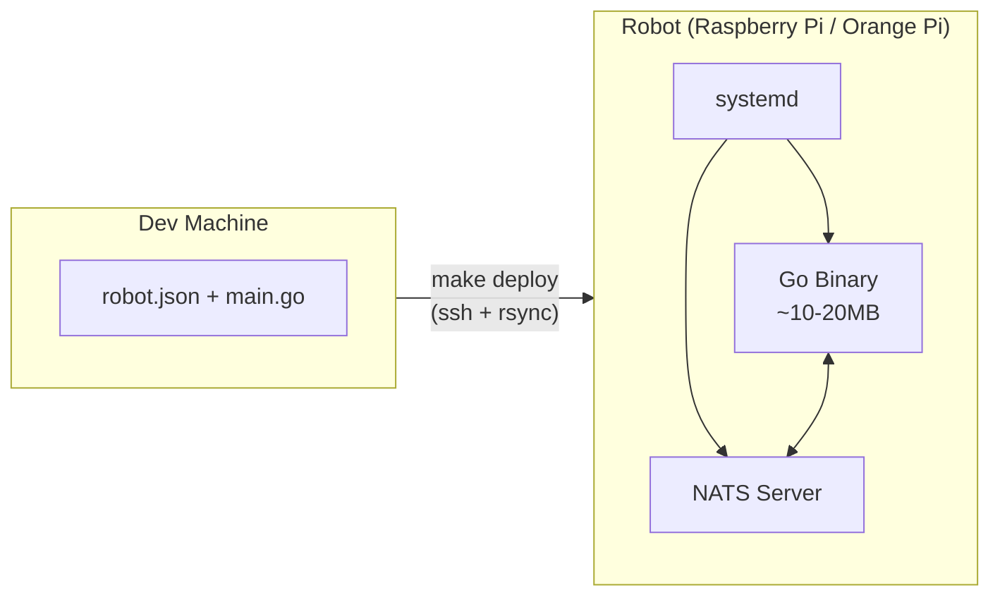
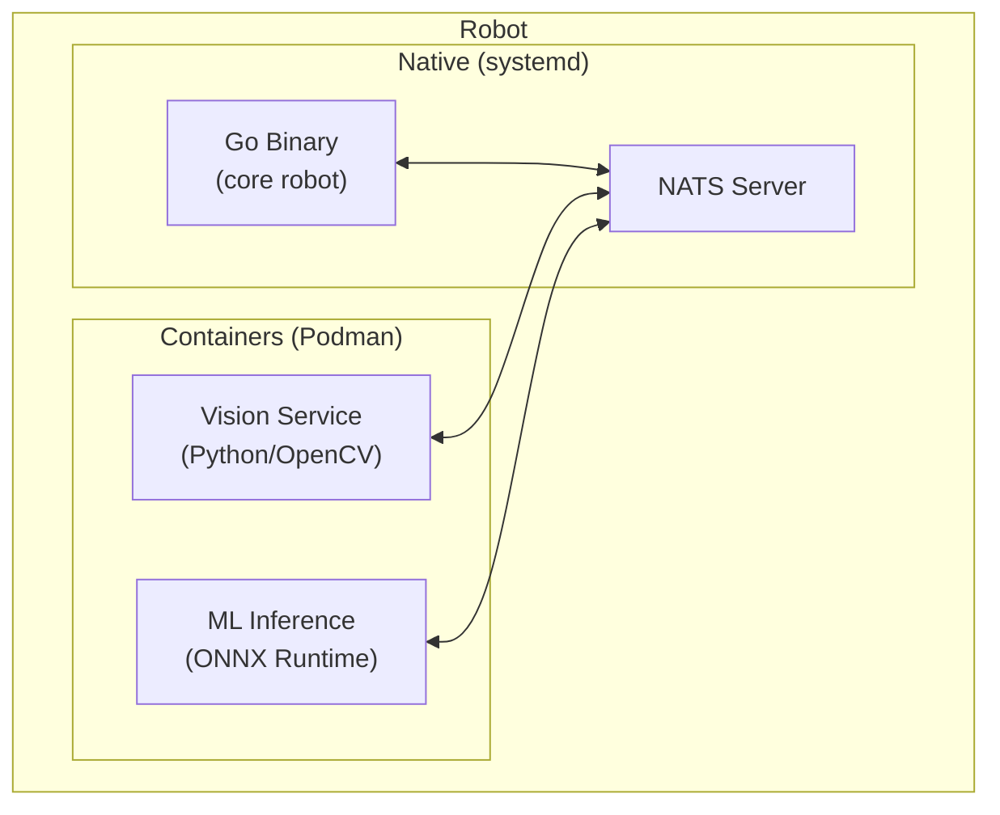
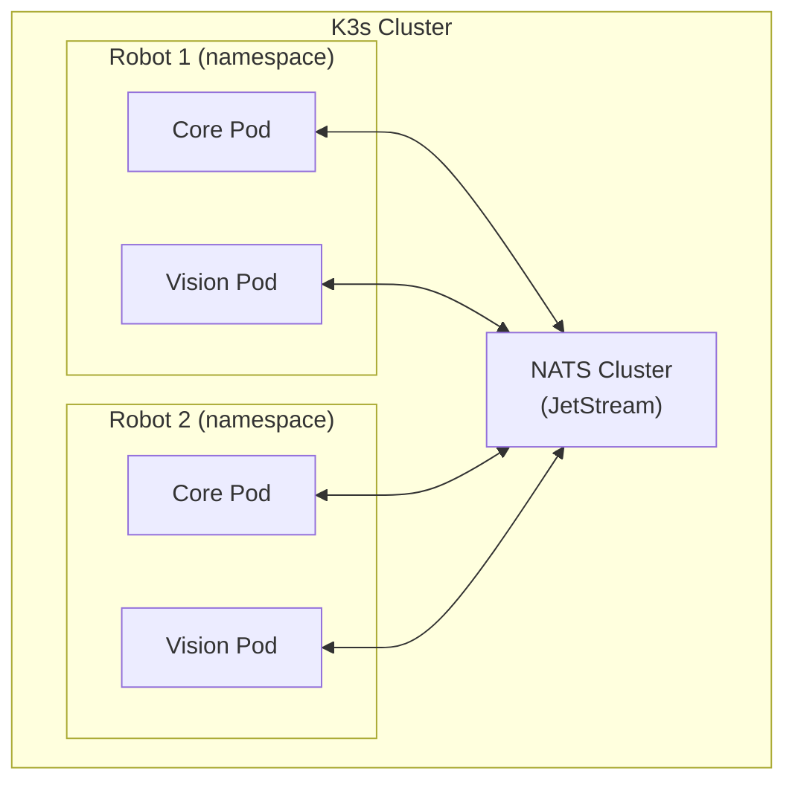

# Deployment Modes

**Version:** 1.0
**Status:** Active
**Last Updated:** 2025-01-24

## Overview

Gorai supports progressive deployment modes that match robot complexity. Start simple and add orchestration only when needed.

> **Important:** Only Mode 1 (Simple Binary) is currently implemented and tested. Modes 2 and 3 are documented designs preserved for future implementation.

---

## Mode 1: Simple Binary (Current)

**Status: Implemented and Tested**

The primary deployment mode. A single Go binary runs directly on the robot, managed by systemd.



### Characteristics

| Aspect | Value |
|--------|-------|
| Binary size | ~10-20MB |
| RAM usage | ~20-50MB |
| Dependencies | NATS server only |
| Orchestration | systemd |
| Container runtime | None required |

### When to Use

- Building your first robot
- Learning and prototyping
- Single-robot deployments
- Resource-constrained devices (< 2GB RAM)
- All components implementable in pure Go

### Deployment

```bash
# Build for target
GOOS=linux GOARCH=arm64 go build -o myrobot ./cmd/myrobot

# Deploy via SSH
rsync -avz myrobot robot.json pi@robot.local:/opt/myrobot/
ssh pi@robot.local "sudo systemctl restart myrobot"
```

### systemd Service

```ini
[Unit]
Description=My Robot
After=network-online.target nats.service

[Service]
Type=simple
User=pi
WorkingDirectory=/opt/myrobot
ExecStart=/opt/myrobot/myrobot --config /opt/myrobot/robot.json
Restart=always
SupplementaryGroups=gpio i2c spi video dialout

[Install]
WantedBy=multi-user.target
```

---

## Mode 2: Containerized Services (Future - Untested)

**Status: Design Only - Not Implemented**

> **Warning:** This mode is a planned future capability. The designs are preserved but the implementation has not been built or tested. Do not rely on this for production use.

For robots requiring ML/vision services that need Python or C++, individual services run in Podman containers while the core robot remains a native binary.



### When This Would Be Needed

- Vision processing (OpenCV, Python)
- ML inference (PyTorch, TensorFlow, ONNX)
- SLAM algorithms (Cartographer, C++)
- Sufficient resources (4GB+ RAM)

### Preserved Design Documents

- [systemd-container-orchestration-v2.md](archive/systemd-container-orchestration-v2.md)
- [gorai-container-v2.md](archive/gorai-container-v2.md)

---

## Mode 3: K3s Fleet Management (Future - Untested)

**Status: Design Only - Not Implemented**

> **Warning:** This mode is a planned future capability. The designs are preserved but the implementation has not been built or tested. Do not rely on this for production use.

Full Kubernetes-based orchestration for production robot fleets.



### When This Would Be Needed

- Managing multiple robots (fleet)
- Rolling updates without downtime
- Resource isolation and limits
- Health checks with auto-restart
- Production deployment requirements

### Preserved Design Documents

- [k3s-installation.md](../docs/archive/future-state/k3s-installation.md)
- [deployment-k3s-v3.md](archive/deployment-k3s-v3.md)

---

## Decision Matrix

| Question | Mode 1 (Binary) | Mode 2 (Containers) | Mode 3 (K3s) |
|----------|-----------------|---------------------|--------------|
| **Status** | **Implemented** | Design only | Design only |
| How many robots? | 1 | 1 | 2+ |
| Need ML/vision? | No | Yes | Yes |
| Available RAM | < 2GB | 4GB+ | 4GB+ |
| Need rolling updates? | No | No | Yes |
| Production fleet? | No | No | Yes |
| Complexity | Low | Medium | High |

---

## Migration Path (Future)

When container and K3s modes are implemented, migration will be additive:

### Mode 1 → Mode 2

1. Install Podman on robot
2. Add `services` section to RDL (existing components unchanged)
3. Build container images for vision/ML
4. Services communicate via existing NATS topics

### Mode 2 → Mode 3

1. Install K3s
2. Change deployment: `gorai run` → `gorai deploy`
3. Add optional resource limits to RDL
4. Same RDL format works across all modes

---

## Current Recommendation

**Use Mode 1 (Simple Binary) for all deployments.**

The simple binary deployment is:
- Fully implemented and tested
- Sufficient for most prosumer robotics use cases
- The foundation that future modes will build upon

Container and K3s modes will be implemented when there is demonstrated need and resources to properly test them.

---

## Related Documentation

- [Build Targets](build-targets.md) - Cross-compilation for different platforms
- [Hardware Requirements](hardware-requirements.md) - Supported boards
- [Runtime Specification](runtime.md) - Robot lifecycle management
- [Future Roadmap](../docs/FUTURE-ROADMAP.md) - Phase planning

---

**Last Updated:** 2025-01-24
