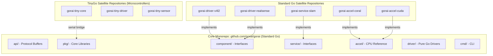
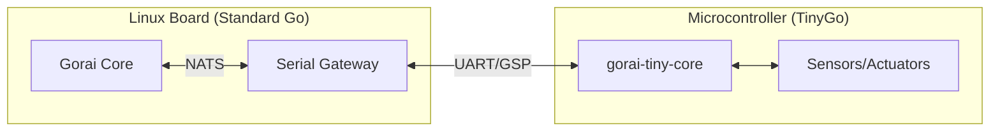

# Gorai Code Organization Specification

**Version 0.1.0**

This specification defines the mandatory code organization structure for the Gorai framework and all associated modules.

---

## Table of Contents

1. [Overview](#overview)
2. [Repository Structure](#repository-structure)
3. [Core Repository Layout](#core-repository-layout)
4. [Satellite Repository Naming](#satellite-repository-naming)
5. [Registration Pattern](#registration-pattern)
6. [Placement Rules](#placement-rules)
7. [TinyGo Module](#tinygo-module)
8. [Versioning](#versioning)
9. [Discovery](#discovery)
10. [Prohibited Patterns](#prohibited-patterns)

---

## Overview

Gorai is a **Linux-based robotics platform**. Every robot running Gorai **SHALL** have at least one network-capable Linux board as the primary compute node. This board runs the Gorai core, connects to the NATS bus, and coordinates all robot functionality.

Gorai uses a **hybrid monorepo architecture** consisting of:

- **One core monorepo** (`github.com/gorai/gorai`) containing all interfaces, core libraries, and reference implementations — **always standard Go**
- **Satellite repositories** for hardware-specific drivers, accelerator backends, and complex services with heavy dependencies — **standard Go**
- **TinyGo satellite repositories** for microcontroller peripherals — **TinyGo only**

This structure is **mandatory**. All contributions must follow this organization.

### Platform Requirements

| Node Type | Platform | Language | Role |
|-----------|----------|----------|------|
| Primary compute | Linux SBC/server | Standard Go | Core framework, NATS, AI/ML |
| Secondary nodes | Linux SBC | Standard Go | Distributed sensors, actuators |
| Microcontroller peripherals | Bare metal/RTOS | TinyGo | Low-level sensors, motor control |

See [Linux Boards Specification](linux-boards.md) for supported hardware. The **Raspberry Pi 5** is the reference platform for initial testing and verification.

### Language Requirements

| Repository Type | Language | Target |
|-----------------|----------|--------|
| Core (`gorai`) | Standard Go | Linux servers, workstations, SBCs |
| Satellites (`gorai-driver-*`, `gorai-accel-*`) | Standard Go | Linux servers, workstations, SBCs |
| TinyGo satellites (`gorai-tiny-*`) | TinyGo | Microcontrollers, ultra-low-power devices |

**Standard Go** is required for:
- All core framework code
- All drivers running on Linux-based systems
- All accelerator backends
- All services

**TinyGo** is exclusively for:
- Microcontrollers (Arduino, ESP32, RP2040, STM32, etc.)
- Ultra-low-power embedded devices
- Hardware that cannot run Linux

Microcontroller nodes communicate with Linux nodes via serial using the Gorai Serial Protocol (GSP). A Linux node runs a serial-to-NATS gateway that proxies messages between the microcontroller and the NATS bus. See [gorai-gsp](https://github.com/emergingrobotics/gorai-gsp) for the GSP/2 protocol specification and implementation.



---

## Repository Structure

### Core Repository

The core repository **SHALL** be located at `github.com/gorai/gorai`.

The core repository **SHALL** contain:
- All interface definitions
- All Protocol Buffer definitions
- Core libraries (node, pub/sub, service, action)
- Reference implementations without CGo dependencies
- CLI tool
- Examples

The core repository **SHALL NOT** contain:
- CGo dependencies to external C libraries
- Platform-specific code that cannot compile on all supported platforms
- Large binary assets (models, maps, datasets)

### Satellite Repositories

Satellite repositories **SHALL** be used for:
- Drivers requiring CGo bindings to external libraries
- Accelerator backends with platform-specific dependencies
- Services with large dependency trees
- Community-contributed implementations

Satellite repositories **SHALL** be located at `github.com/gorai/gorai-{category}-{name}`.

---

## Core Repository Layout

The following directory structure is **mandatory** for the core repository:

```
github.com/gorai/gorai/
├── go.mod                          # module github.com/gorai/gorai
├── go.sum
├── README.md
├── LICENSE                         # Apache 2.0
│
├── api/                            # Protocol Buffer definitions
│   ├── proto/
│   │   └── gorai/
│   │       ├── std/
│   │       │   └── std.proto
│   │       ├── geometry/
│   │       │   └── geometry.proto
│   │       ├── sensor/
│   │       │   └── sensor.proto
│   │       ├── control/
│   │       │   └── control.proto
│   │       ├── vision/
│   │       │   └── vision.proto
│   │       ├── ml/
│   │       │   └── ml.proto
│   │       ├── nav/
│   │       │   └── nav.proto
│   │       └── action/
│   │           └── action.proto
│   ├── gen/                        # Generated Go code (committed)
│   │   └── gorai/
│   └── buf.yaml
│
├── pkg/                            # Core libraries
│   ├── node/                       # Node lifecycle
│   ├── nats/                       # NATS abstraction
│   ├── mesh/                       # Service discovery via NATS KV
│   ├── discovery/                  # Dynamic discovery manager
│   ├── proxy/                      # Remote component proxies
│   ├── pub/                        # Publisher
│   ├── sub/                        # Subscriber
│   ├── services/                    # Service server/client
│   ├── action/                     # Action server/client
│   ├── param/                      # Parameter store
│   ├── tf/                         # Transform tree
│   ├── config/                     # Configuration
│   ├── registry/                   # Component/service registry (compile-time)
│   └── log/                        # Structured logging
│
├── components/                      # Component interfaces
│   ├── component.go                # Base interface
│   ├── motor/
│   │   ├── motor.go                # Motor interface
│   │   └── fake/                   # Fake implementation
│   ├── camera/
│   │   ├── camera.go               # Camera interface
│   │   └── fake/                   # Fake implementation
│   ├── sensor/
│   │   └── sensor.go
│   ├── base/
│   │   └── base.go
│   ├── arm/
│   │   └── arm.go
│   └── gripper/
│       └── gripper.go
│
├── services/                        # Service interfaces
│   ├── service.go                  # Base interface
│   ├── vision/
│   │   └── vision.go
│   ├── mlmodel/
│   │   └── mlmodel.go
│   ├── slam/
│   │   └── slam.go
│   ├── navigation/
│   │   └── navigation.go
│   └── motion/
│       └── motion.go
│
├── accel/                          # Acceleration layer
│   ├── accel.go                    # Accelerator interface
│   ├── tensor/                     # Tensor types
│   │   └── tensor.go
│   └── cpu/                        # CPU reference implementation
│       └── cpu.go
│
├── driver/                         # Pure Go drivers
│   ├── driver.go                   # Base interface
│   ├── gpio/                       # GPIO (periph.io)
│   ├── i2c/                        # I2C
│   ├── spi/                        # SPI
│   └── serial/                     # Serial/UART
│
├── nws/                            # Network wrappers
│   ├── nws.go
│   └── nwc.go
│
├── cmd/
│   └── gorai/                      # CLI
│       └── main.go
│
├── examples/                       # Reference examples
│   ├── minimal/
│   ├── pubsub/
│   ├── motor/
│   ├── camera/
│   └── vision/
│
├── internal/                       # Internal packages
│   ├── testutil/
│   └── proto/
│
└── docs/
    ├── getting-started.md
    ├── concepts.md
    └── contributing.md
```

### Directory Purposes

| Directory | Purpose | Contents |
|-----------|---------|----------|
| `api/` | Protocol Buffer definitions | `.proto` files and generated Go code |
| `pkg/` | Core libraries | Node, messaging, mesh service discovery, configuration |
| `components/` | Component interfaces | Motor, camera, sensor interfaces + fakes |
| `services/` | Service interfaces | Vision, SLAM, navigation interfaces |
| `accel/` | Acceleration layer | Accelerator interface + CPU reference |
| `driver/` | Hardware drivers | Pure Go drivers only |
| `nws/` | Network transparency | Network wrapper server/client |
| `cmd/` | CLI tool | `gorai` command |
| `examples/` | Reference examples | Always-tested examples |
| `internal/` | Internal packages | Not importable by external code |

---

## Satellite Repository Naming

### Naming Convention

All satellite repositories **SHALL** follow this naming pattern:

```
gorai-{category}-{name}
```

### Categories

| Category | Pattern | Purpose |
|----------|---------|---------|
| `driver` | `gorai-driver-{name}` | Hardware drivers with CGo |
| `accel` | `gorai-accel-{name}` | Accelerator backends |
| `service` | `gorai-service-{name}` | Complex services |
| `component` | `gorai-component-{name}` | Specialized components |
| `robot` | `gorai-robot-{name}` | Complete robot configurations |
| `example` | `gorai-example-{name}` | Complex examples |

### Required Repositories

The following satellite repositories **SHALL** be created:

| Repository | Purpose | Dependencies |
|------------|---------|--------------|
| `gorai-driver-v4l2` | Video4Linux2 camera driver | v4l2 CGo bindings |
| `gorai-driver-realsense` | Intel RealSense cameras | librealsense2 |
| `gorai-accel-coral` | Google Coral TPU | libedgetpu |
| `gorai-accel-cuda` | NVIDIA CUDA | CUDA toolkit |
| `gorai-accel-rockchip` | Rockchip NPU | RKNN-Toolkit2 |
| `gorai-service-slam` | SLAM implementations | Various |
| `gorai-service-nav` | Navigation stack | Various |

### Module Declaration

Each satellite repository **SHALL** declare its module as:

```go
// go.mod
module github.com/gorai/gorai-driver-v4l2

go 1.21

require github.com/gorai/gorai v0.1.0
```

---

## Registration Pattern

All implementations **SHALL** use the self-registration pattern via `init()`.

### Registry (Core)

The core repository **SHALL** provide a registry:

```go
// pkg/registry/registry.go
package registry

import (
    "context"
    "sync"
)

type Dependencies interface {
    Get(name string) (any, error)
}

type Config struct {
    Attributes map[string]any
    Raw        []byte
}

type Constructor func(ctx context.Context, deps Dependencies, conf Config) (any, error)

var (
    mu         sync.RWMutex
    components = make(map[string]map[string]Constructor)
)

// RegisterComponent registers a component constructor.
// subtype: component type (e.g., "camera", "motor")
// model: implementation model (e.g., "v4l2", "gpio")
func RegisterComponent(subtype, model string, ctor Constructor) {
    mu.Lock()
    defer mu.Unlock()
    if components[subtype] == nil {
        components[subtype] = make(map[string]Constructor)
    }
    components[subtype][model] = ctor
}

// Lookup returns a registered constructor.
func Lookup(subtype, model string) (Constructor, bool) {
    mu.RLock()
    defer mu.RUnlock()
    if m, ok := components[subtype]; ok {
        ctor, ok := m[model]
        return ctor, ok
    }
    return nil, false
}
```

### Implementation Registration (Satellite)

Satellite implementations **SHALL** register in `init()`:

```go
// github.com/gorai/gorai-driver-v4l2/v4l2.go
package v4l2

import (
    "context"

    "github.com/gorai/gorai/components/camera"
    "github.com/gorai/gorai/pkg/registry"
)

func init() {
    registry.RegisterComponent("camera", "v4l2", New)
}

func New(ctx context.Context, deps registry.Dependencies, conf registry.Config) (any, error) {
    // Implementation
}

// Ensure interface compliance
var _ camera.Camera = (*V4L2Camera)(nil)
```

### Usage

Users **SHALL** import satellite packages with blank identifier:

```go
package main

import (
    "github.com/gorai/gorai/pkg/node"

    _ "github.com/gorai/gorai-driver-v4l2"   // Registers v4l2 camera
    _ "github.com/gorai/gorai-accel-coral"   // Registers Coral TPU
)

func main() {
    // Configuration references "model": "v4l2"
    // Registry resolves automatically
    node.Run("robot.json")
}
```

---

## Placement Rules

### Core Repository Placement

Code **SHALL** be placed in the core repository if it:

1. Defines an interface that others implement
2. Is required by most users
3. Has no CGo dependencies
4. Is a reference implementation for testing
5. Is an example that must always compile

### Satellite Repository Placement

Code **SHALL** be placed in a satellite repository if it:

1. Requires CGo bindings to external C/C++ libraries
2. Is platform-specific and cannot compile everywhere
3. Has a large dependency tree (>10MB compiled)
4. Has a different release cadence than core
5. Has dedicated maintainers

### Placement Matrix

| Component | Location | Reason |
|-----------|----------|--------|
| Motor interface | Core | Interface definition |
| Fake motor | Core | Testing, no deps |
| GPIO motor | Core | Pure Go (periph.io) |
| Dynamixel motor | Satellite | Specific protocol |
| Camera interface | Core | Interface definition |
| V4L2 camera | Satellite | CGo, Linux-specific |
| RealSense camera | Satellite | librealsense2 |
| Vision interface | Core | Interface definition |
| Vision with YOLO | Satellite | Model files, ONNX |
| CPU accelerator | Core | Reference, no deps |
| Coral TPU | Satellite | libedgetpu |
| CUDA | Satellite | NVIDIA toolkit |
| RK3588 NPU | Satellite | RKNN-Toolkit2 |
| SLAM interface | Core | Interface definition |
| Cartographer SLAM | Satellite | Large deps |

---

## TinyGo Modules

### Purpose

TinyGo repositories exist exclusively for code that runs on **microcontrollers** and **extremely low-powered devices** that cannot run Linux. This includes:

- Arduino boards (AVR, SAMD)
- ESP32/ESP8266
- Raspberry Pi Pico (RP2040)
- STM32 microcontrollers
- Nordic nRF series
- Other bare-metal or RTOS-based devices

TinyGo code **SHALL NOT** be used for:

- Raspberry Pi (runs Linux — use standard Go)
- NVIDIA Jetson (runs Linux — use standard Go)
- Any single-board computer running Linux
- Any device capable of running standard Go

### Satellite Requirement

All TinyGo code **SHALL** be placed in satellite repositories, never in the core repository.

The core repository (`github.com/gorai/gorai`) **SHALL** always be standard Go only.

TinyGo repositories **SHALL** use the naming pattern:

```
gorai-tiny-{name}
```

### Required TinyGo Repositories

| Repository | Purpose | Example Use Cases |
|------------|---------|-------------------|
| `gorai-tiny-core` | Node, pub/sub, serial protocol client | MCU-to-host communication |
| `gorai-tiny-driver` | GPIO, I2C, SPI, UART drivers | Hardware interfacing on MCU |
| `gorai-tiny-sensor` | Common sensor implementations | IMU, temperature, distance sensors |

### Architecture: Standard Go Core with TinyGo Peripherals

TinyGo devices communicate with the main Gorai system (running standard Go on Linux) via the Gorai Serial Protocol (GSP). A Linux board (which may be the primary compute node or a dedicated small gateway board) runs a serial-to-NATS gateway that acts as a proxy, translating GSP messages to/from NATS topics.

See [Linux Boards Specification](linux-boards.md) for gateway board options (e.g., Milk-V Duo, Pi Zero 2 W).

See [gorai-gsp](https://github.com/emergingrobotics/gorai-gsp) for the GSP protocol and gateway implementation.



The serial gateway:
- Receives GSP frames from the microcontroller over UART
- Decodes the frames and publishes messages to NATS topics
- Subscribes to NATS topics and sends commands to the microcontroller as GSP frames
- Handles framing, CRC validation, and error recovery

### Structure

```
github.com/gorai/gorai-tiny-core/
├── go.mod                  # module github.com/gorai/gorai-tiny-core
├── node/                   # TinyGo-compatible node
├── pub/                    # TinyGo-compatible publisher
├── sub/                    # TinyGo-compatible subscriber
└── serial/                 # Serial protocol client
    └── gsp/                # Gorai Serial Protocol

github.com/gorai/gorai-tiny-driver/
├── go.mod                  # module github.com/gorai/gorai-tiny-driver
├── gpio/                   # TinyGo GPIO
├── i2c/                    # TinyGo I2C
├── spi/                    # TinyGo SPI
└── uart/                   # TinyGo UART
```

### Why TinyGo is Separate

TinyGo code **SHALL NOT** be placed in the core repository because:

1. **Different runtime**: TinyGo has no reflection, limited stdlib, and different memory model
2. **Different targets**: TinyGo compiles for MCUs; core compiles for Linux
3. **Build complexity**: Mixed TinyGo/Go builds with build tags are error-prone
4. **Maintenance burden**: Core changes can silently break TinyGo compatibility
5. **Different optimization**: TinyGo requires aggressive size optimization

### TinyGo Module Requirements

All TinyGo repositories **SHALL**:

1. Not use reflection (`reflect` package)
2. Not import `encoding/json` (use `tinygo.org/x/tinyjson` or similar)
3. Compile for all documented TinyGo targets without modification
4. Support the Gorai Serial Protocol (GSP) for host communication
5. Maintain separate test suites that run under TinyGo
6. Document supported microcontroller targets explicitly
7. Target devices that **cannot** run standard Go

### When to Use TinyGo vs Standard Go

| Device | OS | Language |
|--------|-----|----------|
| Arduino Uno/Mega | None (bare metal) | TinyGo |
| ESP32 | None/FreeRTOS | TinyGo |
| Raspberry Pi Pico | None (bare metal) | TinyGo |
| STM32F4 | None/FreeRTOS | TinyGo |
| Raspberry Pi 4/5 | Linux | Standard Go |
| NVIDIA Jetson | Linux | Standard Go |
| BeagleBone | Linux | Standard Go |
| Orange Pi | Linux | Standard Go |
| x86 PC | Linux | Standard Go |

---

## Versioning

### Semantic Versioning

All Gorai repositories **SHALL** use semantic versioning:

- `v0.x.y` - Initial development, API may change
- `v1.0.0` - Stable API, breaking changes increment major
- `v2+` - Follow Go module conventions (path includes version)

### Core Repository Versioning

The core repository version **SHALL** reflect API stability:

| Version | Meaning |
|---------|---------|
| `v0.x.y` | Development, expect breaking changes |
| `v1.0.0` | Stable interfaces, stable API |
| `v1.x.y` | Bug fixes and additions, no breaking changes |
| `v2.0.0` | Breaking changes (requires path update) |

### Satellite Repository Versioning

Satellite repositories **SHALL**:

1. Version independently from core
2. Declare compatible core versions in `go.mod`
3. Follow semver for their own API

```go
// go.mod
module github.com/gorai/gorai-driver-v4l2

require github.com/gorai/gorai v0.5.0
```

### Compatibility Matrix

The core repository **SHALL** maintain a compatibility matrix in `docs/compatibility.md`:

```markdown
## Satellite Compatibility

| Satellite | Core v0.1.x | Core v0.2.x | Core v0.3.x |
|-----------|-------------|-------------|-------------|
| gorai-driver-v4l2 | 0.1.0+ | 0.2.0+ | 0.3.0+ |
| gorai-accel-coral | - | 0.1.0+ | 0.2.0+ |
| gorai-accel-rockchip | - | - | 0.1.0+ |
```

---

## Discovery

### Ecosystem Documentation

The core repository **SHALL** maintain `docs/ecosystem.md`:

```markdown
# Gorai Ecosystem

## Official Drivers

| Name | Platform | Status | Maintainer |
|------|----------|--------|------------|
| [gorai-driver-v4l2](https://github.com/gorai/gorai-driver-v4l2) | Linux | Stable | @gorai/drivers |
| [gorai-driver-realsense](https://github.com/gorai/gorai-driver-realsense) | Linux | Beta | @gorai/drivers |

## Official Accelerators

| Name | Hardware | Status | Maintainer |
|------|----------|--------|------------|
| [gorai-accel-coral](https://github.com/gorai/gorai-accel-coral) | Coral TPU | Alpha | @gorai/accel |
| [gorai-accel-rockchip](https://github.com/gorai/gorai-accel-rockchip) | RK3588 | Stable | @gorai/accel |

## Community Contributions

| Name | Maintainer | Status |
|------|------------|--------|
| [gorai-driver-custom](https://github.com/user/gorai-driver-custom) | @user | Community |
```

### GitHub Topics

All Gorai repositories **SHALL** use these GitHub topics:

- `gorai` (required)
- `robotics` (required)
- `go` (required)
- Category-specific: `gorai-driver`, `gorai-accel`, `gorai-service`
- Platform-specific: `linux`, `raspberry-pi`, `nvidia-jetson`

### pkg.go.dev

All repositories under `github.com/gorai/*` appear together on pkg.go.dev, providing natural discovery.

---

## Prohibited Patterns

The following patterns are **prohibited**:

### 1. Contrib/Community Dumping Ground

**DO NOT** create repositories named:
- `gorai-contrib`
- `gorai-community`
- `gorai-extras`

These become unmaintained. Instead:
- Community publishes under their own organizations
- Core maintains curated list of known-good packages
- Well-maintained packages are promoted to official org

### 2. Over-Fragmentation

**DO NOT** create separate repositories for platform variations:

```
# WRONG
gorai-driver-gpio-rpi
gorai-driver-gpio-jetson
gorai-driver-gpio-beaglebone

# CORRECT
gorai-driver-gpio (with platform-specific code paths)
```

### 3. Separate Interface Repositories

**DO NOT** put interfaces in separate repositories:

```
# WRONG
gorai-interfaces
gorai-api
gorai-types

# CORRECT
Interfaces in github.com/gorai/gorai/components/*
```

### 4. Premature Extraction

**DO NOT** extract code to satellite repositories prematurely.

Code **SHALL** start in the core repository and only be extracted when:
- CGo dependencies cause build problems
- Different release cadence is required
- Clear ownership boundary exists
- Size exceeds reasonable limits

### 5. Vendoring Core

**DO NOT** vendor the core repository in satellites:

```
# WRONG
gorai-driver-v4l2/
└── vendor/
    └── github.com/gorai/gorai/

# CORRECT
go.mod with proper require directive
```

---

## Implementation Phases

### Phase 1: Core Only

Initial development **SHALL** occur entirely in the core repository:

```
github.com/gorai/gorai/
├── api/
├── pkg/
├── components/
├── services/
├── accel/cpu/
├── driver/gpio/
├── cmd/
└── examples/
```

### Phase 2: First Satellites

When CGo dependencies are added, extract:

```
github.com/gorai/gorai-driver-v4l2/
github.com/gorai/gorai-accel-rockchip/
```

### Phase 3: Community Growth

As community grows, encourage the pattern:

```
github.com/user/gorai-driver-custom/
github.com/company/gorai-robot-product/
```

Promote well-maintained packages to the official organization.

---

## Summary

| Aspect | Requirement |
|--------|-------------|
| Core location | `github.com/gorai/gorai` |
| Core language | Standard Go only |
| Satellite naming | `gorai-{category}-{name}` |
| Satellite language | Standard Go |
| TinyGo naming | `gorai-tiny-{name}` |
| TinyGo targets | Microcontrollers only (no Linux devices) |
| Interfaces | Always in core |
| CGo code | Always in satellites |
| Registration | Via `init()` function |
| Versioning | Semantic versioning |
| Discovery | `docs/ecosystem.md` + GitHub topics |
| Contrib repos | Prohibited |
