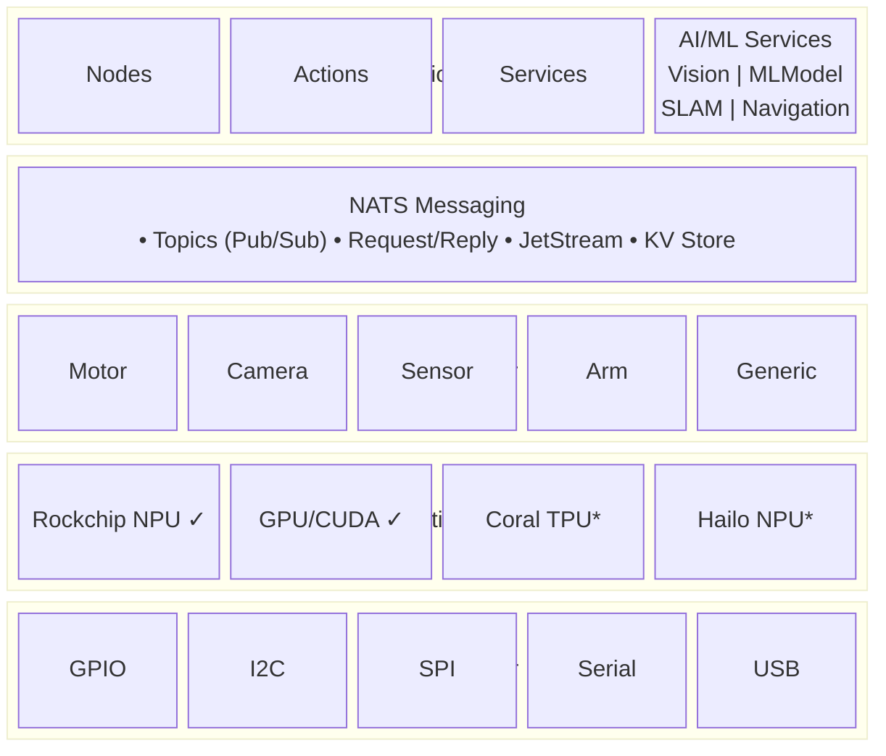
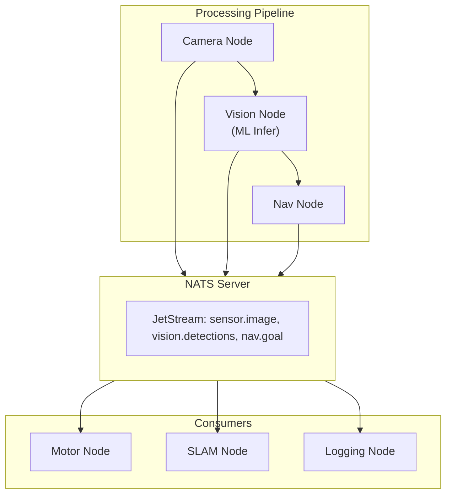

# Gorai Framework Specification

**Version 0.2.0**

A lightweight, Go-based robotics framework built on NATS.io with first-class AI/ML support.

*Pronounced "go-ray" (like "sting-ray")*

> The platform's north star is [VISION.md](../../../gorai/VISION.md): capabilities over NATS (NCP) and the Composite Robot. The resource model, mesh discovery, and topic conventions specified below are the implementation of that vision — resources are sensors, tools are actuators.

---

## Table of Contents

1. [Overview](#overview)
2. [Architecture](#architecture)
3. [Resource Model](#resource-model)
   - [Overview](#overview-1)
   - [Resource Interface](#resource-interface)
   - [Resource Registry](#resource-registry)
   - [Helper Interfaces](#helper-interfaces)
   - [Component Types](#component-types) (Sensors, Actuators, Power, Space, Links)
4. [Communication Layer](#communication-layer)
   - [Mesh Service Discovery](#mesh-service-discovery)
5. [Topic Naming Convention](#topic-naming-convention)
6. [Protocol Buffer Definitions](#protocol-buffer-definitions)
7. [Core Components](#core-components)
8. [Device Interfaces](#device-interfaces)
9. [AI/ML Services](#aiml-services)
   - [Vision Service](#vision-service)
   - [ML Model Service](#ml-model-service)
   - [SLAM Service](#slam-service)
   - [Navigation Service](#navigation-service)
   - [Motion Service](#motion-service)
   - [Behavior Service](#behavior-service)
     - [Derived Sensors](#derived-sensors)
     - [AI-Powered Behaviors](#ai-powered-behaviors) (ML & LLM agents)
   - [Coordinator Service](#coordinator-service)
     - [AI-Powered Coordinators](#ai-powered-coordinators)
10. [Acceleration Layer](#acceleration-layer)
11. [Configuration System](#configuration-system)
    - [Dynamic Discovery](#dynamic-discovery-rdl-v4)
12. [Web Dashboard](#web-dashboard)
13. [Network Transparency](#network-transparency)
14. [CLI Tool](#cli-tool)
15. [Directory Structure](#directory-structure)

---

## Overview

Gorai is a robotics framework providing:

- **NATS-based messaging** for pub/sub, request/reply, and persistence
- **Protocol Buffer serialization** for type-safe, efficient communication
- **Resource-centric architecture** with unified components/service abstraction
- **First-class AI/ML support** with hardware acceleration (RK3588 NPU, NVIDIA CUDA)
- **Hot reconfiguration** without restart
- **TinyGo compatibility** for microcontroller deployment
- **OCI container support** with Podman as the reference runtime

### Target Platform

Gorai targets **Linux-based systems**:

| Platform | Support Level |
|----------|---------------|
| Linux x86_64 | Primary |
| Linux ARM64 (Raspberry Pi, Rockchip, Jetson) | Primary |
| Microcontrollers via TinyGo | Primary |
| macOS | Development only |
| Windows | Not supported |

### Container Support

Gorai supports deployment via OCI-compliant containers:

| Runtime | Support Level | Notes |
|---------|---------------|-------|
| Podman | Reference | Daemonless, rootless-capable |
| Docker | Compatible | Via OCI compliance |
| Kubernetes | Compatible | Via OCI compliance |

Podman is the reference container runtime for Gorai due to:
- **Daemonless architecture**: No background service required
- **Rootless operation**: Run containers without root privileges
- **OCI compliance**: Images work with any OCI-compliant runtime
- **Pod support**: Native multi-container pod support

### Design Document Standard

Gorai uses detailed design documents as the specification format for components and services. See [hello-sensor-design.md](hello-sensor-design.md) for the canonical example.

A complete design document includes:

| Section | Purpose |
|---------|---------|
| **Overview** | Goals, use cases, design philosophy |
| **Architecture** | Component diagrams, data flow, NATS topic structure |
| **Protocol Buffers** | Complete `.proto` definitions with field documentation |
| **Implementation** | Package structure, platform-specific code, configuration |
| **Verification** | Step-by-step testing procedures with expected outputs |
| **Test Specification** | Unit test cases, integration test scenarios |

This level of detail serves two purposes:
1. **Human documentation**: Engineers can understand the component without reading source code
2. **AI implementation blueprint**: AI coding assistants can implement the design with minimal ambiguity

When adding new components or services, create a design document following this format before implementation.

---

## Architecture

### Layer Diagram



### Component Interaction



### Concurrency Model

Gorai uses a **single-owner model** for components, following Go's philosophy of "share memory by communicating, don't communicate by sharing memory."

#### Principles

1. **Single Goroutine Ownership**: Each component instance is owned and accessed by a single goroutine. This eliminates the need for mutex protection on component state.

2. **No Internal Locking Required**: Component implementations should not use `sync.Mutex` or `sync.RWMutex` for protecting their internal state. The owner goroutine is responsible for all direct access.

3. **NATS for Coordination**: When multiple goroutines or nodes need to coordinate around a component:
   - Publish state changes to NATS topics
   - Use NATS request/reply for cross-goroutine queries
   - Leverage JetStream for state persistence and replay

4. **Message Passing Over Shared State**: Inter-component communication happens through NATS messaging, not shared memory. This naturally extends to distributed systems where components may run on different machines.

#### Example Patterns

**Single-owner access (preferred):**
```go
// Component owned by one goroutine - no locking needed
type myMotor struct {
    power    float64
    velocity float64
}

func (m *myMotor) SetPower(ctx context.Context, power float64) error {
    m.power = power  // Safe: single owner
    return nil
}
```

**Cross-goroutine coordination via NATS:**
```go
// When another goroutine needs motor state, request via NATS
reply, err := nc.Request("motor.left_wheel.state", nil, time.Second)
```

**Publishing state changes:**
```go
// Owner publishes state changes for observers
func (m *myMotor) SetPower(ctx context.Context, power float64) error {
    m.power = power
    m.nc.Publish("motor.left_wheel.power", []byte(fmt.Sprintf("%f", power)))
    return nil
}
```

#### Benefits

- **Simplicity**: No complex locking logic or deadlock risks
- **Performance**: No lock contention overhead
- **Scalability**: Same pattern works locally and across network
- **Debuggability**: Clear ownership makes reasoning about state easier
- **Go-idiomatic**: Aligns with Go's concurrency best practices

#### When to Use NATS Coordination

Use NATS messaging instead of direct access when:
- A monitoring/logging goroutine needs to observe component state
- A supervisor needs to query multiple components
- Components need to react to each other's state changes
- The system spans multiple processes or machines

---

## Resource Model

### Overview

The Resource Model is the foundation of Gorai's architecture. **Resource is the common interface for ALL entities in the system**—every component and every service implements Resource. This provides a unified way to manage, configure, and interact with any part of a robot.

```
                    Resource (base interface)
                         │
        ┌────────────────┼────────────────┐
        │                │                │
   Component          Service          Module
        │                │
   ┌────┴────┐      ┌───┴───┐
   │ Types:  │      │Types: │
   │-Sensor  │      │-Vision│
   │-Actuator│      │-SLAM  │
   │-Power   │      │-Nav   │
   │-Space   │      │-Motion│
   │-Link    │      │-Behavior│
   └─────────┘      └───────┘
```

### Resource Interface

All components and services implement the base Resource interface:

```go
package resource

import "context"

// Resource is the base interface for all Gorai components and services.
type Resource interface {
    // Name returns the unique resource identifier.
    Name() Name

    // Reconfigure updates the resource with new configuration.
    // Called during hot reload without full restart.
    Reconfigure(ctx context.Context, deps Dependencies, conf Config) error

    // DoCommand executes arbitrary commands for extensibility.
    DoCommand(ctx context.Context, cmd map[string]any) (map[string]any, error)

    // Close releases all resources.
    Close(ctx context.Context) error
}

// Name identifies a resource with hierarchical naming.
type Name struct {
    Namespace string // Organization namespace (e.g., "gorai", "mycompany")
    Type      string // "component" or "service"
    Subtype   string // Specific type (e.g., "motor", "camera", "vision")
    Name      string // Instance name (e.g., "left_motor", "front_camera")
}

// String returns the full resource name.
func (n Name) String() string {
    return fmt.Sprintf("%s:%s:%s/%s", n.Namespace, n.Type, n.Subtype, n.Name)
}

// Dependencies provides access to dependent resources.
type Dependencies interface {
    Get(name Name) (Resource, error)
    GetByType(subtype string) ([]Resource, error)
}

// Config holds resource configuration.
type Config struct {
    Attributes map[string]any
    Raw        []byte // Original JSON
}
```

### Resource Registry

Resources are registered with factory functions:

```go
package resource

// Model identifies a specific implementation.
type Model struct {
    Namespace string // e.g., "gorai"
    Family    string // e.g., "builtin"
    Name      string // e.g., "gpio"
}

// Creator is a factory function for resources.
type Creator func(ctx context.Context, deps Dependencies, conf Config) (Resource, error)

// Registry holds all registered resource types.
type Registry struct {
    // ...
}

// RegisterComponent registers a component model.
func (r *Registry) RegisterComponent(api API, model Model, creator Creator)

// RegisterService registers a service model.
func (r *Registry) RegisterService(api API, model Model, creator Creator)
```

### Helper Interfaces

Resources may implement additional capability interfaces:

```go
// Sensor represents resources that provide readings.
type Sensor interface {
    Resource
    Readings(ctx context.Context) (map[string]any, error)
}

// Actuator represents resources that can move.
type Actuator interface {
    Resource
    IsMoving(ctx context.Context) (bool, error)
    Stop(ctx context.Context) error
}

// Shaped represents resources with geometry.
type Shaped interface {
    Resource
    Geometries(ctx context.Context) ([]Geometry, error)
}

// Reconfigurable indicates in-place reconfiguration support.
type Reconfigurable interface {
    Resource
    Reconfigure(ctx context.Context, deps Dependencies, conf Config) error
}
```

### Component Types

Components are Resources that abstract hardware. They are organized into five fundamental categories based on their relationship with the physical environment:

#### Sensors

**Sensors observe the environment without changing it.** They provide measurements and data about the world.

| Subtype | Description | Examples |
|---------|-------------|----------|
| `camera` | Visual sensors | RGB webcam, stereo (ZED, RealSense), depth (OAK-D), thermal (MLX90640) |
| `lidar` | Laser scanning | 2D (RPLIDAR A1/A3/C1), 3D (Livox, Velodyne) |
| `imu` | Inertial measurement | 6-DOF (MPU6050), 9-DOF AHRS (BNO055), ICM-20948 |
| `gps` | Global positioning | GNSS modules (NEO-6M, NEO-M9N), RTK receivers |
| `encoder` | Position/velocity | Optical incremental, magnetic absolute (AS5600) |
| `range_sensor` | Distance measurement | Ultrasonic (HC-SR04), ToF (VL53L0X, VL53L1X) |
| `presence_sensor` | Presence/motion detection | PIR (HC-SR501), mmWave radar (24GHz/60GHz) |
| `force_sensor` | Force/torque measurement | FSR, load cells (HX711), 6-axis F/T |
| `current_sensor` | Electrical current | Hall effect (ACS712), INA219 |
| `environmental` | Environmental conditions | Temperature, humidity, pressure, illuminance |

```go
// Sensor can only read from the environment
type Sensor interface {
    Component
    Readings(ctx context.Context) (map[string]any, error)
}
```

#### Actuators

**Actuators change the environment.** They produce physical motion, force, or other effects. Many actuators include embedded sensors for feedback.

| Subtype | Description | Examples |
|---------|-------------|----------|
| `motor` | Rotary motion (generic) | DC brushed, BLDC with FOC (ODrive, VESC) |
| `servo` | Position-controlled motor | RC PWM servos, smart servos (Dynamixel, LX-16A) |
| `stepper` | Discrete-step motor | NEMA 17/23/34 with drivers (A4988, TMC2209) |
| `thruster` | Underwater propulsion | BlueRobotics T100/T200, marine ESCs |
| `base` | Mobile platform | Differential drive, holonomic, tracked |
| `arm` | Articulated manipulator | 6-DOF arm, SCARA, delta |
| `gripper` | End effector | Parallel jaw, vacuum, soft gripper |
| `linear` | Linear motion | Lead screw, ball screw, belt drive actuators |
| `valve` | Fluid control | Solenoid, servo valve, ball valve |

```go
// Actuator can change the environment and optionally sense it
type Actuator interface {
    Component
    IsMoving(ctx context.Context) (bool, error)
    Stop(ctx context.Context) error
}
```

#### Power

**Power components manage energy storage and distribution.** They typically have a capacity and current level.

| Subtype | Description | Examples |
|---------|-------------|----------|
| `battery` | Energy storage | Li-ion, LiFePO4, lead-acid |
| `power_supply` | Power conversion | AC/DC adapter, solar panel |
| `power_distribution` | Power routing | PDU, fuse box, relay board |

```go
// Power provides energy management
type Power interface {
    Component
    // GetCapacity returns total capacity (Wh, Ah, or Joules)
    GetCapacity(ctx context.Context) (float64, error)
    // GetLevel returns current level (0.0 - 1.0)
    GetLevel(ctx context.Context) (float64, error)
    // GetVoltage returns current voltage
    GetVoltage(ctx context.Context) (float64, error)
    // GetCurrent returns current draw (positive = discharging)
    GetCurrent(ctx context.Context) (float64, error)
    // IsCharging returns true if currently charging
    IsCharging(ctx context.Context) (bool, error)
}
```

#### Space

**Space components represent physical volumes on the robot that can contain things or be managed.** A Space is a virtual abstraction over a physical area—it doesn't directly interface with hardware, but it aggregates and coordinates other components (actuators, sensors) that do.

Spaces are useful for modeling:
- Storage areas with doors or access hatches
- Tanks with valves and level sensors
- Compartments with lighting or environmental controls
- Work envelopes with safety interlocks

| Subtype | Description | Examples |
|---------|-------------|----------|
| `container` | Storage volume | Cargo bay, hopper, sample drawer |
| `tank` | Fluid storage | Ballast tank, fuel tank, coolant reservoir |
| `compartment` | Enclosed area | Equipment bay, battery compartment |

A Space typically references other components:
- **Actuators**: Door servos, valve motors, latch mechanisms
- **Sensors**: Level sensors, presence detectors, temperature monitors
- **Power**: Lighting, heating/cooling elements

```go
// Space represents a physical volume on the robot
type Space interface {
    Component
    // GetVolume returns volume in cubic meters
    GetVolume(ctx context.Context) (float64, error)
    // GetBounds returns bounding box geometry
    GetBounds(ctx context.Context) (*geometry.Box, error)
    // GetContents returns what's currently in this space (if trackable)
    GetContents(ctx context.Context) ([]string, error)
    // IsEmpty returns true if space contains nothing
    IsEmpty(ctx context.Context) (bool, error)
    // GetComponents returns components associated with this space
    GetComponents(ctx context.Context) ([]resource.Name, error)
}
```

**Example: Ballast Tank**

```go
// A ballast tank Space coordinates multiple components
type BallastTank struct {
    name        resource.Name
    volume      float64
    fillValve   actuator.Valve   // Controls water intake
    drainValve  actuator.Valve   // Controls water release
    levelSensor sensor.Level     // Measures fill percentage
    // ...
}

func (t *BallastTank) GetContents(ctx context.Context) ([]string, error) {
    level, _ := t.levelSensor.Readings(ctx)
    return []string{fmt.Sprintf("water:%.1f%%", level["percent"])}, nil
}
```

#### Links

**Links provide additional communication channels beyond the primary NATS connection.** All Gorai components assume IP connectivity to a NATS server—that's the baseline infrastructure, not a "Link." A Link component represents an *extra* communication path, typically for:

- **Microcontroller bridges**: Serial connections to TinyGo devices without IP capability
- **Telemetry channels**: Radio links for remote monitoring or control
- **Legacy protocols**: CAN bus, RS-485, or other industrial networks
- **Redundant paths**: Backup communication for safety-critical systems

Links are bi-directional (point-to-point) or broadcast (one-to-many), and abstract various transport mechanisms.

| Subtype | Direction | Transport | Use Case |
|---------|-----------|-----------|----------|
| `serial_link` | Bi-directional | UART/RS-232/RS-485 | Microcontroller gateway, legacy devices |
| `radio_link` | Bi-directional | RF/LoRa/cellular | Remote telemetry, long-range control |
| `can_link` | Broadcast | CAN bus | Vehicle systems, industrial automation |
| `i2c_link` | Bi-directional | I2C | Local sensor buses on SBCs |

**Important**: The NATS connection is *not* modeled as a Link—it's assumed infrastructure. Every component publishes/subscribes via NATS. Links exist for communication paths that NATS cannot reach.

```go
// Link provides an additional communication channel
type Link interface {
    Component
    // Type returns the link type
    Type() LinkType
    // Direction returns Bidirectional or Broadcast
    Direction() LinkDirection
    // IsConnected returns true if link is active
    IsConnected(ctx context.Context) (bool, error)
    // GetStats returns link statistics
    GetStats(ctx context.Context) (*LinkStats, error)
}

type LinkType int
const (
    LinkTypeSerial LinkType = iota
    LinkTypeRadio
    LinkTypeCAN
    LinkTypeI2C
    LinkTypeSPI
)

type LinkDirection int
const (
    LinkBidirectional LinkDirection = iota
    LinkBroadcast
)

type LinkStats struct {
    BytesSent     uint64
    BytesReceived uint64
    MessagesSent  uint64
    MessagesRecv  uint64
    ErrorCount    uint64
    Latency       time.Duration
}
```

**Example: Serial Gateway to Microcontroller**

A common pattern is a serial link bridging NATS to a TinyGo microcontroller:

```go
// SerialLink bridges NATS messages to/from a microcontroller
type SerialLink struct {
    name     resource.Name
    port     string           // e.g., "/dev/ttyUSB0"
    baudRate int
    conn     serial.Port
    // ...
}

// The gateway subscribes to NATS topics and forwards commands over serial,
// then publishes serial responses back to NATS
func (l *SerialLink) Run(ctx context.Context) {
    // Subscribe to motor commands on NATS
    l.nc.Subscribe("gorai.robot.motor.command", func(msg *nats.Msg) {
        // Forward to microcontroller over serial
        l.conn.Write(encodeCommand(msg.Data))
    })

    // Read sensor data from serial, publish to NATS
    go func() {
        for {
            data := l.conn.Read()
            l.nc.Publish("gorai.robot.mcu.sensors", data)
        }
    }()
}
```

**Example: Radio Telemetry Link**

```go
// RadioLink provides long-range telemetry via LoRa or similar
type RadioLink struct {
    name      resource.Name
    frequency float64
    power     int  // transmit power in dBm
    // ...
}

// Used for remote monitoring when the robot is out of WiFi range
```

### Component Type Summary

| Type | Purpose | Key Characteristic |
|------|---------|-------------------|
| Sensor | Observes the environment | Returns readings, read-only |
| Actuator | Changes the environment | Can move, can be stopped |
| Power | Manages energy | Has capacity and level |
| Space | Virtual container on robot | Aggregates other components (valves, doors, sensors) |
| Link | Extra communication channel | Bridges to devices without NATS (MCUs, radios) |

**Note on NATS**: All components assume NATS connectivity as baseline infrastructure. NATS is not a "Link"—it's the assumed communication fabric. Links exist for additional channels that NATS cannot reach.

---

## Communication Layer

### NATS Integration

Gorai uses NATS for all communication:

| Gorai Pattern | NATS Primitive | Persistence |
|---------------|----------------|-------------|
| Topic (pub/sub) | Core NATS Publish/Subscribe | Optional (JetStream) |
| Service (RPC) | Request/Reply | No |
| Action (long-running) | Request/Reply + Publish | Feedback via pub/sub |
| Parameter | KV Store | Yes (JetStream KV) |
| State | Object Store | Yes (JetStream Object) |

### Quality of Service

| QoS Level | NATS Implementation | Use Case |
|-----------|---------------------|----------|
| `BestEffort` | Core NATS | High-frequency sensor data |
| `Reliable` | JetStream with ack | Commands, state changes |
| `Retained` | JetStream last-value | Late subscriber catch-up |
| `History(n)` | JetStream limit | Replay for debugging |
| `Persistent` | JetStream durable | Data logging |

### Message Envelope

All messages are wrapped with metadata:

```protobuf
message Envelope {
    Header header = 1;
    string type_url = 2;      // e.g., "gorai.sensor.Image"
    bytes payload = 3;        // Serialized protobuf
    map<string, string> metadata = 4;
}
```

### Mesh Service Discovery

The mesh system provides runtime service discovery using NATS KV buckets:

| Bucket | Purpose | TTL |
|--------|---------|-----|
| `gorai-services` | Active service registrations | 30s (heartbeat required) |
| `gorai-channels` | Channel/subject descriptors | None (persistent) |
| `gorai-schemas` | Message schemas (JSON Schema) | None (persistent) |

**Key Features:**
- **Cross-Binary Discovery**: Independent processes find each other via NATS KV
- **Automatic Heartbeat**: Services refresh their registration every 10s
- **Schema Registry**: JSON Schema definitions for message types
- **Watch Capability**: Real-time notifications when services join/leave

**Well-Known Subjects:**
- `gorai.mesh.announce` — Service join/leave announcements
- `gorai.mesh.heartbeat.<service-id>` — Per-service heartbeats

**CLI Commands:**
```bash
gorai mesh services          # List running services
gorai mesh channels          # List registered channels
gorai mesh schemas           # List message schemas
gorai mesh watch             # Watch for changes
```

See [specs/mesh-service-discovery.md](mesh-service-discovery.md) for complete specification.

---

## Topic Naming Convention

### Hierarchy

```
gorai.{robot}.{node}.{topic}[.{suffix}]
```

| Segment | Description | Example |
|---------|-------------|---------|
| `gorai` | Framework prefix (fixed) | `gorai` |
| `{robot}` | Robot/machine identifier | `sentinel`, `skimmer` |
| `{node}` | Node name | `camera`, `motor_left`, `vision` |
| `{topic}` | Topic name | `image`, `cmd_vel`, `detections` |
| `{suffix}` | Optional qualifier | `raw`, `compressed`, `filtered` |

### Standard Topic Patterns

#### Sensor Topics

```
gorai.{robot}.{sensor}.data              # Primary sensor output
gorai.{robot}.{sensor}.data.raw          # Unprocessed data
gorai.{robot}.{sensor}.data.compressed   # Compressed variant
gorai.{robot}.{sensor}.info              # Sensor metadata/calibration
gorai.{robot}.{sensor}.diagnostics       # Health/status
```

Examples:
```
gorai.sentinel.camera_front.data.compressed    # JPEG images
gorai.sentinel.imu.data                        # IMU readings
gorai.sentinel.lidar.data                      # Point cloud
gorai.sentinel.gps.data                        # GPS fix
```

#### Control Topics

```
gorai.{robot}.{actuator}.command         # Incoming commands
gorai.{robot}.{actuator}.state           # Current state
gorai.{robot}.{actuator}.feedback        # Control feedback
```

Examples:
```
gorai.sentinel.drive.command             # Twist commands
gorai.sentinel.drive.state               # Odometry
gorai.sentinel.arm.command               # Joint commands
gorai.sentinel.arm.state                 # Joint states
```

#### AI/ML Topics

```
gorai.{robot}.vision.detections          # Object detections
gorai.{robot}.vision.classifications     # Image classifications
gorai.{robot}.vision.segmentation        # Segmentation masks
gorai.{robot}.mlmodel.{name}.input       # Model input
gorai.{robot}.mlmodel.{name}.output      # Model output
gorai.{robot}.slam.map                   # SLAM map updates
gorai.{robot}.slam.pose                  # Localized pose
gorai.{robot}.nav.path                   # Planned path
gorai.{robot}.nav.goal                   # Navigation goal
```

#### Service Subjects

```
gorai.{robot}.{node}.{service}.request   # Service request
gorai.{robot}.{node}.{service}.response  # Service response
```

Examples:
```
gorai.sentinel.camera.set_exposure.request
gorai.sentinel.arm.get_pose.request
gorai.sentinel.vision.detect.request
```

#### Action Subjects

```
gorai.{robot}.{node}.{action}.goal       # Action goal
gorai.{robot}.{node}.{action}.cancel     # Cancel request
gorai.{robot}.{node}.{action}.feedback   # Progress feedback
gorai.{robot}.{node}.{action}.result     # Final result
gorai.{robot}.{node}.{action}.status     # Action status
```

Examples:
```
gorai.sentinel.nav.navigate_to.goal
gorai.sentinel.nav.navigate_to.feedback
gorai.sentinel.arm.move_to_pose.goal
gorai.sentinel.arm.move_to_pose.result
```

#### System Topics

```
gorai.{robot}._system.nodes              # Active nodes
gorai.{robot}._system.heartbeat          # Node heartbeats
gorai.{robot}._system.logs               # Centralized logs
gorai.{robot}._system.diagnostics        # System diagnostics
gorai.{robot}._system.tf                 # Transform tree
```

### Wildcards

NATS wildcards for subscription:

| Pattern | Matches |
|---------|---------|
| `gorai.sentinel.>` | All topics for sentinel robot |
| `gorai.*.camera.>` | All camera topics on any robot |
| `gorai.sentinel.*.data` | All sensor data topics |
| `gorai.sentinel._system.*` | All system topics |

---

## Protocol Buffer Definitions

### Package Structure

```
api/proto/gorai/
├── std/
│   └── std.proto           # Common types (Header, Time, Duration)
├── geometry/
│   └── geometry.proto      # Spatial types (Vector3, Pose, Transform)
├── sensor/
│   └── sensor.proto        # Sensor messages (Image, PointCloud, IMU)
├── control/
│   └── control.proto       # Control messages (Twist, JointCommand)
├── vision/
│   └── vision.proto        # Vision types (Detection, Classification)
├── ml/
│   └── ml.proto            # ML types (Tensor, ModelMetadata)
├── nav/
│   └── nav.proto           # Navigation (Path, Waypoint, Map)
├── action/
│   └── action.proto        # Action protocol messages
└── buf.yaml
```

### std.proto - Common Types

```protobuf
syntax = "proto3";
package gorai.std;

option go_package = "github.com/gorai-robotics/gorai/api/std";

// Header contains metadata for all stamped messages.
message Header {
    // Nanoseconds since Unix epoch (1970-01-01 00:00:00 UTC).
    int64 timestamp_ns = 1;

    // Coordinate frame this data is associated with.
    string frame_id = 2;

    // Sequence number for ordering.
    uint32 seq = 3;
}

// Time represents a point in time.
message Time {
    int64 sec = 1;
    int32 nsec = 2;
}

// Duration represents a time span.
message Duration {
    int64 sec = 1;
    int32 nsec = 2;
}

// DiagnosticStatus represents component health.
message DiagnosticStatus {
    enum Level {
        OK = 0;
        WARN = 1;
        ERROR = 2;
        STALE = 3;
    }
    Level level = 1;
    string name = 2;
    string message = 3;
    string hardware_id = 4;
    map<string, string> values = 5;
}

// KeyValue for generic key-value pairs.
message KeyValue {
    string key = 1;
    string value = 2;
}
```

### geometry.proto - Spatial Types

```protobuf
syntax = "proto3";
package gorai.geometry;

option go_package = "github.com/gorai-robotics/gorai/api/geometry";

import "gorai/std/std.proto";

// Vector3 represents a 3D vector.
message Vector3 {
    double x = 1;
    double y = 2;
    double z = 3;
}

// Point is an alias for Vector3 representing position.
message Point {
    double x = 1;
    double y = 2;
    double z = 3;
}

// Quaternion represents rotation.
message Quaternion {
    double x = 1;
    double y = 2;
    double z = 3;
    double w = 4;
}

// Pose represents position and orientation.
message Pose {
    Point position = 1;
    Quaternion orientation = 2;
}

// PoseStamped is a Pose with header.
message PoseStamped {
    gorai.std.Header header = 1;
    Pose pose = 2;
}

// PoseWithCovariance includes uncertainty.
message PoseWithCovariance {
    Pose pose = 1;
    repeated double covariance = 2; // 6x6 row-major (36 elements)
}

// PoseWithCovarianceStamped is PoseWithCovariance with header.
message PoseWithCovarianceStamped {
    gorai.std.Header header = 1;
    PoseWithCovariance pose = 2;
}

// Twist represents linear and angular velocity.
message Twist {
    Vector3 linear = 1;
    Vector3 angular = 2;
}

// TwistStamped is a Twist with header.
message TwistStamped {
    gorai.std.Header header = 1;
    Twist twist = 2;
}

// TwistWithCovariance includes uncertainty.
message TwistWithCovariance {
    Twist twist = 1;
    repeated double covariance = 2; // 6x6 row-major
}

// Accel represents linear and angular acceleration.
message Accel {
    Vector3 linear = 1;
    Vector3 angular = 2;
}

// AccelStamped is Accel with header.
message AccelStamped {
    gorai.std.Header header = 1;
    Accel accel = 2;
}

// Wrench represents force and torque.
message Wrench {
    Vector3 force = 1;
    Vector3 torque = 2;
}

// WrenchStamped is Wrench with header.
message WrenchStamped {
    gorai.std.Header header = 1;
    Wrench wrench = 2;
}

// Transform represents a coordinate transformation.
message Transform {
    Vector3 translation = 1;
    Quaternion rotation = 2;
}

// TransformStamped is a Transform between two frames.
message TransformStamped {
    gorai.std.Header header = 1;
    string child_frame_id = 2;
    Transform transform = 3;
}

// Polygon is a 2D polygon.
message Polygon {
    repeated Point32 points = 1;
}

// Point32 is a 32-bit precision point.
message Point32 {
    float x = 1;
    float y = 2;
    float z = 3;
}

// Inertia represents moment of inertia.
message Inertia {
    double m = 1;       // Mass
    Vector3 com = 2;    // Center of mass
    double ixx = 3;
    double ixy = 4;
    double ixz = 5;
    double iyy = 6;
    double iyz = 7;
    double izz = 8;
}
```

### sensor.proto - Sensor Messages

```protobuf
syntax = "proto3";
package gorai.sensor;

option go_package = "github.com/gorai-robotics/gorai/api/sensor";

import "gorai/std/std.proto";
import "gorai/geometry/geometry.proto";

// Image encodings
enum ImageEncoding {
    ENCODING_UNKNOWN = 0;
    RGB8 = 1;
    RGBA8 = 2;
    BGR8 = 3;
    BGRA8 = 4;
    MONO8 = 5;
    MONO16 = 6;
    DEPTH16 = 7;      // 16-bit depth in mm
    DEPTH32F = 8;     // 32-bit float depth in meters
    BAYER_RGGB8 = 9;
    BAYER_BGGR8 = 10;
    BAYER_GBRG8 = 11;
    BAYER_GRBG8 = 12;
    YUV422 = 13;
    NV12 = 14;
    NV21 = 15;
}

// Image represents an uncompressed image.
message Image {
    gorai.std.Header header = 1;
    uint32 height = 2;
    uint32 width = 3;
    ImageEncoding encoding = 4;
    bool is_bigendian = 5;
    uint32 step = 6;              // Row length in bytes
    bytes data = 7;
}

// CompressedImage represents a compressed image.
message CompressedImage {
    gorai.std.Header header = 1;
    string format = 2;            // "jpeg", "png", "webp", "h264", "h265"
    bytes data = 3;
}

// CameraInfo contains camera calibration data.
message CameraInfo {
    gorai.std.Header header = 1;
    uint32 height = 2;
    uint32 width = 3;
    string distortion_model = 4;  // "plumb_bob", "rational_polynomial", "equidistant"
    repeated double d = 5;        // Distortion parameters
    repeated double k = 6;        // Intrinsic matrix (3x3 row-major)
    repeated double r = 7;        // Rectification matrix (3x3)
    repeated double p = 8;        // Projection matrix (3x4)
    uint32 binning_x = 9;
    uint32 binning_y = 10;
    RegionOfInterest roi = 11;
}

// RegionOfInterest defines a sub-region.
message RegionOfInterest {
    uint32 x_offset = 1;
    uint32 y_offset = 2;
    uint32 height = 3;
    uint32 width = 4;
    bool do_rectify = 5;
}

// PointField describes a field in a PointCloud2.
message PointField {
    enum Datatype {
        INT8 = 0;
        UINT8 = 1;
        INT16 = 2;
        UINT16 = 3;
        INT32 = 4;
        UINT32 = 5;
        FLOAT32 = 6;
        FLOAT64 = 7;
    }
    string name = 1;
    uint32 offset = 2;
    Datatype datatype = 3;
    uint32 count = 4;
}

// PointCloud2 represents a 3D point cloud.
message PointCloud2 {
    gorai.std.Header header = 1;
    uint32 height = 2;
    uint32 width = 3;
    repeated PointField fields = 4;
    bool is_bigendian = 5;
    uint32 point_step = 6;        // Bytes per point
    uint32 row_step = 7;          // Bytes per row
    bytes data = 8;
    bool is_dense = 9;            // True if no invalid points
}

// LaserScan represents a 2D laser scan.
message LaserScan {
    gorai.std.Header header = 1;
    float angle_min = 2;          // Start angle (rad)
    float angle_max = 3;          // End angle (rad)
    float angle_increment = 4;    // Angular resolution (rad)
    float time_increment = 5;     // Time between measurements
    float scan_time = 6;          // Time for full scan
    float range_min = 7;          // Minimum range (m)
    float range_max = 8;          // Maximum range (m)
    repeated float ranges = 9;    // Range data (m)
    repeated float intensities = 10;
}

// Range represents a single range measurement.
message Range {
    gorai.std.Header header = 1;
    enum RadiationType {
        ULTRASOUND = 0;
        INFRARED = 1;
        LIDAR = 2;
    }
    RadiationType radiation_type = 2;
    float field_of_view = 3;      // Radians
    float min_range = 4;
    float max_range = 5;
    float range = 6;
}

// Imu represents IMU data.
message Imu {
    gorai.std.Header header = 1;
    gorai.geometry.Quaternion orientation = 2;
    repeated double orientation_covariance = 3;     // 3x3
    gorai.geometry.Vector3 angular_velocity = 4;
    repeated double angular_velocity_covariance = 5; // 3x3
    gorai.geometry.Vector3 linear_acceleration = 6;
    repeated double linear_acceleration_covariance = 7; // 3x3
}

// MagneticField represents magnetometer data.
message MagneticField {
    gorai.std.Header header = 1;
    gorai.geometry.Vector3 magnetic_field = 2;      // Tesla
    repeated double magnetic_field_covariance = 3;  // 3x3
}

// NavSatFix represents GPS data.
message NavSatFix {
    gorai.std.Header header = 1;
    enum Status {
        STATUS_NO_FIX = 0;
        STATUS_FIX = 1;
        STATUS_SBAS_FIX = 2;
        STATUS_GBAS_FIX = 3;
    }
    enum Service {
        SERVICE_GPS = 1;
        SERVICE_GLONASS = 2;
        SERVICE_COMPASS = 4;
        SERVICE_GALILEO = 8;
    }
    Status status = 2;
    uint32 service = 3;           // Bitfield of Service
    double latitude = 4;          // Degrees
    double longitude = 5;         // Degrees
    double altitude = 6;          // Meters (WGS84)
    repeated double position_covariance = 7; // 3x3 ENU
    enum CovarianceType {
        COVARIANCE_TYPE_UNKNOWN = 0;
        COVARIANCE_TYPE_APPROXIMATED = 1;
        COVARIANCE_TYPE_DIAGONAL_KNOWN = 2;
        COVARIANCE_TYPE_KNOWN = 3;
    }
    CovarianceType position_covariance_type = 8;
}

// JointState represents joint positions/velocities/efforts.
message JointState {
    gorai.std.Header header = 1;
    repeated string name = 2;
    repeated double position = 3;     // Radians or meters
    repeated double velocity = 4;     // Rad/s or m/s
    repeated double effort = 5;       // Nm or N
}

// BatteryState represents battery status.
message BatteryState {
    gorai.std.Header header = 1;
    float voltage = 2;                // Volts
    float current = 3;                // Amps (negative = discharging)
    float charge = 4;                 // Ah
    float capacity = 5;               // Ah
    float design_capacity = 6;        // Ah
    float percentage = 7;             // 0.0 - 1.0
    enum PowerSupplyStatus {
        POWER_SUPPLY_STATUS_UNKNOWN = 0;
        POWER_SUPPLY_STATUS_CHARGING = 1;
        POWER_SUPPLY_STATUS_DISCHARGING = 2;
        POWER_SUPPLY_STATUS_NOT_CHARGING = 3;
        POWER_SUPPLY_STATUS_FULL = 4;
    }
    PowerSupplyStatus power_supply_status = 8;
    enum PowerSupplyHealth {
        POWER_SUPPLY_HEALTH_UNKNOWN = 0;
        POWER_SUPPLY_HEALTH_GOOD = 1;
        POWER_SUPPLY_HEALTH_OVERHEAT = 2;
        POWER_SUPPLY_HEALTH_DEAD = 3;
        POWER_SUPPLY_HEALTH_OVERVOLTAGE = 4;
        POWER_SUPPLY_HEALTH_UNSPEC_FAILURE = 5;
        POWER_SUPPLY_HEALTH_COLD = 6;
        POWER_SUPPLY_HEALTH_WATCHDOG_TIMER_EXPIRE = 7;
        POWER_SUPPLY_HEALTH_SAFETY_TIMER_EXPIRE = 8;
    }
    PowerSupplyHealth power_supply_health = 9;
    bool present = 10;
    repeated float cell_voltage = 11;
    string location = 12;
    string serial_number = 13;
}

// Temperature represents a temperature reading.
message Temperature {
    gorai.std.Header header = 1;
    double temperature = 2;           // Celsius
    double variance = 3;
}

// FluidPressure represents pressure reading.
message FluidPressure {
    gorai.std.Header header = 1;
    double fluid_pressure = 2;        // Pascals
    double variance = 3;
}

// Illuminance represents light level.
message Illuminance {
    gorai.std.Header header = 1;
    double illuminance = 2;           // Lux
    double variance = 3;
}

// ThermalImage represents thermal array data (AMG8833, MLX90640).
message ThermalImage {
    gorai.std.Header header = 1;
    uint32 height = 2;                // Pixels (e.g., 8, 32)
    uint32 width = 3;                 // Pixels (e.g., 8, 24)
    repeated float temperatures = 4;  // Row-major, Celsius
    float ambient_temperature = 5;    // Sensor ambient temp
    float min_temperature = 6;        // Minimum in frame
    float max_temperature = 7;        // Maximum in frame
}

// Presence represents presence/motion detection (PIR, mmWave).
message Presence {
    gorai.std.Header header = 1;
    bool detected = 2;                // Presence detected
    enum MotionState {
        MOTION_UNKNOWN = 0;
        MOTION_STATIC = 1;
        MOTION_MOVING = 2;
    }
    MotionState motion_state = 3;     // For mmWave radar
    float distance = 4;               // Meters (if available)
    float speed = 5;                  // m/s (if available)
}

// Force represents force sensor reading.
message Force {
    gorai.std.Header header = 1;
    double force = 2;                 // Newtons
    double variance = 3;
}

// Current represents electrical current measurement.
message Current {
    gorai.std.Header header = 1;
    double current = 2;               // Amps
    double voltage = 3;               // Volts (if available)
    double power = 4;                 // Watts (if available)
}

// Reflectance represents line following sensor data.
message Reflectance {
    gorai.std.Header header = 1;
    repeated float values = 2;        // 0.0-1.0 per channel
    float line_position = 3;          // Weighted average position
    uint32 channel_count = 4;         // Number of channels
}

// EncoderState represents encoder position and velocity.
message EncoderState {
    gorai.std.Header header = 1;
    int64 position = 2;               // Counts
    double velocity = 3;              // Counts/sec
    int32 resolution = 4;             // PPR or bits
    bool is_absolute = 5;             // Absolute vs incremental
}
```

### control.proto - Control Messages

```protobuf
syntax = "proto3";
package gorai.control;

option go_package = "github.com/gorai-robotics/gorai/api/control";

import "gorai/std/std.proto";
import "gorai/geometry/geometry.proto";

// JointCommand sends commands to joints.
message JointCommand {
    gorai.std.Header header = 1;
    repeated string name = 2;
    repeated double position = 3;     // Desired position (optional)
    repeated double velocity = 4;     // Desired velocity (optional)
    repeated double effort = 5;       // Desired effort (optional)
    repeated double kp = 6;           // Position gains (optional)
    repeated double kd = 7;           // Velocity gains (optional)
}

// JointTrajectory defines a trajectory for joints.
message JointTrajectory {
    gorai.std.Header header = 1;
    repeated string joint_names = 2;
    repeated JointTrajectoryPoint points = 3;
}

// JointTrajectoryPoint is a waypoint in a trajectory.
message JointTrajectoryPoint {
    repeated double positions = 1;
    repeated double velocities = 2;
    repeated double accelerations = 3;
    repeated double effort = 4;
    gorai.std.Duration time_from_start = 5;
}

// PanTiltCommand commands a pan-tilt unit.
message PanTiltCommand {
    gorai.std.Header header = 1;
    double pan = 2;                   // Radians
    double tilt = 3;                  // Radians
    double pan_velocity = 4;          // Rad/s (optional)
    double tilt_velocity = 5;         // Rad/s (optional)
}

// PanTiltState reports pan-tilt status.
message PanTiltState {
    gorai.std.Header header = 1;
    double pan = 2;
    double tilt = 3;
    double pan_velocity = 4;
    double tilt_velocity = 5;
    bool is_moving = 6;
}

// MotorCommand commands a single motor.
message MotorCommand {
    gorai.std.Header header = 1;
    enum Mode {
        MODE_POWER = 0;           // Direct PWM/power
        MODE_VELOCITY = 1;        // Velocity control
        MODE_POSITION = 2;        // Position control
    }
    Mode mode = 2;
    double value = 3;             // Power (-1 to 1), velocity, or position
}

// MotorState reports motor status.
message MotorState {
    gorai.std.Header header = 1;
    double position = 2;          // Encoder position
    double velocity = 3;          // Current velocity
    double current = 4;           // Motor current (amps)
    double temperature = 5;       // Temperature (celsius)
    bool is_moving = 6;
}

// GripperCommand commands a gripper.
message GripperCommand {
    gorai.std.Header header = 1;
    double position = 2;          // 0.0 = closed, 1.0 = open
    double max_effort = 3;        // Maximum force
}

// GripperState reports gripper status.
message GripperState {
    gorai.std.Header header = 1;
    double position = 2;
    double effort = 3;
    bool stalled = 4;
    bool reached_goal = 5;
}

// ServoCommand commands a servo motor.
message ServoCommand {
    gorai.std.Header header = 1;
    double angle = 2;                 // Target angle (degrees)
    double speed = 3;                 // Movement speed (degrees/sec or 0-1)
    double torque_limit = 4;          // Torque limit (0-1, optional)
}

// ServoState reports servo status.
message ServoState {
    gorai.std.Header header = 1;
    double angle = 2;                 // Current angle (degrees)
    double velocity = 3;              // Current velocity
    double load = 4;                  // Current load/torque (0-1)
    double temperature = 5;           // Temperature (Celsius)
    double voltage = 6;               // Supply voltage
    bool is_moving = 7;
}

// StepperCommand commands a stepper motor.
message StepperCommand {
    gorai.std.Header header = 1;
    enum Mode {
        MODE_STEP = 0;                // Step count mode
        MODE_POSITION = 1;            // Absolute position mode
        MODE_VELOCITY = 2;            // Velocity mode
    }
    Mode mode = 2;
    int64 steps = 3;                  // For MODE_STEP
    int64 position = 4;               // For MODE_POSITION
    double velocity = 5;              // Steps/sec or for MODE_VELOCITY
    double acceleration = 6;          // Steps/sec²
    bool direction = 7;               // For MODE_STEP
}

// StepperState reports stepper status.
message StepperState {
    gorai.std.Header header = 1;
    int64 position = 2;               // Current position (steps)
    double velocity = 3;              // Current velocity (steps/sec)
    bool is_moving = 4;
    bool stall_detected = 5;          // For TMC drivers
    int32 microstepping = 6;          // Current microstepping divisor
}

// ThrusterCommand commands an underwater thruster.
message ThrusterCommand {
    gorai.std.Header header = 1;
    double thrust = 2;                // -1.0 to 1.0
}

// ThrusterState reports thruster status.
message ThrusterState {
    gorai.std.Header header = 1;
    double thrust = 2;                // Current thrust setting
    int32 rpm = 3;                    // Current RPM (if telemetry available)
    double current = 4;               // Motor current (amps)
    double temperature = 5;           // Motor temperature (Celsius)
    bool is_running = 6;
}

// ValveCommand commands a valve actuator.
message ValveCommand {
    gorai.std.Header header = 1;
    double position = 2;              // 0.0 = closed, 1.0 = open
}

// ValveState reports valve status.
message ValveState {
    gorai.std.Header header = 1;
    double position = 2;              // Current position (0-1)
    bool is_open = 3;                 // Fully open
    bool is_closed = 4;               // Fully closed
    bool is_moving = 5;
}
```

### vision.proto - Vision Messages

```protobuf
syntax = "proto3";
package gorai.vision;

option go_package = "github.com/gorai-robotics/gorai/api/vision";

import "gorai/std/std.proto";
import "gorai/geometry/geometry.proto";

// Detection represents a detected object.
message Detection {
    // Bounding box (normalized 0-1 or pixel coordinates).
    BoundingBox2D bbox = 1;

    // Detection results with confidence scores.
    repeated ObjectHypothesis results = 2;

    // Optional 3D pose of detected object.
    gorai.geometry.PoseWithCovariance pose = 3;

    // Instance segmentation mask (optional).
    bytes mask = 4;
    uint32 mask_width = 5;
    uint32 mask_height = 6;

    // Tracking ID for multi-frame tracking (optional).
    string tracking_id = 7;
}

// Detections is a collection of detections.
message Detections {
    gorai.std.Header header = 1;
    repeated Detection detections = 2;

    // Source image dimensions.
    uint32 source_width = 3;
    uint32 source_height = 4;
}

// BoundingBox2D represents a 2D bounding box.
message BoundingBox2D {
    // Center of the bounding box.
    double center_x = 1;
    double center_y = 2;

    // Size of the bounding box.
    double size_x = 3;
    double size_y = 4;

    // Alternative: corner representation.
    double x_min = 5;
    double y_min = 6;
    double x_max = 7;
    double y_max = 8;
}

// BoundingBox3D represents a 3D bounding box.
message BoundingBox3D {
    gorai.geometry.Pose center = 1;
    gorai.geometry.Vector3 size = 2;
}

// ObjectHypothesis represents a classification result.
message ObjectHypothesis {
    string class_id = 1;          // Class identifier
    string class_name = 2;        // Human-readable name
    double score = 3;             // Confidence (0-1)
}

// Classification represents image classification result.
message Classification {
    gorai.std.Header header = 1;
    repeated ObjectHypothesis results = 2;
}

// Classifications for batch classification.
message Classifications {
    gorai.std.Header header = 1;
    repeated Classification classifications = 2;
}

// SemanticSegmentation represents pixel-wise classification.
message SemanticSegmentation {
    gorai.std.Header header = 1;
    uint32 height = 2;
    uint32 width = 3;

    // Class ID for each pixel (row-major).
    bytes class_map = 4;          // uint8 per pixel

    // Or 16-bit class IDs for many classes.
    bytes class_map_16 = 5;       // uint16 per pixel

    // Class definitions.
    repeated ClassInfo classes = 6;
}

// ClassInfo describes a segmentation class.
message ClassInfo {
    uint32 id = 1;
    string name = 2;
    uint32 color_rgb = 3;         // Visualization color
}

// InstanceSegmentation represents instance-level segmentation.
message InstanceSegmentation {
    gorai.std.Header header = 1;
    uint32 height = 2;
    uint32 width = 3;

    // Instance ID for each pixel.
    bytes instance_map = 4;       // uint16 per pixel

    // Instance information.
    repeated InstanceInfo instances = 5;
}

// InstanceInfo describes a segmentation instance.
message InstanceInfo {
    uint32 id = 1;
    string class_name = 2;
    double confidence = 3;
    BoundingBox2D bbox = 4;
    uint32 pixel_count = 5;
}

// Keypoints represents detected keypoints (pose estimation).
message Keypoints {
    gorai.std.Header header = 1;
    repeated KeypointGroup groups = 2;
}

// KeypointGroup is a set of related keypoints (e.g., one person).
message KeypointGroup {
    repeated Keypoint keypoints = 1;
    repeated KeypointConnection connections = 2;
    double confidence = 3;
    string tracking_id = 4;
}

// Keypoint is a single detected keypoint.
message Keypoint {
    string name = 1;              // e.g., "left_shoulder"
    double x = 2;                 // Normalized 0-1
    double y = 3;
    double z = 4;                 // For 3D pose (optional)
    double confidence = 5;
    bool is_visible = 6;
}

// KeypointConnection defines a skeleton edge.
message KeypointConnection {
    string from_keypoint = 1;
    string to_keypoint = 2;
}

// DepthImage represents depth data.
message DepthImage {
    gorai.std.Header header = 1;
    uint32 height = 2;
    uint32 width = 3;

    enum DepthEncoding {
        DEPTH_16UC1_MM = 0;       // 16-bit unsigned, millimeters
        DEPTH_32FC1_M = 1;        // 32-bit float, meters
    }
    DepthEncoding encoding = 4;

    float min_depth = 5;          // Minimum valid depth
    float max_depth = 6;          // Maximum valid depth
    bytes data = 7;
}
```

### ml.proto - Machine Learning Messages

```protobuf
syntax = "proto3";
package gorai.ml;

option go_package = "github.com/gorai-robotics/gorai/api/ml";

import "gorai/std/std.proto";

// Tensor represents an n-dimensional array.
message Tensor {
    // Tensor name (for named inputs/outputs).
    string name = 1;

    // Data type.
    enum DataType {
        DT_INVALID = 0;
        DT_FLOAT = 1;
        DT_DOUBLE = 2;
        DT_INT8 = 3;
        DT_INT16 = 4;
        DT_INT32 = 5;
        DT_INT64 = 6;
        DT_UINT8 = 7;
        DT_UINT16 = 8;
        DT_UINT32 = 9;
        DT_UINT64 = 10;
        DT_BOOL = 11;
        DT_STRING = 12;
        DT_FLOAT16 = 13;
        DT_BFLOAT16 = 14;
    }
    DataType dtype = 2;

    // Shape (dimensions).
    repeated int64 shape = 3;

    // Raw data (packed according to dtype).
    bytes data = 4;

    // Or typed data (only one should be set).
    repeated float float_data = 5;
    repeated double double_data = 6;
    repeated int32 int32_data = 7;
    repeated int64 int64_data = 8;
    repeated bytes string_data = 9;
}

// TensorList is a collection of tensors.
message TensorList {
    repeated Tensor tensors = 1;
}

// ModelMetadata describes an ML model.
message ModelMetadata {
    string name = 1;
    string version = 2;
    string framework = 3;         // "tensorflow", "onnx", "tflite", "pytorch"
    string description = 4;

    // Input specifications.
    repeated TensorSpec inputs = 5;

    // Output specifications.
    repeated TensorSpec outputs = 6;

    // Model properties.
    map<string, string> properties = 7;
}

// TensorSpec describes expected tensor format.
message TensorSpec {
    string name = 1;
    Tensor.DataType dtype = 2;
    repeated int64 shape = 3;     // -1 for dynamic dimensions
    string description = 4;
}

// InferenceRequest requests model inference.
message InferenceRequest {
    gorai.std.Header header = 1;
    string model_name = 2;
    string model_version = 3;     // Empty for latest
    repeated Tensor inputs = 4;

    // Output filtering (empty = all outputs).
    repeated string output_names = 5;

    // Request options.
    map<string, string> options = 6;
}

// InferenceResponse contains inference results.
message InferenceResponse {
    gorai.std.Header header = 1;
    string model_name = 2;
    string model_version = 3;
    repeated Tensor outputs = 4;

    // Timing information.
    int64 inference_time_ns = 5;
    int64 preprocess_time_ns = 6;
    int64 postprocess_time_ns = 7;
}

// ModelInfo provides runtime model information.
message ModelInfo {
    ModelMetadata metadata = 1;

    // Runtime status.
    enum Status {
        STATUS_UNKNOWN = 0;
        STATUS_LOADING = 1;
        STATUS_READY = 2;
        STATUS_ERROR = 3;
        STATUS_UNLOADING = 4;
    }
    Status status = 2;

    // Accelerator being used.
    string accelerator = 3;       // "cpu", "cuda", "tpu", "npu"

    // Statistics.
    int64 inference_count = 4;
    int64 avg_inference_time_ns = 5;
}
```

### nav.proto - Navigation Messages

```protobuf
syntax = "proto3";
package gorai.nav;

option go_package = "github.com/gorai-robotics/gorai/api/nav";

import "gorai/std/std.proto";
import "gorai/geometry/geometry.proto";

// Path represents a sequence of poses.
message Path {
    gorai.std.Header header = 1;
    repeated gorai.geometry.PoseStamped poses = 2;
}

// Odometry represents robot odometry.
message Odometry {
    gorai.std.Header header = 1;
    string child_frame_id = 2;
    gorai.geometry.PoseWithCovariance pose = 3;
    gorai.geometry.TwistWithCovariance twist = 4;
}

// OccupancyGrid represents a 2D occupancy map.
message OccupancyGrid {
    gorai.std.Header header = 1;
    MapMetaData info = 2;

    // Occupancy data: -1 = unknown, 0-100 = probability (0 free, 100 occupied).
    repeated int8 data = 3;
}

// MapMetaData describes map properties.
message MapMetaData {
    gorai.std.Time map_load_time = 1;
    float resolution = 2;         // Meters per cell
    uint32 width = 3;             // Cells
    uint32 height = 4;            // Cells
    gorai.geometry.Pose origin = 5;
}

// Waypoint represents a navigation waypoint.
message Waypoint {
    string id = 1;
    gorai.geometry.Pose pose = 2;
    string name = 3;
    map<string, string> properties = 4;
}

// WaypointList is a collection of waypoints.
message WaypointList {
    gorai.std.Header header = 1;
    repeated Waypoint waypoints = 2;
}

// NavigationGoal requests navigation to a pose.
message NavigationGoal {
    gorai.std.Header header = 1;
    gorai.geometry.PoseStamped target_pose = 2;

    // Tolerances.
    double xy_goal_tolerance = 3;
    double yaw_goal_tolerance = 4;

    // Behavior flags.
    bool allow_backward = 5;
    double max_velocity = 6;
}

// NavigationFeedback provides navigation progress.
message NavigationFeedback {
    gorai.std.Header header = 1;
    gorai.geometry.PoseStamped current_pose = 2;
    double distance_remaining = 3;
    gorai.std.Duration time_remaining = 4;
    int32 recovery_count = 5;
}

// NavigationResult provides navigation outcome.
message NavigationResult {
    gorai.std.Header header = 1;

    enum Status {
        STATUS_UNKNOWN = 0;
        STATUS_SUCCEEDED = 1;
        STATUS_CANCELED = 2;
        STATUS_FAILED = 3;
    }
    Status status = 2;
    string message = 3;
    gorai.geometry.PoseStamped final_pose = 4;
}

// GeoPoint represents a geographic location.
message GeoPoint {
    double latitude = 1;          // Degrees
    double longitude = 2;         // Degrees
    double altitude = 3;          // Meters (WGS84)
}

// GeoPose represents a geographic pose.
message GeoPose {
    GeoPoint position = 1;
    gorai.geometry.Quaternion orientation = 2;
}

// GeoPath represents a geographic path.
message GeoPath {
    gorai.std.Header header = 1;
    repeated GeoPose poses = 2;
}
```

### action.proto - Action Protocol Messages

```protobuf
syntax = "proto3";
package gorai.action;

option go_package = "github.com/gorai-robotics/gorai/api/action";

import "gorai/std/std.proto";
import "google/protobuf/any.proto";

// GoalID uniquely identifies an action goal.
message GoalID {
    string id = 1;
    gorai.std.Time stamp = 2;
}

// GoalStatus represents the status of a goal.
message GoalStatus {
    GoalID goal_id = 1;

    enum Status {
        STATUS_UNKNOWN = 0;
        STATUS_ACCEPTED = 1;
        STATUS_EXECUTING = 2;
        STATUS_CANCELING = 3;
        STATUS_SUCCEEDED = 4;
        STATUS_CANCELED = 5;
        STATUS_ABORTED = 6;
    }
    Status status = 2;
    string text = 3;
}

// GoalStatusArray is a list of goal statuses.
message GoalStatusArray {
    gorai.std.Header header = 1;
    repeated GoalStatus status_list = 2;
}

// CancelGoal requests goal cancellation.
message CancelGoal {
    GoalID goal_id = 1;           // Empty = cancel all
    gorai.std.Time stamp = 2;     // Cancel goals before this time
}

// CancelGoalResponse responds to cancellation.
message CancelGoalResponse {
    enum Code {
        ERROR_NONE = 0;
        ERROR_REJECTED = 1;
        ERROR_UNKNOWN_GOAL = 2;
        ERROR_GOAL_TERMINATED = 3;
    }
    Code return_code = 1;
    repeated GoalID goals_canceling = 2;
}
```

---

## Core Components

### Node

```go
package node

type Node struct {
    // ...
}

type Option func(*Node) error

// New creates a new node.
func New(name string, opts ...Option) (*Node, error)

// Options
func WithNATS(url string) Option
func WithNATSConn(nc *nats.Conn) Option
func WithNamespace(ns string) Option
func WithLogger(logger *slog.Logger) Option
func WithContext(ctx context.Context) Option

// Methods
func (n *Node) Name() string
func (n *Node) Namespace() string
func (n *Node) FullName() string                    // namespace.name
func (n *Node) NATS() *nats.Conn
func (n *Node) JetStream() nats.JetStreamContext
func (n *Node) Logger() *slog.Logger
func (n *Node) Context() context.Context
func (n *Node) Spin(ctx context.Context) error      // Block until context done
func (n *Node) SpinOnce() error                     // Process one message
func (n *Node) Close() error
```

### Publisher

```go
package pub

type Publisher[T proto.Message] struct {
    // ...
}

type Option func(*options)

// New creates a typed publisher.
func New[T proto.Message](n *node.Node, topic string, opts ...Option) *Publisher[T]

// Options
func WithQoS(qos QoS) Option
func WithRetain() Option
func WithHistory(n int) Option

// Methods
func (p *Publisher[T]) Publish(ctx context.Context, msg T) error
func (p *Publisher[T]) Topic() string
func (p *Publisher[T]) Close() error
```

### Subscriber

```go
package sub

type Subscriber[T proto.Message] struct {
    // ...
}

type Option func(*options)
type Handler[T proto.Message] func(msg T)

// New creates a typed subscriber.
func New[T proto.Message](n *node.Node, topic string, handler Handler[T], opts ...Option) *Subscriber[T]

// Options
func WithQueueGroup(name string) Option
func WithBuffer(size int) Option
func WithStartTime(t time.Time) Option
func WithDeliverAll() Option
func WithDeliverLast() Option

// Methods
func (s *Subscriber[T]) Topic() string
func (s *Subscriber[T]) Close() error
```

### Service

```go
package srv

type Server[Req, Resp proto.Message] struct {
    // ...
}

type Client[Req, Resp proto.Message] struct {
    // ...
}

type Handler[Req, Resp proto.Message] func(ctx context.Context, req Req) (Resp, error)

// NewServer creates a service server.
func NewServer[Req, Resp proto.Message](n *node.Node, name string, handler Handler[Req, Resp]) *Server[Req, Resp]

// NewClient creates a service client.
func NewClient[Req, Resp proto.Message](n *node.Node, name string) *Client[Req, Resp]

// Client methods
func (c *Client[Req, Resp]) Call(ctx context.Context, req Req, opts ...CallOption) (Resp, error)

// Call options
func WithTimeout(d time.Duration) CallOption
```

### Action

```go
package action

type Server[Goal, Feedback, Result proto.Message] struct {
    // ...
}

type Client[Goal, Feedback, Result proto.Message] struct {
    // ...
}

type FeedbackSender[Feedback proto.Message] interface {
    Send(fb Feedback) error
}

type Handler[Goal, Feedback, Result proto.Message] func(
    ctx context.Context,
    goal Goal,
    feedback FeedbackSender[Feedback],
) (Result, error)

// NewServer creates an action server.
func NewServer[Goal, Feedback, Result proto.Message](
    n *node.Node,
    name string,
    handler Handler[Goal, Feedback, Result],
) *Server[Goal, Feedback, Result]

// NewClient creates an action client.
func NewClient[Goal, Feedback, Result proto.Message](
    n *node.Node,
    name string,
) *Client[Goal, Feedback, Result]

// GoalHandle represents an active goal.
type GoalHandle[Feedback, Result proto.Message] interface {
    ID() string
    Status() Status
    Feedback() <-chan Feedback
    Result() (Result, error)
    Cancel() error
}

// Client methods
func (c *Client[G, F, R]) SendGoal(ctx context.Context, goal G) (GoalHandle[F, R], error)
func (c *Client[G, F, R]) CancelAll(ctx context.Context) error
```

### Parameter Store

```go
package param

type Store struct {
    // ...
}

// NewStore creates a parameter store backed by NATS KV.
func NewStore(n *node.Node) (*Store, error)

// Methods
func (s *Store) Set(key string, value any) error
func (s *Store) Get(key string) (any, error)
func (s *Store) Delete(key string) error
func (s *Store) Keys(pattern string) ([]string, error)
func (s *Store) Watch(pattern string, handler func(key string, value any)) error

// Typed accessors
func Get[T any](s *Store, key string) (T, error)
func GetWithDefault[T any](s *Store, key string, def T) T
```

---

## Device Interfaces

### Motor Interface

```go
package motor

type Motor interface {
    resource.Resource

    // SetPower sets motor power (-1.0 to 1.0).
    SetPower(ctx context.Context, power float64) error

    // SetVelocity sets target velocity (rad/s or m/s).
    SetVelocity(ctx context.Context, velocity float64) error

    // GoTo moves to absolute position.
    GoTo(ctx context.Context, position float64, velocity float64) error

    // GetPosition returns current position.
    GetPosition(ctx context.Context) (float64, error)

    // GetVelocity returns current velocity.
    GetVelocity(ctx context.Context) (float64, error)

    // ResetZeroPosition sets current position as zero.
    ResetZeroPosition(ctx context.Context) error

    // Stop stops the motor.
    Stop(ctx context.Context) error

    // IsMoving returns true if motor is in motion.
    IsMoving(ctx context.Context) (bool, error)

    // IsPowered returns true if motor is powered.
    IsPowered(ctx context.Context) (bool, error)

    // Properties returns motor capabilities.
    Properties(ctx context.Context) (Properties, error)
}

type Properties struct {
    PositionReporting bool
    VelocityReporting bool
    SupportsGoTo      bool
}

// Specialized motor interfaces

// Servo for position-controlled motors (RC servos, Dynamixel, etc.)
type Servo interface {
    resource.Resource

    // SetAngle sets target angle in degrees.
    SetAngle(ctx context.Context, degrees float64) error

    // GetAngle returns current angle in degrees.
    GetAngle(ctx context.Context) (float64, error)

    // SetSpeed sets movement speed (degrees/sec for smart servos, or 0.0-1.0 for RC).
    SetSpeed(ctx context.Context, speed float64) error

    // SetTorqueLimit sets torque limit (0.0 to 1.0, smart servos only).
    SetTorqueLimit(ctx context.Context, limit float64) error

    // Stop stops movement.
    Stop(ctx context.Context) error

    // IsMoving returns true if servo is moving.
    IsMoving(ctx context.Context) (bool, error)

    // GetProperties returns servo capabilities.
    GetProperties(ctx context.Context) (ServoProperties, error)
}

type ServoProperties struct {
    MinAngle      float64 // degrees
    MaxAngle      float64 // degrees
    IsContinuous  bool    // Continuous rotation mode
    HasFeedback   bool    // Position feedback available
    Protocol      string  // "pwm", "dynamixel", "lx16a", "feetech"
}

// Stepper for discrete-step motors (NEMA 17, etc.)
type Stepper interface {
    resource.Resource

    // Step moves a number of steps in a direction.
    Step(ctx context.Context, steps int64, direction bool) error

    // SetMicrostepping sets microstepping divisor (1, 2, 4, 8, 16, 32, 256).
    SetMicrostepping(ctx context.Context, divisor int) error

    // SetCurrent sets run and hold current in milliamps.
    SetCurrent(ctx context.Context, runMA, holdMA int) error

    // GetPosition returns current position in steps.
    GetPosition(ctx context.Context) (int64, error)

    // ResetPosition sets current position as zero.
    ResetPosition(ctx context.Context) error

    // Home moves to home position using limit switch or stall detection.
    Home(ctx context.Context, direction bool) error

    // Stop stops movement.
    Stop(ctx context.Context) error

    // IsMoving returns true if stepper is moving.
    IsMoving(ctx context.Context) (bool, error)

    // GetProperties returns stepper capabilities.
    GetProperties(ctx context.Context) (StepperProperties, error)
}

type StepperProperties struct {
    StepsPerRevolution int     // Native steps (typically 200)
    MaxMicrostepping   int     // Maximum microstepping divisor
    MaxCurrent         int     // Maximum current in mA
    HasStallDetection  bool    // Sensorless homing available (TMC)
    Driver             string  // "a4988", "drv8825", "tmc2209", "tmc5160"
}

// Thruster for underwater propulsion (BlueRobotics, etc.)
type Thruster interface {
    resource.Resource

    // SetThrust sets thrust level (-1.0 to 1.0).
    // Negative = reverse, positive = forward.
    SetThrust(ctx context.Context, thrust float64) error

    // Stop stops the thruster.
    Stop(ctx context.Context) error

    // IsRunning returns true if thruster is spinning.
    IsRunning(ctx context.Context) (bool, error)

    // GetRPM returns current RPM (if telemetry available).
    GetRPM(ctx context.Context) (int, error)

    // GetTemperature returns motor temperature (if available).
    GetTemperature(ctx context.Context) (float64, error)

    // GetCurrent returns motor current draw (if available).
    GetCurrent(ctx context.Context) (float64, error)

    // GetProperties returns thruster capabilities.
    GetProperties(ctx context.Context) (ThrusterProperties, error)
}

type ThrusterProperties struct {
    MaxThrustForward  float64 // kgf
    MaxThrustReverse  float64 // kgf
    DeadbandWidth     float64 // PWM deadband in microseconds
    IsBidirectional   bool
    HasTelemetry      bool    // RPM/temp/current feedback
    Protocol          string  // "pwm", "i2c", "can"
}

// Valve for fluid control actuators
type Valve interface {
    resource.Resource

    // Open opens the valve fully.
    Open(ctx context.Context) error

    // Close closes the valve fully.
    Close(ctx context.Context) error

    // SetPosition sets valve position (0.0 = closed, 1.0 = open).
    SetPosition(ctx context.Context, position float64) error

    // GetPosition returns current valve position.
    GetPosition(ctx context.Context) (float64, error)

    // IsOpen returns true if valve is fully open.
    IsOpen(ctx context.Context) (bool, error)

    // IsClosed returns true if valve is fully closed.
    IsClosed(ctx context.Context) (bool, error)
}
```

### Camera Interface

```go
package camera

type Camera interface {
    resource.Resource

    // GetImage captures an image.
    GetImage(ctx context.Context) (*sensor.Image, error)

    // GetImages captures from all streams (color, depth, etc.).
    GetImages(ctx context.Context) ([]*sensor.Image, error)

    // GetPointCloud returns 3D point cloud (if depth capable).
    GetPointCloud(ctx context.Context) (*sensor.PointCloud2, error)

    // GetProperties returns camera properties.
    GetProperties(ctx context.Context) (Properties, error)

    // Stream returns a channel of images.
    Stream(ctx context.Context) (<-chan *sensor.Image, error)
}

type Properties struct {
    Width             int
    Height            int
    FrameRate         float64
    SupportedFormats  []string
    IntrinsicParams   *sensor.CameraInfo
    DistortionParams  []float64
    SupportsDepth     bool
    SupportsPointCloud bool
}
```

### Sensor Interface

```go
package sensor

type Sensor interface {
    resource.Resource

    // Readings returns current sensor readings.
    Readings(ctx context.Context) (map[string]any, error)
}

// Specialized sensor interfaces

type IMU interface {
    Sensor
    GetAngularVelocity(ctx context.Context) (*geometry.Vector3, error)
    GetLinearAcceleration(ctx context.Context) (*geometry.Vector3, error)
    GetOrientation(ctx context.Context) (*geometry.Quaternion, error)
}

// AHRS extends IMU with onboard sensor fusion (e.g., BNO055)
type AHRS interface {
    IMU
    GetEulerAngles(ctx context.Context) (roll, pitch, yaw float64, err error)
    GetQuaternion(ctx context.Context) (*geometry.Quaternion, error)
    GetLinearAccelerationWithoutGravity(ctx context.Context) (*geometry.Vector3, error)
    GetGravityVector(ctx context.Context) (*geometry.Vector3, error)
    GetCalibrationStatus(ctx context.Context) (sys, gyro, accel, mag uint8, err error)
}

type GPS interface {
    Sensor
    GetPosition(ctx context.Context) (*GeoPoint, error)
    GetAltitude(ctx context.Context) (float64, error)
    GetLinearVelocity(ctx context.Context) (*geometry.Vector3, error)
    GetHeading(ctx context.Context) (float64, error)
    GetAccuracy(ctx context.Context) (float64, float64, error) // horizontal, vertical
    GetFixQuality(ctx context.Context) (FixQuality, error)
    GetSatellitesUsed(ctx context.Context) (int, error)
}

type FixQuality int
const (
    FixNone FixQuality = iota
    FixGPS
    FixDGPS
    FixRTK
)

type Encoder interface {
    Sensor
    GetPosition(ctx context.Context) (float64, error)  // counts or radians
    GetVelocity(ctx context.Context) (float64, error)  // counts/sec or rad/s
    ResetPosition(ctx context.Context) error
    GetResolution(ctx context.Context) (int, error)    // PPR or bits
}

type RangeSensor interface {
    Sensor
    GetRange(ctx context.Context) (float64, error)     // meters
    GetRanges(ctx context.Context) ([]float64, error)  // For array sensors
    GetMinRange(ctx context.Context) (float64, error)
    GetMaxRange(ctx context.Context) (float64, error)
}

// LiDAR for 2D/3D laser scanning (RPLIDAR, etc.)
type LiDAR interface {
    Sensor
    GetScan(ctx context.Context) (*LaserScan, error)
    GetPointCloud(ctx context.Context) (*PointCloud2, error) // For 3D LiDAR
    GetScanRate(ctx context.Context) (float64, error)        // Hz
    SetScanMode(ctx context.Context, mode string) error      // "standard", "boost", etc.
    GetProperties(ctx context.Context) (LiDARProperties, error)
}

type LiDARProperties struct {
    MinRange        float64   // meters
    MaxRange        float64   // meters
    AngularResolution float64 // degrees
    SampleRate      int       // points/second
    Is3D            bool
}

// PresenceSensor for PIR and mmWave presence detection
type PresenceSensor interface {
    Sensor
    IsPresenceDetected(ctx context.Context) (bool, error)
    GetDistance(ctx context.Context) (float64, error)        // meters, if supported
    GetMotionState(ctx context.Context) (MotionState, error) // static/moving
}

type MotionState int
const (
    MotionUnknown MotionState = iota
    MotionStatic
    MotionMoving
)

// ThermalArray for thermal imaging (AMG8833, MLX90640)
type ThermalArray interface {
    Sensor
    GetTemperatureGrid(ctx context.Context) ([][]float64, error)  // °C
    GetAmbientTemperature(ctx context.Context) (float64, error)
    GetMinMaxTemperature(ctx context.Context) (min, max float64, err error)
    GetResolution(ctx context.Context) (width, height int, err error)
}

// ForceSensor for force/torque measurement
type ForceSensor interface {
    Sensor
    GetForce(ctx context.Context) (float64, error)  // Newtons
    Tare(ctx context.Context) error                 // Zero the sensor
}

// Force6DOF for 6-axis force/torque sensors
type Force6DOF interface {
    ForceSensor
    GetWrench(ctx context.Context) (*geometry.Wrench, error)  // Fx,Fy,Fz,Tx,Ty,Tz
}

// CurrentSensor for electrical current monitoring
type CurrentSensor interface {
    Sensor
    GetCurrent(ctx context.Context) (float64, error)   // Amps
    GetVoltage(ctx context.Context) (float64, error)   // Volts, if supported
    GetPower(ctx context.Context) (float64, error)     // Watts, if supported
}

// ReflectanceSensor for line following (QTR-8RC, etc.)
type ReflectanceSensor interface {
    Sensor
    GetReflectances(ctx context.Context) ([]float64, error)  // 0.0-1.0 per channel
    GetLinePosition(ctx context.Context) (float64, error)    // Weighted average
    Calibrate(ctx context.Context) error
}
```

### Base Interface (Mobile Robot)

```go
package base

type Base interface {
    resource.Resource
    resource.Actuator
    resource.Shaped

    // MoveStraight moves forward/backward.
    MoveStraight(ctx context.Context, distanceMm int, mmPerSec float64) error

    // Spin rotates in place.
    Spin(ctx context.Context, angleDeg float64, degPerSec float64) error

    // SetPower sets raw wheel powers.
    SetPower(ctx context.Context, linear, angular geometry.Vector3) error

    // SetVelocity sets velocity.
    SetVelocity(ctx context.Context, linear, angular geometry.Vector3) error

    // GetProperties returns base properties.
    GetProperties(ctx context.Context) (Properties, error)
}

type Properties struct {
    WheelCircumferenceMm float64
    WidthMm              float64
    TurningRadiusMm      float64
}
```

### Arm Interface

```go
package arm

type Arm interface {
    resource.Resource
    resource.Actuator
    resource.Shaped

    // GetEndPosition returns end effector pose.
    GetEndPosition(ctx context.Context) (*geometry.Pose, error)

    // MoveToPosition moves end effector to pose.
    MoveToPosition(ctx context.Context, pose *geometry.Pose) error

    // GetJointPositions returns current joint positions.
    GetJointPositions(ctx context.Context) ([]float64, error)

    // MoveToJointPositions moves to joint positions.
    MoveToJointPositions(ctx context.Context, positions []float64) error

    // GetKinematics returns kinematic model.
    GetKinematics(ctx context.Context) (Kinematics, error)
}

type Kinematics struct {
    DOF          int
    JointLimits  []JointLimit
    URDFModel    []byte // Optional URDF
}

type JointLimit struct {
    Min float64
    Max float64
}
```

### Gripper Interface

```go
package gripper

type Gripper interface {
    resource.Resource
    resource.Actuator
    resource.Shaped

    // Open opens the gripper.
    Open(ctx context.Context) error

    // Close closes the gripper.
    Close(ctx context.Context) error

    // Grab closes until resistance is felt.
    Grab(ctx context.Context) (bool, error) // Returns true if object grasped

    // GetPosition returns current position (0 = closed, 1 = open).
    GetPosition(ctx context.Context) (float64, error)

    // SetPosition sets position (0-1).
    SetPosition(ctx context.Context, position float64) error
}
```

---

## AI/ML Services

### Vision Service

```go
package vision

type Service interface {
    resource.Resource

    // GetDetections runs object detection.
    GetDetections(ctx context.Context, img *sensor.Image) (*vision.Detections, error)

    // GetDetectionsFromCamera runs detection on camera stream.
    GetDetectionsFromCamera(ctx context.Context, cameraName string) (*vision.Detections, error)

    // GetClassifications runs image classification.
    GetClassifications(ctx context.Context, img *sensor.Image, n int) (*vision.Classifications, error)

    // GetClassificationsFromCamera runs classification on camera.
    GetClassificationsFromCamera(ctx context.Context, cameraName string, n int) (*vision.Classifications, error)

    // GetObjectPointClouds returns 3D segmented objects.
    GetObjectPointClouds(ctx context.Context, cameraName string) ([]*sensor.PointCloud2, error)

    // GetDetectorNames returns available detector models.
    GetDetectorNames(ctx context.Context) ([]string, error)

    // GetClassifierNames returns available classifier models.
    GetClassifierNames(ctx context.Context) ([]string, error)

    // AddDetector adds a detection model.
    AddDetector(ctx context.Context, config DetectorConfig) error

    // AddClassifier adds a classification model.
    AddClassifier(ctx context.Context, config ClassifierConfig) error
}

type DetectorConfig struct {
    Name           string
    ModelPath      string
    ModelType      string            // "tflite", "onnx", "tensorflow", "pytorch"
    LabelPath      string
    Accelerator    string            // "cpu", "tpu", "npu", "cuda"
    ConfidenceThreshold float64
    MaxDetections  int
    Parameters     map[string]any
}

type ClassifierConfig struct {
    Name           string
    ModelPath      string
    ModelType      string
    LabelPath      string
    Accelerator    string
    TopK           int
    Parameters     map[string]any
}
```

### ML Model Service

```go
package mlmodel

type Service interface {
    resource.Resource

    // Infer runs model inference.
    Infer(ctx context.Context, inputs map[string]*ml.Tensor) (map[string]*ml.Tensor, error)

    // Metadata returns model metadata.
    Metadata(ctx context.Context) (*ml.ModelMetadata, error)
}

// ModelConfig configures a model.
type ModelConfig struct {
    Name        string
    ModelPath   string
    ModelType   string            // "tflite", "onnx", "tensorflow", "pytorch", "openvino"
    Accelerator string            // "cpu", "tpu", "npu", "cuda", "auto"

    // Preprocessing options.
    InputNormalization  *Normalization
    InputResize         *Resize

    // Runtime options.
    NumThreads          int
    UseXNNPack          bool
    AllowFP16           bool
    AllowInt8           bool

    // Accelerator-specific options.
    TPUDevice           string    // e.g., "usb:0"
    NPUDevice           string
    CUDADevice          int
}

type Normalization struct {
    Mean   []float32
    Stddev []float32
}

type Resize struct {
    Width  int
    Height int
    Mode   string // "bilinear", "nearest"
}
```

### SLAM Service

```go
package slam

type Service interface {
    resource.Resource

    // GetPosition returns current pose estimate.
    GetPosition(ctx context.Context) (*geometry.PoseStamped, error)

    // GetPointCloudMap returns the current map as point cloud.
    GetPointCloudMap(ctx context.Context) (*sensor.PointCloud2, error)

    // GetInternalState returns internal SLAM state for persistence.
    GetInternalState(ctx context.Context) ([]byte, error)

    // GetProperties returns SLAM properties.
    GetProperties(ctx context.Context) (Properties, error)
}

type Properties struct {
    CloudSlam       bool    // Using cloud SLAM
    MappingMode     string  // "localization_only", "mapping", "updating"
    SensorType      string  // "lidar", "camera", "rgbd"
}
```

### Navigation Service

```go
package navigation

type Service interface {
    resource.Resource

    // GetMode returns current navigation mode.
    GetMode(ctx context.Context) (Mode, error)

    // SetMode sets navigation mode.
    SetMode(ctx context.Context, mode Mode) error

    // GetLocation returns current location.
    GetLocation(ctx context.Context) (*nav.GeoPoint, error)

    // GetWaypoints returns configured waypoints.
    GetWaypoints(ctx context.Context) ([]*nav.Waypoint, error)

    // AddWaypoint adds a navigation waypoint.
    AddWaypoint(ctx context.Context, point *nav.GeoPoint) error

    // RemoveWaypoint removes a waypoint.
    RemoveWaypoint(ctx context.Context, id string) error

    // GetObstacles returns detected obstacles.
    GetObstacles(ctx context.Context) ([]*geometry.GeoObstacle, error)

    // GetPaths returns planned paths.
    GetPaths(ctx context.Context) ([]*nav.GeoPath, error)

    // GetProperties returns navigation properties.
    GetProperties(ctx context.Context) (Properties, error)
}

type Mode int

const (
    ModeManual Mode = iota
    ModeWaypoint
    ModeExplore
)

type Properties struct {
    MapType string // "gps", "local", "none"
}
```

### Motion Service

```go
package motion

type Service interface {
    resource.Resource

    // Move moves a component to a destination.
    Move(ctx context.Context, componentName string, destination *geometry.PoseStamped, worldState *WorldState) error

    // MoveOnMap moves on a SLAM map.
    MoveOnMap(ctx context.Context, componentName string, destination *geometry.Pose, slamService string) (ExecutionID, error)

    // MoveOnGlobe moves to a geographic location.
    MoveOnGlobe(ctx context.Context, componentName string, destination *nav.GeoPoint, heading float64) (ExecutionID, error)

    // StopPlan stops current motion plan.
    StopPlan(ctx context.Context, componentName string) error

    // GetPose gets pose of a component in a frame.
    GetPose(ctx context.Context, componentName string, destinationFrame string) (*geometry.PoseStamped, error)
}

type WorldState struct {
    Obstacles   []*geometry.GeometriesInFrame
    Transforms  []*geometry.TransformStamped
}

type ExecutionID string
```

### Behavior Service

**Behaviors are the "brain" of the robot.** They implement high-level decision-making logic that determines what the robot should do based on sensor inputs, goals, and the current state.

A Behavior service can use:
- **Components** (sensors, actuators) for direct hardware interaction
- **Other services** (vision, navigation, motion) for higher-level capabilities
- **Other behaviors** for hierarchical decision-making

A Behavior service can also **expose derived sensors**—virtual sensors that provide computed or inferred data as a byproduct of the behavior's operation. This allows other parts of the system to consume high-level information without knowing how it was derived.

```go
package behavior

// Service is the interface for behavior services.
// Behaviors implement decision-making logic that coordinates
// components and other services to achieve goals.
type Service interface {
    resource.Resource

    // Start begins behavior execution.
    Start(ctx context.Context) error

    // Stop halts behavior execution.
    Stop(ctx context.Context) error

    // IsRunning returns true if the behavior is active.
    IsRunning(ctx context.Context) (bool, error)

    // GetState returns current behavior state.
    GetState(ctx context.Context) (*State, error)

    // SetGoal sets a goal for the behavior to achieve.
    SetGoal(ctx context.Context, goal *Goal) error

    // GetGoal returns the current goal.
    GetGoal(ctx context.Context) (*Goal, error)

    // Tick executes one cycle of the behavior (for external schedulers).
    Tick(ctx context.Context) (*TickResult, error)

    // GetDerivedSensors returns sensors exposed by this behavior.
    // These are virtual sensors providing computed/inferred data.
    GetDerivedSensors(ctx context.Context) ([]resource.Name, error)
}

// State represents the current state of a behavior.
type State struct {
    Status      Status
    CurrentNode string            // For behavior trees
    Variables   map[string]any    // Blackboard or state variables
    LastTick    time.Time
    Error       string
}

type Status int
const (
    StatusIdle Status = iota
    StatusRunning
    StatusSuccess
    StatusFailure
    StatusCanceled
)

// Goal represents an objective for the behavior.
type Goal struct {
    Type       string
    Target     any               // Goal-specific target (pose, object, etc.)
    Priority   int
    Timeout    time.Duration
    Parameters map[string]any
}

// TickResult is the result of one behavior tick.
type TickResult struct {
    Status   Status
    Action   string             // What action was taken
    Duration time.Duration      // How long the tick took
}
```

**Common Behavior Implementations:**

| Implementation | Description | Use Case |
|----------------|-------------|----------|
| `behavior_tree` | Hierarchical tree of behaviors | Complex decision logic |
| `state_machine` | Finite state machine | Sequential tasks |
| `subsumption` | Priority-based layers | Reactive behaviors |
| `utility` | Utility-based selection | Dynamic prioritization |
| `ai_agent` | AI/ML-powered decision making | Adaptive, learning behaviors |
| `llm_agent` | LLM-powered reasoning | Natural language tasks, complex planning |

### Derived Sensors

Behaviors can expose **derived sensors**—virtual sensors that provide computed, fused, or inferred data as a byproduct of the behavior's operation. This is a powerful pattern that allows behaviors to contribute data back to the system.

**Examples of Derived Sensors:**

| Behavior | Derived Sensor | Data Provided |
|----------|----------------|---------------|
| Localization | `estimated_pose` | Fused position from GPS, IMU, wheel odometry |
| Object Tracking | `tracked_objects` | Bounding boxes, velocities, object IDs |
| SLAM | `map_updates` | New map segments, landmarks |
| Person Following | `target_person` | Tracked person's position and identity |
| Anomaly Detection | `anomalies` | Detected anomalies with confidence scores |
| Scene Understanding | `scene_context` | Semantic description of the environment |

```go
// DerivedSensor is a virtual sensor exposed by a behavior.
type DerivedSensor struct {
    resource.Resource
    resource.Sensor  // Implements Readings()

    // SourceBehavior returns the behavior that produces this sensor.
    SourceBehavior() resource.Name

    // DataType returns the type of data this sensor provides.
    DataType() string

    // UpdateRate returns how often this sensor updates (0 = event-driven).
    UpdateRate() time.Duration
}

// Example: Object tracking behavior exposes tracked objects as a sensor
type TrackedObjectsSensor struct {
    // Implements Sensor interface
}

func (s *TrackedObjectsSensor) Readings(ctx context.Context) (map[string]any, error) {
    return map[string]any{
        "objects": []TrackedObject{
            {ID: "obj_1", Class: "person", BBox: BoundingBox{...}, Velocity: Vector3{...}},
            {ID: "obj_2", Class: "car", BBox: BoundingBox{...}, Velocity: Vector3{...}},
        },
        "frame_id":  "camera_front",
        "timestamp": time.Now(),
    }, nil
}
```

**Configuration Example:**

```json
{
    "name": "object_tracker",
    "type": "behavior",
    "model": "gorai:builtin:object_tracker",
    "config": {
        "vision_service": "vision",
        "camera": "camera_front",
        "tracking_algorithm": "sort",
        "derived_sensors": [
            {
                "name": "tracked_objects",
                "type": "sensor",
                "topic": "gorai.robot.tracker.objects",
                "update_rate_hz": 30
            },
            {
                "name": "object_count",
                "type": "sensor",
                "topic": "gorai.robot.tracker.count"
            }
        ]
    }
}
```

### AI-Powered Behaviors

Behaviors can be powered by AI/ML models or Large Language Models (LLMs), enabling adaptive, learning, and reasoning capabilities that go beyond traditional programmatic approaches.

#### ML Model-Powered Behaviors

These behaviors use trained ML models for decision-making:

```go
// AIBehavior extends Service with AI-specific capabilities.
type AIBehavior interface {
    Service

    // GetModel returns the ML model used by this behavior.
    GetModel(ctx context.Context) (string, error)

    // GetConfidence returns confidence in current decision (0-1).
    GetConfidence(ctx context.Context) (float64, error)

    // GetExplanation returns human-readable explanation of current action.
    GetExplanation(ctx context.Context) (string, error)

    // Learn updates the model based on feedback (for online learning).
    Learn(ctx context.Context, feedback *Feedback) error
}

type Feedback struct {
    GoalID    string
    Outcome   Outcome  // Success, Failure, Partial
    Reward    float64  // For reinforcement learning
    Metadata  map[string]any
}
```

**Example Use Cases:**

| Model Type | Behavior | Description |
|------------|----------|-------------|
| Reinforcement Learning | Navigation | Learn optimal paths through experience |
| Imitation Learning | Manipulation | Learn from human demonstrations |
| Classification | Anomaly Detection | Identify unusual situations |
| Object Detection | Person Following | Track and follow specific targets |
| Semantic Segmentation | Terrain Analysis | Understand drivable surfaces |

**Configuration Example:**

```json
{
    "name": "adaptive_navigator",
    "type": "behavior",
    "model": "gorai:ai:reinforcement_navigator",
    "config": {
        "model_path": "/models/nav_policy.onnx",
        "accelerator": "npu",
        "learning_enabled": true,
        "exploration_rate": 0.1,
        "reward_function": "distance_to_goal + safety_penalty"
    }
}
```

#### LLM-Powered Behaviors

Large Language Models enable behaviors that can reason, plan, and interact using natural language:

```go
// LLMBehavior extends Service with LLM-specific capabilities.
type LLMBehavior interface {
    Service

    // GetLLMProvider returns the LLM service being used.
    GetLLMProvider(ctx context.Context) (string, error)

    // SendPrompt sends a prompt and gets a response (for debugging/interaction).
    SendPrompt(ctx context.Context, prompt string) (string, error)

    // GetReasoningTrace returns the LLM's reasoning for current action.
    GetReasoningTrace(ctx context.Context) ([]ReasoningStep, error)

    // SetSystemPrompt updates the system prompt/persona.
    SetSystemPrompt(ctx context.Context, prompt string) error
}

type ReasoningStep struct {
    Step       int
    Thought    string
    Action     string
    Observation string
    Timestamp  time.Time
}
```

**LLM Behavior Capabilities:**

| Capability | Description | Example |
|------------|-------------|---------|
| **Natural Language Goals** | Accept goals in plain English | "Find the red ball and bring it to me" |
| **Contextual Reasoning** | Understand and reason about situations | "The door is closed, I need to open it first" |
| **Dynamic Planning** | Generate and adapt plans on the fly | Breaking complex tasks into steps |
| **Error Recovery** | Reason about failures and alternatives | "That path is blocked, trying another route" |
| **Human Interaction** | Communicate status and ask questions | "I found two red objects. Which one?" |
| **Tool Use** | Decide which robot capabilities to use | Selecting appropriate sensors and actuators |

**Configuration Example:**

```json
{
    "name": "assistant_behavior",
    "type": "behavior",
    "model": "gorai:ai:llm_agent",
    "config": {
        "llm_provider": "anthropic",
        "llm_model": "claude-3-sonnet",
        "system_prompt": "You are a helpful robot assistant...",
        "available_tools": [
            "navigate_to",
            "pick_object",
            "place_object",
            "speak",
            "take_photo"
        ],
        "max_reasoning_steps": 10,
        "timeout_per_step": "30s",
        "safety_constraints": [
            "never_enter_restricted_zones",
            "always_announce_before_moving"
        ]
    },
    "depends_on": ["navigation", "arm", "gripper", "speech", "camera"]
}
```

**LLM Agent Architecture:**

```
┌─────────────────────────────────────────────────────────────────┐
│                      LLM Agent Behavior                          │
├─────────────────────────────────────────────────────────────────┤
│  ┌─────────────┐    ┌─────────────┐    ┌─────────────┐         │
│  │   Perceive  │───▶│   Reason    │───▶│     Act     │         │
│  │  (sensors)  │    │   (LLM)     │    │ (actuators) │         │
│  └─────────────┘    └─────────────┘    └─────────────┘         │
│         │                  │                  │                 │
│         ▼                  ▼                  ▼                 │
│  ┌─────────────────────────────────────────────────────┐       │
│  │              Working Memory / Context                │       │
│  │  • Current goal           • Conversation history    │       │
│  │  • Environment state      • Recent actions          │       │
│  │  • Available tools        • Safety constraints      │       │
│  └─────────────────────────────────────────────────────┘       │
│                            │                                    │
│                            ▼                                    │
│  ┌─────────────────────────────────────────────────────┐       │
│  │              Derived Sensors (exposed)               │       │
│  │  • intent_sensor: Current understood goal           │       │
│  │  • plan_sensor: Current execution plan              │       │
│  │  • reasoning_sensor: Latest reasoning trace         │       │
│  └─────────────────────────────────────────────────────┘       │
└─────────────────────────────────────────────────────────────────┘
```

**Safety Considerations for AI Behaviors:**

| Concern | Mitigation |
|---------|------------|
| Unpredictable actions | Action allowlists, safety constraints |
| Hallucinations | Ground decisions in actual sensor data |
| Latency | Timeout limits, fallback behaviors |
| Cost | Rate limiting, caching, local models |
| Privacy | On-device inference when possible |

**Example: Behavior Tree Configuration:**

```json
{
    "name": "patrol_behavior",
    "type": "behavior",
    "model": "gorai:builtin:behavior_tree",
    "config": {
        "tree_path": "/config/patrol.btree",
        "tick_rate_hz": 10,
        "blackboard": {
            "patrol_points": ["waypoint_a", "waypoint_b", "waypoint_c"],
            "speed": 0.5
        }
    },
    "depends_on": ["navigation", "vision", "base"]
}
```

### Coordinator Service

**A Coordinator is a special type of Behavior that ONLY works through other behaviors.** It does not directly use components—instead, it orchestrates multiple behaviors to achieve complex, multi-phase goals.

Think of Coordinators as "meta-behaviors" or "behavior managers" that:
- Sequence behaviors (do A, then B, then C)
- Run behaviors in parallel (do A and B simultaneously)
- Select behaviors based on conditions
- Manage behavior priorities and conflicts

```go
package coordinator

// Service orchestrates multiple behaviors without directly using components.
// Coordinators implement higher-level logic by delegating to other behaviors.
type Service interface {
    resource.Resource

    // Start begins coordinator execution.
    Start(ctx context.Context) error

    // Stop halts coordinator and all managed behaviors.
    Stop(ctx context.Context) error

    // IsRunning returns true if the coordinator is active.
    IsRunning(ctx context.Context) (bool, error)

    // GetState returns coordinator state including child behavior states.
    GetState(ctx context.Context) (*State, error)

    // GetManagedBehaviors returns behaviors this coordinator manages.
    GetManagedBehaviors(ctx context.Context) ([]string, error)

    // SetMission sets a high-level mission for the coordinator.
    SetMission(ctx context.Context, mission *Mission) error

    // GetMission returns the current mission.
    GetMission(ctx context.Context) (*Mission, error)

    // GetProgress returns mission progress.
    GetProgress(ctx context.Context) (*Progress, error)
}

// State represents coordinator state.
type State struct {
    Status           Status
    CurrentPhase     string
    BehaviorStates   map[string]*behavior.State
    MissionProgress  float64  // 0.0 - 1.0
    StartTime        time.Time
    ElapsedTime      time.Duration
}

// Mission represents a high-level objective composed of phases.
type Mission struct {
    ID          string
    Name        string
    Phases      []Phase
    Priority    int
    Timeout     time.Duration
    OnFailure   FailurePolicy
}

// Phase is a step in a mission.
type Phase struct {
    Name        string
    Behaviors   []BehaviorRef      // Behaviors to run in this phase
    Parallel    bool               // Run behaviors in parallel vs sequence
    Condition   string             // Optional condition to check before starting
    OnComplete  string             // Next phase on success
    OnFailure   string             // Phase to go to on failure (or "abort")
}

// BehaviorRef references a behavior to be used in a phase.
type BehaviorRef struct {
    Name       string             // Name of the behavior service
    Goal       *behavior.Goal     // Goal to set for this behavior
    Required   bool               // If true, phase fails if this behavior fails
}

type FailurePolicy int
const (
    FailureAbort FailurePolicy = iota      // Stop everything on failure
    FailureRetry                           // Retry the failed phase
    FailureSkip                            // Skip and continue to next phase
    FailureFallback                        // Execute fallback mission
)

// Progress tracks mission completion.
type Progress struct {
    MissionID       string
    CurrentPhase    int
    TotalPhases     int
    PhaseProgress   float64        // Progress within current phase
    OverallProgress float64        // Total mission progress
    EstimatedTime   time.Duration  // Estimated time to completion
}
```

**Coordinator vs Behavior:**

| Aspect | Behavior | Coordinator |
|--------|----------|-------------|
| Uses Components | Yes | **No** |
| Uses Services | Yes | Yes (especially behaviors) |
| Uses Behaviors | Optional | **Required** |
| Purpose | Execute tasks | Orchestrate tasks |
| Granularity | Single objective | Multi-phase missions |

**Example: Coordinator Configuration:**

```json
{
    "name": "mission_coordinator",
    "type": "coordinator",
    "model": "gorai:builtin:mission_coordinator",
    "config": {
        "default_mission": "patrol_and_inspect",
        "behaviors": ["patrol_behavior", "inspect_behavior", "dock_behavior"],
        "missions": {
            "patrol_and_inspect": {
                "phases": [
                    {
                        "name": "patrol",
                        "behaviors": [{"name": "patrol_behavior"}],
                        "on_complete": "inspect"
                    },
                    {
                        "name": "inspect",
                        "behaviors": [{"name": "inspect_behavior"}],
                        "on_complete": "dock"
                    },
                    {
                        "name": "dock",
                        "behaviors": [{"name": "dock_behavior"}]
                    }
                ]
            }
        }
    },
    "depends_on": ["patrol_behavior", "inspect_behavior", "dock_behavior"]
}
```

**Hierarchical Example:**

```
┌─────────────────────────────────────────────┐
│           mission_coordinator               │  ← Coordinator (no components)
│  Orchestrates: patrol, inspect, dock        │
└─────────────────────────────────────────────┘
          │           │            │
          ▼           ▼            ▼
┌─────────────┐ ┌─────────────┐ ┌─────────────┐
│   patrol    │ │   inspect   │ │    dock     │  ← Behaviors (use components)
│  behavior   │ │  behavior   │ │  behavior   │
└─────────────┘ └─────────────┘ └─────────────┘
     │  │            │  │            │  │
     ▼  ▼            ▼  ▼            ▼  ▼
  [base] [nav]   [camera] [vision]  [base] [power]  ← Components & Services
```

### AI-Powered Coordinators

Coordinators can also be AI-powered, using ML models or LLMs for high-level mission planning and orchestration:

```go
// AICoordinator extends Coordinator with AI capabilities.
type AICoordinator interface {
    Service  // Coordinator Service

    // GenerateMission creates a mission from a natural language description.
    GenerateMission(ctx context.Context, description string) (*Mission, error)

    // AdaptMission modifies the current mission based on new information.
    AdaptMission(ctx context.Context, situation string) error

    // ExplainPlan returns human-readable explanation of the mission plan.
    ExplainPlan(ctx context.Context) (string, error)
}
```

**AI Coordinator Capabilities:**

| Capability | Description | Example |
|------------|-------------|---------|
| **Mission Generation** | Create missions from goals | "Patrol the warehouse and report anomalies" → multi-phase mission |
| **Dynamic Replanning** | Adapt when situations change | Reroute when path blocked, skip phases if conditions met |
| **Behavior Selection** | Choose which behaviors to use | Select appropriate inspection behavior for object type |
| **Resource Optimization** | Optimize for battery, time, etc. | Reorder phases to minimize travel distance |
| **Natural Language Reports** | Summarize mission status | "Completed 3 of 5 waypoints. Found 2 anomalies." |

**Example: LLM-Powered Coordinator:**

```json
{
    "name": "smart_coordinator",
    "type": "coordinator",
    "model": "gorai:ai:llm_coordinator",
    "config": {
        "llm_provider": "anthropic",
        "llm_model": "claude-3-sonnet",
        "system_prompt": "You are a mission planner for a warehouse robot...",
        "available_behaviors": [
            {"name": "patrol", "description": "Navigate through waypoints"},
            {"name": "inspect", "description": "Examine objects with camera"},
            {"name": "pickup", "description": "Pick up objects with gripper"},
            {"name": "deliver", "description": "Deliver objects to locations"},
            {"name": "dock", "description": "Return to charging station"}
        ],
        "planning_strategy": "minimize_time",
        "replanning_triggers": [
            "behavior_failure",
            "battery_low",
            "new_priority_task"
        ],
        "derived_sensors": [
            {
                "name": "mission_status",
                "type": "sensor",
                "description": "Current mission progress and status"
            },
            {
                "name": "next_action",
                "type": "sensor",
                "description": "What the coordinator plans to do next"
            }
        ]
    },
    "depends_on": ["patrol", "inspect", "pickup", "deliver", "dock"]
}
```

**Coordinator with Derived Sensors:**

Like behaviors, coordinators can also expose derived sensors that provide visibility into their planning and execution state:

| Coordinator | Derived Sensor | Data Provided |
|-------------|----------------|---------------|
| Mission Coordinator | `mission_status` | Current phase, progress, ETA |
| Mission Coordinator | `active_behaviors` | Which behaviors are running |
| LLM Coordinator | `current_plan` | Generated mission plan |
| LLM Coordinator | `reasoning_log` | Why decisions were made |
| Fleet Coordinator | `robot_assignments` | Which robot is doing what |

---

## Acceleration Layer

### Accelerator Interface

```go
package accel

// Accelerator provides hardware acceleration for ML inference.
type Accelerator interface {
    // Name returns accelerator identifier.
    Name() string

    // Type returns accelerator type.
    Type() AcceleratorType

    // IsAvailable checks if accelerator is usable.
    IsAvailable() bool

    // Capabilities returns supported operations.
    Capabilities() Capabilities

    // LoadModel loads a model for inference.
    LoadModel(ctx context.Context, config ModelConfig) (Model, error)

    // Close releases accelerator resources.
    Close() error
}

type AcceleratorType int

const (
    AcceleratorCPU AcceleratorType = iota
    AcceleratorCUDA
    AcceleratorTPU           // Google Coral
    AcceleratorNPU           // Various NPU chips
    AcceleratorOpenVINO      // Intel
    AcceleratorROCm          // AMD
)

type Capabilities struct {
    SupportedFormats []string  // "tflite", "onnx", "tensorflow", "openvino"
    MaxBatchSize     int
    SupportsInt8     bool
    SupportsFP16     bool
    SupportsDynamic  bool      // Dynamic input shapes
    MemoryMB         int
}

type Model interface {
    // Infer runs inference.
    Infer(ctx context.Context, inputs []Tensor) ([]Tensor, error)

    // Metadata returns model info.
    Metadata() ModelMetadata

    // Close releases model resources.
    Close() error
}
```

### NPU Support (Rockchip RK3588) - WORKING

**Status:** Production-ready via [go-rknnlite](https://github.com/swdee/go-rknnlite)

```go
package npu

import "github.com/swdee/go-rknnlite"

// RK3588 has 3 NPU cores, 6 TOPS total
// Supported chips: RK3562, RK3566, RK3568, RK3576, RK3582, RK3588

runtime, _ := rknnlite.NewRuntime(modelPath, rknnlite.NPUCoreAuto)
defer runtime.Close()

outputs, _ := runtime.Inference(inputData)
```

**Requirements:**
- Linux (Armbian, Radxa OS, etc.)
- RKNN-Toolkit2 installed

### GPU Support (NVIDIA CUDA) - WORKING

**Status:** Production-ready via [onnxruntime_go](https://github.com/yalue/onnxruntime_go)

```go
package gpu

import ort "github.com/yalue/onnxruntime_go"

// Requires CUDA 12.x and cuDNN 9.x
// Requires CUDA-enabled onnxruntime library (not included by default)

cudaOpts, _ := ort.NewCUDAProviderOptions()
defer cudaOpts.Destroy()

sessionOpts, _ := ort.NewSessionOptions()
sessionOpts.AppendExecutionProviderCUDA(cudaOpts)

session, _ := ort.NewSessionWithOptions(modelPath, sessionOpts)
```

### TPU Support (Google Coral) - ASPIRATIONAL

**Status:** No Go bindings exist. CGo bindings to [libedgetpu](https://github.com/google-coral/libedgetpu) required.

```go
package tpu

// FUTURE: Requires CGo bindings to libedgetpu C API
// Available Coral TPU implementations:
// - USB Accelerator (~$60)
// - M.2/Mini PCIe Accelerator (~$25)
// - Dev Board

type CoralAccelerator struct {
    // ...
}

func NewCoralAccelerator(device string) (*CoralAccelerator, error)

// device examples:
// - "usb:0" - First USB accelerator
// - "pci:0" - First PCIe accelerator
// - ""      - Auto-detect
```

### NPU Support (Hailo) - ASPIRATIONAL

**Status:** No Go bindings exist. CGo bindings to [HailoRT](https://github.com/hailo-ai/hailort) required.

```go
package npu

// FUTURE: Requires CGo bindings to HailoRT C API
// Hailo-8L: 13 TOPS (Raspberry Pi AI Kit)
// Hailo-8: 26 TOPS

type HailoAccelerator struct {
    // ...
}

func NewHailoAccelerator(device string) (*HailoAccelerator, error)
```

### Acceleration Status Summary

| Platform | Go Support | Status | Library/Notes |
|----------|------------|--------|---------------|
| Rockchip RK3588 NPU | **Working** | Production | go-rknnlite |
| NVIDIA CUDA | **Working** | Production | onnxruntime_go (requires CUDA 12.x) |
| Intel OpenVINO | Partial | May need updates | GoCV (uses OpenVINO 2022.1) |
| Google Coral TPU | **None** | Aspirational | CGo bindings needed |
| Hailo NPU | **None** | Aspirational | CGo bindings needed |

### Model Format Support

| Format | CPU | Rockchip NPU | CUDA | Coral TPU* | Hailo NPU* |
|--------|-----|--------------|------|------------|------------|
| ONNX | Yes | Via RKNN | Yes | N/A | N/A |
| TFLite | Yes | Via RKNN | Via TensorRT | N/A | N/A |
| RKNN | No | Yes | No | N/A | N/A |

*Coral TPU and Hailo NPU require CGo bindings to be developed before model support is available.

### Model Conversion Utilities

```go
package convert

// ConvertToTFLite converts models to TFLite format.
func ConvertToTFLite(src string, dst string, opts ConvertOptions) error

// ConvertToEdgeTPU compiles TFLite for Coral TPU.
func ConvertToEdgeTPU(src string, dst string) error

// ConvertToRKNN converts to Rockchip RKNN format.
func ConvertToRKNN(src string, dst string, platform string) error

// ConvertToHEF converts to Hailo HEF format.
func ConvertToHEF(src string, dst string) error

type ConvertOptions struct {
    Quantize        bool
    QuantizationType string  // "int8", "fp16"
    RepresentativeDataset func() [][]float32
}
```

---

## Configuration System

### Configuration File Format

```json
{
  "robot": {
    "name": "sentinel",
    "namespace": "gorai"
  },

  "nats": {
    "url": "nats://localhost:4222",
    "embedded": true,
    "jetstream": true
  },

  "components": [
    {
      "name": "camera_front",
      "type": "camera",
      "model": "gorai:builtin:v4l2",
      "config": {
        "device": "/dev/video0",
        "width": 1280,
        "height": 720,
        "format": "MJPEG",
        "fps": 30
      },
      "depends_on": []
    },
    {
      "name": "motor_left",
      "type": "motor",
      "model": "gorai:builtin:gpio",
      "config": {
        "pin_pwm": 18,
        "pin_dir": 23,
        "pin_encoder_a": 24,
        "pin_encoder_b": 25,
        "encoder_ticks_per_rev": 1440,
        "max_rpm": 200
      }
    },
    {
      "name": "imu",
      "type": "movement_sensor",
      "model": "gorai:builtin:mpu6050",
      "config": {
        "i2c_bus": 1,
        "i2c_addr": "0x68",
        "sample_rate": 100
      }
    },
    {
      "name": "drive",
      "type": "base",
      "model": "gorai:builtin:differential",
      "config": {
        "left_motor": "motor_left",
        "right_motor": "motor_right",
        "wheel_circumference_mm": 220,
        "wheel_separation_mm": 300
      },
      "depends_on": ["motor_left", "motor_right"]
    }
  ],

  "services": [
    {
      "name": "vision",
      "type": "vision",
      "model": "gorai:builtin:mlvision",
      "config": {
        "detectors": [
          {
            "name": "objects",
            "model_path": "/models/ssd_mobilenet_v2.tflite",
            "label_path": "/models/coco_labels.txt",
            "accelerator": "tpu",
            "confidence_threshold": 0.5
          }
        ],
        "classifiers": [
          {
            "name": "scene",
            "model_path": "/models/mobilenet_v2.tflite",
            "label_path": "/models/imagenet_labels.txt",
            "accelerator": "tpu"
          }
        ]
      }
    },
    {
      "name": "slam",
      "type": "slam",
      "model": "gorai:builtin:cartographer",
      "config": {
        "sensors": [
          {"name": "lidar"},
          {"name": "imu"}
        ],
        "mode": "mapping",
        "map_resolution": 0.05
      }
    },
    {
      "name": "navigation",
      "type": "navigation",
      "model": "gorai:builtin:nav",
      "config": {
        "slam_service": "slam",
        "base": "drive",
        "motion_service": "motion"
      }
    },
    {
      "name": "motion",
      "type": "motion",
      "model": "gorai:builtin:motion",
      "config": {
        "slam_service": "slam"
      }
    }
  ],

  "modules": [
    {
      "name": "custom_sensor",
      "path": "/opt/gorai/modules/custom_sensor",
      "config": {
        "port": 9000
      }
    }
  ],

  "dashboard": {
    "enabled": true,
    "listen": ":10101",
    "retention": "5m",
    "websocket": {
      "buffer_size": 100,
      "sensor_downsample_hz": 10
    },
    "video": {
      "enabled": true,
      "format": "mjpeg",
      "max_fps": 15,
      "quality": 80
    }
  },

  "params": {
    "camera_front": {
      "exposure": "auto",
      "white_balance": "auto"
    },
    "navigation": {
      "max_velocity": 0.5,
      "goal_tolerance": 0.1
    }
  }
}
```

### Dynamic Discovery (RDL v4)

RDL supports hybrid static/dynamic configuration where gateways discover hardware at runtime:

```json
{
  "gateways": [
    {
      "name": "usb-gateway",
      "type": "gateway/gsp",
      "config": {
        "discovery": {"enabled": true, "patterns": ["/dev/ttyACM*"]}
      }
    }
  ],

  "discovery": {
    "enabled": true,
    "auto_adopt": true,
    "sources": [
      {"type": "gateway", "gateway": "usb-gateway"}
    ],
    "rules": [
      {"match": {"capability": "PWM"}, "adopt_as": {"type": "motor"}},
      {"match": {"capability": "IMU"}, "adopt_as": {"type": "sensor", "subtype": "imu"}}
    ]
  },

  "services": [
    {
      "name": "patrol",
      "depends_on": ["@discovered:motor/*", "@discovered:sensor/imu/*"]
    }
  ]
}
```

**Key Features:**
- `gateways` — Protocol bridges that discover hardware
- `discovery.sources` — Where to find devices (gateways, mesh)
- `discovery.rules` — How to map capabilities to component types
- `@discovered:` — Dynamic dependency resolution

See [specs/dynamic-discovery.md](dynamic-discovery.md) for complete specification.

### Hot Reconfiguration

```go
package config

type Manager struct {
    // ...
}

// NewManager creates a configuration manager.
func NewManager(configPath string) (*Manager, error)

// Methods
func (m *Manager) Load() (*Config, error)
func (m *Manager) Watch(handler func(old, new *Config)) error
func (m *Manager) Reload() error

// Config change handling
type ChangeSet struct {
    Added    []ResourceConfig
    Removed  []ResourceConfig
    Modified []ResourceConfig
    Unchanged []ResourceConfig
}

func (m *Manager) ComputeChanges(old, new *Config) ChangeSet
```

---

## Prometheus Integration

Prometheus is a **required dependency** for Gorai, running locally on the robot alongside NATS. It provides time-series storage, powerful queries via PromQL, and integrates with Alert Manager for alerting.

### Dependencies Architecture

```
┌──────────────────────────────────────────────────────────────────────────┐
│ Robot (Single Machine)                                                    │
│                                                                           │
│  ┌─────────────────┐     ┌─────────────────┐     ┌─────────────────┐    │
│  │ Gorai Binary    │     │ NATS Server     │     │ Prometheus      │    │
│  │                 │     │ (nats-server)   │     │ (prometheus)    │    │
│  │ Components:     │     │                 │     │                 │    │
│  │  - Sensors      │────▶│ Message Bus     │     │ Time-Series DB  │    │
│  │  - Actuators    │     │ Real-time       │     │ Scrapes /metrics│    │
│  │  - Services     │     │ Pub/Sub         │     │                 │    │
│  │                 │     │                 │     │ Retention:      │    │
│  │ Dashboard:      │     └─────────────────┘     │ 15d default     │    │
│  │  - HTTP :10101  │                             │                 │    │
│  │                 │◀────────────────────────────│ PromQL queries  │    │
│  │ Metrics:        │                             │                 │    │
│  │  - /metrics     │────────────────────────────▶│ Scrape :9091    │    │
│  │    :9091        │                             │                 │    │
│  └─────────────────┘                             └────────┬────────┘    │
│                                                           │             │
│  ┌────────────────────────────────────────────────────────▼──────────┐ │
│  │ Alert Manager (optional)                                           │ │
│  │  - Evaluate alert rules                                           │ │
│  │  - Local notifications (webhook to Gorai)                         │ │
│  └───────────────────────────────────────────────────────────────────┘ │
└──────────────────────────────────────────────────────────────────────────┘
```

### Resource Requirements

| Component | RAM | CPU | Disk |
|-----------|-----|-----|------|
| Gorai | 50-200 MB | Variable | Minimal |
| NATS | 10-50 MB | Low | Minimal |
| Prometheus | 200-500 MB | Low | ~2 GB/month |
| Alert Manager | 50 MB | Minimal | Minimal |
| **Total** | **~500 MB** | Low | ~2 GB/month |

Compatible with: Raspberry Pi 4 (4GB), Jetson Nano, Rock 5B, any x86 system.

### Prometheus Configuration

```json
{
  "prometheus": {
    "url": "http://localhost:9090",
    "metrics_port": 9091,
    "scrape_interval": "5s",
    "retention": "15d"
  }
}
```

### Metrics Exported by Gorai

```prometheus
# Sensor readings
gorai_sensor_value{robot="sentinel", sensor="imu", field="accel_x"} 0.02
gorai_sensor_value{robot="sentinel", sensor="battery", field="level"} 0.73

# Component state (1=running, 0=stopped, -1=error)
gorai_component_state{robot="sentinel", component="motor_left"} 1

# Inference metrics
gorai_inference_duration_seconds{robot="sentinel", model="yolox"} 0.045
gorai_detections_total{robot="sentinel", model="yolox", class="person"} 892

# System metrics
gorai_messages_total{robot="sentinel", direction="published"} 1234567
```

### Alert Manager Integration

```json
{
  "alerting": {
    "enabled": true,
    "alertmanager_url": "http://localhost:9093",
    "rules_file": "/etc/gorai/alerts.yml"
  }
}
```

Example alert rules:
```yaml
groups:
  - name: robot_alerts
    rules:
      - alert: BatteryLow
        expr: gorai_sensor_value{sensor="battery", field="level"} < 0.2
        for: 1m
        labels:
          severity: warning

      - alert: ComponentError
        expr: gorai_component_state == -1
        for: 10s
        labels:
          severity: critical
```

---

## Web Dashboard

The dashboard queries **local Prometheus** for both real-time gauges and historical data. It provides a unified monitoring interface with minimal JavaScript footprint.

### Overview

| Section | Description | Prometheus Query |
|---------|-------------|------------------|
| **Gauges** | Real-time current values | Instant query (~5ms) |
| **History** | Time-series graphs | Range query (~10-50ms) |

| View | Description |
|------|-------------|
| **Home** | System status, uptime, active alerts |
| **Topology** | Tree view of all components and services |
| **Sensors** | Gauges + History for sensor data |
| **Cameras** | Live camera feeds with inference overlays |
| **Inference** | ML model outputs and performance |
| **Alerts** | Active and resolved alerts |

### Technology Stack

| Component | Library | Size | Purpose |
|-----------|---------|------|---------|
| Routing | Chi | - | HTTP router (Go) |
| Templates | Templ | - | Type-safe HTML generation (Go) |
| Assets | embed.FS | - | Compiled into binary (Go) |
| Prometheus Client | prometheus/client_golang | - | Query local Prometheus |
| Interactivity | HTMX | 14KB | Server-driven UI updates |
| Charts | uPlot | 50KB | High-performance time-series |

### Architecture

```
┌─────────────────────────────────────────────────────────────────┐
│ Browser                                                          │
│                                                                  │
│  Dashboard UI (HTMX + uPlot)                                    │
│   ├─ Gauges: polls /api/gauges every 5s                        │
│   ├─ History: polls /api/history on load + refresh             │
│   └─ Cameras: streams from /api/cameras/{name}/stream          │
└────────────────────────────────────────────────────────────────┘
                              │ HTTP :10101
                              ▼
┌─────────────────────────────────────────────────────────────────┐
│ Gorai Dashboard Server                                           │
│                                                                  │
│  /api/gauges   → Prometheus instant query                       │
│  /api/history  → Prometheus range query                         │
│  /api/topology → Component/service registry                     │
│  /api/alerts   → Active alerts from Alert Manager               │
│  /api/cameras  → MJPEG streams from camera components           │
└─────────────────────────────────────────────────────────────────┘
                              │ PromQL queries
                              ▼
┌─────────────────────────────────────────────────────────────────┐
│ Local Prometheus (localhost:9090)                                │
│                                                                  │
│  Time-series storage, 15-day retention                          │
│  Scrapes Gorai /metrics endpoint every 5s                       │
└─────────────────────────────────────────────────────────────────┘
```

### Configuration

```json
{
  "dashboard": {
    "enabled": true,
    "listen": ":10101",
    "video": {
      "enabled": true,
      "format": "mjpeg",
      "max_fps": 15,
      "quality": 80
    }
  }
}
```

| Field | Type | Default | Description |
|-------|------|---------|-------------|
| `enabled` | bool | true | Enable/disable dashboard |
| `listen` | string | ":10101" | HTTP listen address |
| `video.enabled` | bool | true | Enable camera streaming |
| `video.format` | string | "mjpeg" | Stream format: mjpeg, webrtc, hls |
| `video.max_fps` | int | 15 | Maximum video frame rate |
| `video.quality` | int | 80 | JPEG quality (1-100) |

Note: Data retention is configured via `prometheus.retention`, not in the dashboard.

### Disabling the Dashboard

```json
{
  "dashboard": {
    "enabled": false
  }
}
```

When disabled:
- No HTTP server starts on :10101
- Prometheus continues to collect metrics
- Can still use Grafana or other tools to visualize

### Implementation

```go
package dashboard

import (
    "context"
    "embed"
    "encoding/json"
    "fmt"
    "net/http"
    "time"

    "github.com/go-chi/chi/v5"
    "github.com/prometheus/client_golang/api"
    promv1 "github.com/prometheus/client_golang/api/prometheus/v1"
)

//go:embed static/* templates/*
var assets embed.FS

// Config for the dashboard service.
type Config struct {
    Enabled bool   `json:"enabled"`
    Listen  string `json:"listen"`
    Video   struct {
        Enabled bool   `json:"enabled"`
        Format  string `json:"format"`
        MaxFPS  int    `json:"max_fps"`
        Quality int    `json:"quality"`
    } `json:"video"`
}

// Server is the dashboard HTTP server.
type Server struct {
    config     Config
    promURL    string
    promClient promv1.API
    router     *chi.Mux
}

// New creates a new dashboard server.
func New(config Config, prometheusURL string) (*Server, error) {
    if !config.Enabled {
        return nil, nil
    }

    // Connect to local Prometheus
    client, err := api.NewClient(api.Config{
        Address: prometheusURL,
    })
    if err != nil {
        return nil, fmt.Errorf("connecting to prometheus: %w", err)
    }

    s := &Server{
        config:     config,
        promURL:    prometheusURL,
        promClient: promv1.NewAPI(client),
        router:     chi.NewRouter(),
    }

    s.setupRoutes()
    return s, nil
}

func (s *Server) setupRoutes() {
    // Static assets
    s.router.Handle("/static/*", http.FileServer(http.FS(assets)))

    // HTML views
    s.router.Get("/", s.handleHome)
    s.router.Get("/topology", s.handleTopology)
    s.router.Get("/sensors", s.handleSensors)
    s.router.Get("/cameras", s.handleCameras)
    s.router.Get("/inference", s.handleInference)
    s.router.Get("/alerts", s.handleAlerts)

    // API endpoints that query Prometheus
    s.router.Get("/api/gauges", s.handleGauges)
    s.router.Get("/api/history", s.handleHistory)
    s.router.Get("/api/alerts", s.handleAlertsAPI)

    // Camera streaming
    s.router.Get("/api/cameras/{name}/stream", s.handleCameraStream)
}

// handleGauges returns current values for all sensors (Prometheus instant query)
func (s *Server) handleGauges(w http.ResponseWriter, r *http.Request) {
    ctx := r.Context()

    result, _, err := s.promClient.Query(ctx, `gorai_sensor_value`, time.Now())
    if err != nil {
        http.Error(w, err.Error(), http.StatusInternalServerError)
        return
    }

    w.Header().Set("Content-Type", "application/json")
    json.NewEncoder(w).Encode(result)
}

// handleHistory returns time-series data (Prometheus range query)
func (s *Server) handleHistory(w http.ResponseWriter, r *http.Request) {
    ctx := r.Context()
    sensor := r.URL.Query().Get("sensor")
    rangeStr := r.URL.Query().Get("range")

    duration, _ := time.ParseDuration(rangeStr)
    if duration == 0 {
        duration = 5 * time.Minute
    }

    query := fmt.Sprintf(`gorai_sensor_value{sensor="%s"}`, sensor)
    result, _, err := s.promClient.QueryRange(ctx, query, promv1.Range{
        Start: time.Now().Add(-duration),
        End:   time.Now(),
        Step:  time.Second,
    })
    if err != nil {
        http.Error(w, err.Error(), http.StatusInternalServerError)
        return
    }

    w.Header().Set("Content-Type", "application/json")
    json.NewEncoder(w).Encode(result)
}

// Start begins serving the dashboard.
func (s *Server) Start(ctx context.Context) error {
    return http.ListenAndServe(s.config.Listen, s.router)
}
```

### REST API Endpoints

The dashboard exposes REST endpoints that query Prometheus:

| Endpoint | Method | Description |
|----------|--------|-------------|
| `/api/gauges` | GET | Current sensor values (instant query) |
| `/api/history?sensor=X&range=5m` | GET | Time-series data (range query) |
| `/api/alerts` | GET | Active alerts from Alert Manager |
| `/api/cameras/{name}/stream` | GET | MJPEG video stream |

### HTMX Integration

Views use HTMX for dynamic updates without JavaScript:

```html
<!-- Auto-refresh gauges every 2 seconds -->
<div hx-get="/api/gauges" hx-trigger="every 2s" hx-swap="innerHTML">
    Loading...
</div>

<!-- History chart updated every 5 seconds -->
<div hx-get="/partials/history?sensor=temperature" hx-trigger="every 5s">
    <!-- Chart rendered server-side -->
</div>
```

### Video Streaming

The dashboard supports camera streaming via MJPEG (default) with optional WebRTC for lower latency:

| Format | Latency | Browser Support | Notes |
|--------|---------|-----------------|-------|
| MJPEG | 1-2s | All browsers | Simple, universal |
| WebRTC | <0.5s | Modern browsers | Requires go2rtc or Pion |
| HLS | 5-10s | All browsers | Adaptive bitrate |

### Security

The dashboard is designed for **trusted networks**. For production:

1. Bind to localhost: `"listen": "127.0.0.1:10101"`
2. Use SSH tunneling for remote access
3. Or disable completely: `"enabled": false`

Future versions may add optional token authentication.

---

## Network Transparency

### Network Wrapper Pattern

Following YARP's NWS/NWC pattern, resources can be accessed transparently over the network:

```go
package nws

// NetworkWrapperServer exposes a local resource over NATS.
type NetworkWrapperServer struct {
    // ...
}

// Wrap exposes a resource over the network.
func Wrap(n *node.Node, res resource.Resource) (*NetworkWrapperServer, error)

// NetworkWrapperClient provides remote resource access.
type NetworkWrapperClient struct {
    // ...
}

// Connect creates a client for a remote resource.
func Connect[T resource.Resource](n *node.Node, name resource.Name) (T, error)
```

### Example: Remote Camera

```go
// On robot (server side)
cam, _ := v4l2.NewCamera(config)
nws.Wrap(node, cam)  // Exposes as gorai.robot.camera_front.*

// On workstation (client side)
remoteCam, _ := nws.Connect[camera.Camera](node, resource.Name{
    Namespace: "gorai",
    Type:      "component",
    Subtype:   "camera",
    Name:      "camera_front",
})
img, _ := remoteCam.GetImage(ctx)  // Transparent RPC
```

---

## CLI Tool

### Commands

```bash
# Topic operations
gorai topic list                                    # List active topics
gorai topic echo <topic>                            # Print messages
gorai topic hz <topic>                              # Measure rate
gorai topic pub <topic> '<json>'                    # Publish message
gorai topic info <topic>                            # Topic info

# Service operations
gorai service list                                  # List services
gorai service call <service> '<json>'               # Call service
gorai service info <service>                        # Service info

# Action operations
gorai action list                                   # List actions
gorai action send <action> '<json>'                 # Send goal
gorai action cancel <action> [goal_id]              # Cancel goal

# Parameter operations
gorai param list [pattern]                          # List parameters
gorai param get <key>                               # Get value
gorai param set <key> <value>                       # Set value
gorai param delete <key>                            # Delete parameter

# Node operations
gorai node list                                     # List nodes
gorai node info <node>                              # Node details
gorai node kill <node>                              # Stop node

# Resource operations
gorai resource list                                 # List all resources
gorai resource info <name>                          # Resource details
gorai resource call <name> <method> '<json>'        # Call DoCommand

# Transform operations
gorai tf list                                       # List frames
gorai tf echo <source> <target>                     # Print transform
gorai tf tree                                       # Show TF tree

# Recording/playback
gorai bag record <topics...> -o <file>              # Record messages
gorai bag play <file>                               # Playback messages
gorai bag info <file>                               # Bag file info

# System operations
gorai launch <config.json>                          # Launch robot
gorai status                                        # System status
gorai doctor                                        # Diagnostics
```

---

## Directory Structure

```
gorai/
├── go.mod
├── go.sum
├── README.md
├── LICENSE                          # Apache 2.0
│
├── api/                             # Protocol buffer definitions
│   └── proto/
│       ├── gorai/
│       │   ├── std/
│       │   ├── geometry/
│       │   ├── sensor/
│       │   ├── control/
│       │   ├── vision/
│       │   ├── ml/
│       │   ├── nav/
│       │   └── action/
│       └── buf.yaml
│
├── pkg/                             # Core library
│   ├── node/                        # Node implementation
│   ├── pub/                         # Publisher
│   ├── sub/                         # Subscriber
│   ├── srv/                         # Service
│   ├── action/                      # Action
│   ├── param/                       # Parameter store
│   ├── tf/                          # Transform library
│   ├── resource/                    # Resource interfaces
│   ├── config/                      # Configuration
│   └── nws/                         # Network wrappers
│
├── components/                       # Component interfaces
│   ├── motor/
│   ├── camera/
│   ├── sensor/
│   ├── base/
│   ├── arm/
│   └── gripper/
│
├── services/                         # Service interfaces
│   ├── vision/
│   ├── mlmodel/
│   ├── slam/
│   ├── navigation/
│   └── motion/
│
├── accel/                           # Acceleration layer
│   ├── accel.go                     # Interface
│   ├── cpu/
│   ├── tpu/                         # Coral TPU
│   ├── npu/                         # Various NPUs
│   └── cuda/                        # NVIDIA GPU
│
├── driver/                          # Hardware drivers
│   ├── v4l2/                        # Video4Linux cameras
│   ├── gpio/                        # GPIO motors/sensors
│   ├── i2c/                         # I2C devices
│   ├── spi/                         # SPI devices
│   ├── serial/                      # Serial devices
│   └── usb/                         # USB devices
│
├── cmd/
│   └── gorai/                       # CLI tool
│       └── main.go
│
├── examples/
│   ├── minimal/                     # Minimal example
│   ├── camera/                      # Camera streaming
│   ├── motor/                       # Motor control
│   ├── vision/                      # Object detection
│   └── navigation/                  # Navigation example
│
└── docs/
    ├── getting-started.md
    ├── concepts.md
    ├── tutorials/
    └── api/
```

---

## Appendix A: NATS Quick Reference

### Running NATS

```bash
# Install
go install github.com/nats-io/nats-server/v2@latest

# Run with JetStream
nats-server -js

# Podman (OCI container)
podman run -p 4222:4222 -p 8222:8222 docker.io/library/nats:latest -js
```

### NATS CLI

```bash
# Install
go install github.com/nats-io/natscli/nats@latest

# Subscribe to all gorai topics
nats sub "gorai.>"

# Publish
nats pub gorai.test "hello"

# Request/reply
nats request gorai.service.test '{"foo": "bar"}'

# JetStream
nats stream add GORAI --subjects "gorai.>" --retention limits --max-msgs 1000000
nats stream ls
nats consumer add GORAI replay --deliver all --replay instant

# KV store
nats kv add PARAMS
nats kv put PARAMS camera.exposure 100
nats kv get PARAMS camera.exposure
nats kv watch PARAMS ">"
```

---

## Appendix B: Version History

| Version | Date | Changes |
|---------|------|---------|
| 0.2.0 | 2025-12-08 | Added Resource taxonomy (Component Types: sensors, actuators, power, space, links), Link types (bi-directional, broadcast), Behavior and Coordinator services, Derived Sensors, AI/ML-powered behaviors and coordinators (including LLM agents) |
| 0.1.0 | 2024-XX-XX | Initial specification |

---

## Appendix C: References

- [NATS Documentation](https://docs.nats.io/)
- [Protocol Buffers](https://protobuf.dev/)
- [TensorFlow Lite](https://www.tensorflow.org/lite)
- [ONNX Runtime](https://onnxruntime.ai/)
- [Coral Edge TPU](https://coral.ai/)
- [Hailo AI Processors](https://hailo.ai/)
