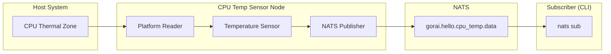
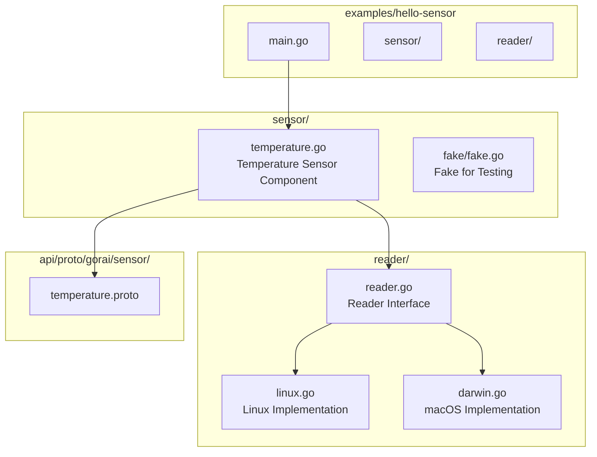
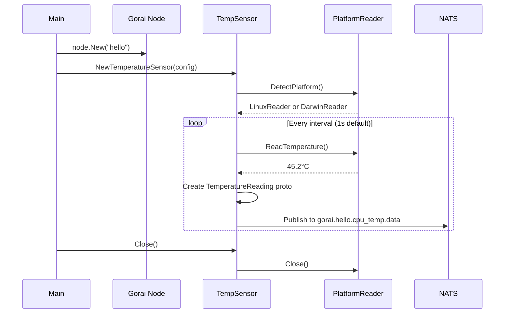

# Hello Sensor Design Document

**Version 0.1.0**

A "Hello World" example for Gorai: a CPU temperature sensor that publishes readings over NATS.

---

## Table of Contents

1. [Overview](#overview)
2. [Goals](#goals)
3. [Architecture](#architecture)
4. [Protocol Buffer Definitions](#protocol-buffer-definitions)
5. [Platform Detection](#platform-detection)
6. [Implementation](#implementation)
7. [Configuration](#configuration)
8. [Topic Design](#topic-design)
9. [Testing](#testing)
10. [Running the Example](#running-the-example)
11. [Directory Structure](#directory-structure)

---

## Overview

The "Hello Sensor" example demonstrates core Gorai concepts with a minimal, real-world sensor: reading the host CPU temperature. This example:

- Implements the Gorai `Sensor` interface
- Uses Protocol Buffers for message serialization
- Publishes telemetry to NATS topics
- Supports both Linux and macOS (development)
- Follows Gorai naming and structural conventions



---

## Goals

### Primary Goals

1. **Demonstrate Gorai patterns**: Node creation, sensor interface, NATS publishing
2. **Real sensor data**: Actual CPU temperature, not simulated
3. **Cross-platform**: Work on Linux (production) and macOS (development)
4. **Proper Protocol Buffers**: Follow the Gorai protobuf conventions
5. **Testable**: Include unit and component tests

### Non-Goals

- Hardware abstraction beyond CPU temperature
- Complex multi-sensor fusion
- Historical data storage (JetStream)
- Service/RPC endpoints (pub/sub only for simplicity)

---

## Architecture

### Component Diagram



### Sequence Diagram



---

## Protocol Buffer Definitions

### temperature.proto

Add to the existing `sensor.proto` or create as a separate file for this example:

```protobuf
// api/proto/gorai/sensor/temperature.proto
syntax = "proto3";
package gorai.sensor;

option go_package = "github.com/emergingrobotics/gorai/api/gen/gorai/sensor";

import "gorai/std/std.proto";

// TemperatureReading represents a temperature measurement.
message TemperatureReading {
    // Standard header with timestamp and frame_id
    gorai.std.Header header = 1;

    // Temperature in Celsius
    double temperature_celsius = 2;

    // Temperature in Fahrenheit (convenience)
    double temperature_fahrenheit = 3;

    // Source identifier (e.g., "cpu", "gpu", "ambient")
    string source = 4;

    // Zone or core identifier (e.g., "zone0", "core0", "package")
    string zone = 5;

    // Optional min/max thresholds from the hardware
    double critical_celsius = 6;
    double warning_celsius = 7;
}

// TemperatureSensorInfo provides sensor metadata.
message TemperatureSensorInfo {
    // Standard header
    gorai.std.Header header = 1;

    // Human-readable sensor name
    string name = 2;

    // Platform identifier
    string platform = 3;

    // Available zones
    repeated string zones = 4;

    // Update rate in Hz
    double update_rate_hz = 5;

    // Temperature unit (always "celsius" for raw, both provided in readings)
    string unit = 6;
}

// TemperatureDiagnostics provides health information.
message TemperatureDiagnostics {
    // Standard header
    gorai.std.Header header = 1;

    // Diagnostic status
    gorai.std.DiagnosticStatus status = 2;

    // Number of readings taken
    uint64 reading_count = 3;

    // Number of read errors
    uint64 error_count = 4;

    // Last error message (if any)
    string last_error = 5;

    // Average temperature over last minute
    double average_celsius = 6;

    // Min/max over last minute
    double min_celsius = 7;
    double max_celsius = 8;
}
```

### Generated Go Code

After running `buf generate`:

```go
// api/gen/gorai/sensor/temperature.pb.go (generated)
package sensor

type TemperatureReading struct {
    Header               *std.Header
    TemperatureCelsius   float64
    TemperatureFahrenheit float64
    Source               string
    Zone                 string
    CriticalCelsius      float64
    WarningCelsius       float64
}

type TemperatureSensorInfo struct {
    Header       *std.Header
    Name         string
    Platform     string
    Zones        []string
    UpdateRateHz float64
    Unit         string
}

type TemperatureDiagnostics struct {
    Header        *std.Header
    Status        *std.DiagnosticStatus
    ReadingCount  uint64
    ErrorCount    uint64
    LastError     string
    AverageCelsius float64
    MinCelsius    float64
    MaxCelsius    float64
}
```

---

## Platform Detection

### Reader Interface

```go
// examples/hello-sensor/reader/reader.go
package reader

import (
    "context"
    "runtime"
)

// Reading represents a temperature reading from a thermal zone.
type Reading struct {
    Zone            string
    TemperatureC    float64
    CriticalC       float64 // 0 if unknown
    WarningC        float64 // 0 if unknown
}

// Reader reads temperature from the host system.
type Reader interface {
    // Platform returns the platform name (e.g., "linux", "darwin").
    Platform() string

    // Zones returns available thermal zones.
    Zones(ctx context.Context) ([]string, error)

    // Read returns temperature for a specific zone.
    // Use "" or "default" for the primary zone.
    Read(ctx context.Context, zone string) (Reading, error)

    // Close releases resources.
    Close() error
}

// New creates a Reader for the current platform.
func New() (Reader, error) {
    switch runtime.GOOS {
    case "linux":
        return newLinuxReader()
    case "darwin":
        return newDarwinReader()
    default:
        return nil, fmt.Errorf("unsupported platform: %s", runtime.GOOS)
    }
}
```

### Linux Implementation

```go
// examples/hello-sensor/reader/linux.go
//go:build linux

package reader

import (
    "bufio"
    "context"
    "fmt"
    "os"
    "path/filepath"
    "strconv"
    "strings"
)

const thermalBasePath = "/sys/class/thermal"

type linuxReader struct {
    zones []string
}

func newLinuxReader() (Reader, error) {
    r := &linuxReader{}

    // Discover thermal zones
    entries, err := os.ReadDir(thermalBasePath)
    if err != nil {
        return nil, fmt.Errorf("failed to read thermal directory: %w", err)
    }

    for _, entry := range entries {
        if strings.HasPrefix(entry.Name(), "thermal_zone") {
            r.zones = append(r.zones, entry.Name())
        }
    }

    if len(r.zones) == 0 {
        return nil, fmt.Errorf("no thermal zones found")
    }

    return r, nil
}

func (r *linuxReader) Platform() string {
    return "linux"
}

func (r *linuxReader) Zones(ctx context.Context) ([]string, error) {
    return r.zones, nil
}

func (r *linuxReader) Read(ctx context.Context, zone string) (Reading, error) {
    if zone == "" || zone == "default" {
        zone = r.zones[0]
    }

    reading := Reading{Zone: zone}

    // Read temperature (in millidegrees Celsius)
    tempPath := filepath.Join(thermalBasePath, zone, "temp")
    tempData, err := os.ReadFile(tempPath)
    if err != nil {
        return reading, fmt.Errorf("failed to read temperature: %w", err)
    }

    tempMilliC, err := strconv.ParseInt(strings.TrimSpace(string(tempData)), 10, 64)
    if err != nil {
        return reading, fmt.Errorf("failed to parse temperature: %w", err)
    }
    reading.TemperatureC = float64(tempMilliC) / 1000.0

    // Try to read trip points (optional)
    reading.CriticalC = r.readTripPoint(zone, "critical")
    reading.WarningC = r.readTripPoint(zone, "hot")

    return reading, nil
}

func (r *linuxReader) readTripPoint(zone, tripType string) float64 {
    // Trip points are in /sys/class/thermal/thermal_zone0/trip_point_*_type
    // and /sys/class/thermal/thermal_zone0/trip_point_*_temp
    basePath := filepath.Join(thermalBasePath, zone)
    entries, err := os.ReadDir(basePath)
    if err != nil {
        return 0
    }

    for _, entry := range entries {
        if strings.HasPrefix(entry.Name(), "trip_point_") && strings.HasSuffix(entry.Name(), "_type") {
            typeData, err := os.ReadFile(filepath.Join(basePath, entry.Name()))
            if err != nil {
                continue
            }

            if strings.TrimSpace(string(typeData)) == tripType {
                // Found the trip type, read corresponding temp
                tempName := strings.Replace(entry.Name(), "_type", "_temp", 1)
                tempData, err := os.ReadFile(filepath.Join(basePath, tempName))
                if err != nil {
                    continue
                }

                tempMilliC, err := strconv.ParseInt(strings.TrimSpace(string(tempData)), 10, 64)
                if err != nil {
                    continue
                }
                return float64(tempMilliC) / 1000.0
            }
        }
    }

    return 0
}

func (r *linuxReader) Close() error {
    return nil
}
```

### macOS Implementation

```go
// examples/hello-sensor/reader/darwin.go
//go:build darwin

package reader

import (
    "context"
    "fmt"
    "os/exec"
    "strconv"
    "strings"
)

type darwinReader struct{}

func newDarwinReader() (Reader, error) {
    // Check if we can read SMC temperature
    // On Apple Silicon, we use powermetrics or osx-cpu-temp
    // On Intel, we use SMC via osx-cpu-temp or similar

    // For simplicity, we'll try to use the `osx-cpu-temp` tool
    // or fall back to a simulated reading with a warning

    return &darwinReader{}, nil
}

func (r *darwinReader) Platform() string {
    return "darwin"
}

func (r *darwinReader) Zones(ctx context.Context) ([]string, error) {
    return []string{"cpu"}, nil
}

func (r *darwinReader) Read(ctx context.Context, zone string) (Reading, error) {
    reading := Reading{Zone: "cpu"}

    // Try osx-cpu-temp first (brew install osx-cpu-temp)
    if temp, err := r.readOSXCPUTemp(ctx); err == nil {
        reading.TemperatureC = temp
        return reading, nil
    }

    // Try powermetrics (requires sudo, may not work)
    if temp, err := r.readPowermetrics(ctx); err == nil {
        reading.TemperatureC = temp
        return reading, nil
    }

    // Try reading from IOKit via system_profiler (limited)
    if temp, err := r.readSystemProfiler(ctx); err == nil {
        reading.TemperatureC = temp
        return reading, nil
    }

    return reading, fmt.Errorf("no temperature source available on macOS; install osx-cpu-temp: brew install osx-cpu-temp")
}

func (r *darwinReader) readOSXCPUTemp(ctx context.Context) (float64, error) {
    cmd := exec.CommandContext(ctx, "osx-cpu-temp")
    output, err := cmd.Output()
    if err != nil {
        return 0, err
    }

    // Output format: "45.2°C"
    tempStr := strings.TrimSpace(string(output))
    tempStr = strings.TrimSuffix(tempStr, "°C")
    return strconv.ParseFloat(tempStr, 64)
}

func (r *darwinReader) readPowermetrics(ctx context.Context) (float64, error) {
    // powermetrics requires root and is complex to parse
    // This is a placeholder for a more sophisticated implementation
    return 0, fmt.Errorf("powermetrics not implemented")
}

func (r *darwinReader) readSystemProfiler(ctx context.Context) (float64, error) {
    // system_profiler doesn't reliably provide CPU temperature
    return 0, fmt.Errorf("system_profiler temperature not available")
}

func (r *darwinReader) Close() error {
    return nil
}
```

### Stub for Unsupported Platforms

```go
// examples/hello-sensor/reader/unsupported.go
//go:build !linux && !darwin

package reader

import "fmt"

func newLinuxReader() (Reader, error) {
    return nil, fmt.Errorf("linux reader not available on this platform")
}

func newDarwinReader() (Reader, error) {
    return nil, fmt.Errorf("darwin reader not available on this platform")
}
```

---

## Implementation

### Temperature Sensor Component

```go
// examples/hello-sensor/sensor/temperature.go
package sensor

import (
    "context"
    "fmt"
    "sync"
    "time"

    "github.com/emergingrobotics/gorai/api/gen/gorai/sensor"
    "github.com/emergingrobotics/gorai/api/gen/gorai/std"
    "github.com/emergingrobotics/gorai/examples/hello-sensor/reader"
    "github.com/emergingrobotics/gorai/pkg/node"
    "github.com/emergingrobotics/gorai/pkg/pub"
    "github.com/emergingrobotics/gorai/pkg/resource"
)

// Config holds temperature sensor configuration.
type Config struct {
    // Name is the sensor instance name
    Name string `json:"name"`

    // Zone is the thermal zone to read (empty for default)
    Zone string `json:"zone"`

    // IntervalMS is the polling interval in milliseconds
    IntervalMS int `json:"interval_ms"`

    // PublishDiagnostics enables diagnostic publishing
    PublishDiagnostics bool `json:"publish_diagnostics"`
}

// DefaultConfig returns sensible defaults.
func DefaultConfig() Config {
    return Config{
        Name:               "cpu_temp",
        Zone:               "",
        IntervalMS:         1000,
        PublishDiagnostics: true,
    }
}

// TemperatureSensor reads and publishes CPU temperature.
type TemperatureSensor struct {
    mu     sync.RWMutex
    config Config
    reader reader.Reader
    node   *node.Node

    dataPub        *pub.Publisher[sensor.TemperatureReading]
    infoPub        *pub.Publisher[sensor.TemperatureSensorInfo]
    diagnosticsPub *pub.Publisher[sensor.TemperatureDiagnostics]

    cancel context.CancelFunc
    wg     sync.WaitGroup

    // Diagnostics
    readingCount uint64
    errorCount   uint64
    lastError    string
    recentTemps  []float64 // circular buffer for averaging
    tempIndex    int
}

// Ensure interface compliance
var _ resource.Sensor = (*TemperatureSensor)(nil)

// New creates a new temperature sensor.
func New(ctx context.Context, n *node.Node, cfg Config) (*TemperatureSensor, error) {
    r, err := reader.New()
    if err != nil {
        return nil, fmt.Errorf("failed to create reader: %w", err)
    }

    ts := &TemperatureSensor{
        config:      cfg,
        reader:      r,
        node:        n,
        recentTemps: make([]float64, 60), // 1 minute at 1Hz
    }

    // Create publishers
    robotName := n.Name()
    baseTopic := fmt.Sprintf("gorai.%s.%s", robotName, cfg.Name)

    ts.dataPub = pub.New[sensor.TemperatureReading](n, baseTopic+".data")
    ts.infoPub = pub.New[sensor.TemperatureSensorInfo](n, baseTopic+".info")

    if cfg.PublishDiagnostics {
        ts.diagnosticsPub = pub.New[sensor.TemperatureDiagnostics](n, baseTopic+".diagnostics")
    }

    return ts, nil
}

// Name returns the resource name.
func (ts *TemperatureSensor) Name() resource.Name {
    return resource.Name{
        Namespace: "gorai",
        Type:      "component",
        Subtype:   "sensor",
        Name:      ts.config.Name,
    }
}

// Readings returns the current sensor readings.
func (ts *TemperatureSensor) Readings(ctx context.Context) (map[string]any, error) {
    reading, err := ts.reader.Read(ctx, ts.config.Zone)
    if err != nil {
        return nil, err
    }

    return map[string]any{
        "temperature_celsius":    reading.TemperatureC,
        "temperature_fahrenheit": celsiusToFahrenheit(reading.TemperatureC),
        "zone":                   reading.Zone,
    }, nil
}

// Start begins the sensor polling loop.
func (ts *TemperatureSensor) Start(ctx context.Context) error {
    ctx, ts.cancel = context.WithCancel(ctx)

    // Publish sensor info once
    if err := ts.publishInfo(ctx); err != nil {
        return fmt.Errorf("failed to publish info: %w", err)
    }

    // Start polling loop
    ts.wg.Add(1)
    go ts.run(ctx)

    return nil
}

func (ts *TemperatureSensor) run(ctx context.Context) {
    defer ts.wg.Done()

    interval := time.Duration(ts.config.IntervalMS) * time.Millisecond
    ticker := time.NewTicker(interval)
    defer ticker.Stop()

    diagTicker := time.NewTicker(10 * time.Second)
    defer diagTicker.Stop()

    seq := uint32(0)

    for {
        select {
        case <-ctx.Done():
            return

        case <-ticker.C:
            ts.readAndPublish(ctx, &seq)

        case <-diagTicker.C:
            if ts.config.PublishDiagnostics {
                ts.publishDiagnostics(ctx)
            }
        }
    }
}

func (ts *TemperatureSensor) readAndPublish(ctx context.Context, seq *uint32) {
    reading, err := ts.reader.Read(ctx, ts.config.Zone)

    ts.mu.Lock()
    if err != nil {
        ts.errorCount++
        ts.lastError = err.Error()
        ts.mu.Unlock()
        return
    }

    ts.readingCount++
    ts.recentTemps[ts.tempIndex] = reading.TemperatureC
    ts.tempIndex = (ts.tempIndex + 1) % len(ts.recentTemps)
    ts.mu.Unlock()

    // Create protobuf message
    msg := &sensor.TemperatureReading{
        Header: &std.Header{
            TimestampNs: time.Now().UnixNano(),
            FrameId:     ts.config.Name,
            Seq:         *seq,
        },
        TemperatureCelsius:    reading.TemperatureC,
        TemperatureFahrenheit: celsiusToFahrenheit(reading.TemperatureC),
        Source:                "cpu",
        Zone:                  reading.Zone,
        CriticalCelsius:       reading.CriticalC,
        WarningCelsius:        reading.WarningC,
    }

    *seq++

    // Publish
    if err := ts.dataPub.Publish(ctx, msg); err != nil {
        ts.mu.Lock()
        ts.errorCount++
        ts.lastError = fmt.Sprintf("publish error: %v", err)
        ts.mu.Unlock()
    }
}

func (ts *TemperatureSensor) publishInfo(ctx context.Context) error {
    zones, err := ts.reader.Zones(ctx)
    if err != nil {
        zones = []string{"unknown"}
    }

    msg := &sensor.TemperatureSensorInfo{
        Header: &std.Header{
            TimestampNs: time.Now().UnixNano(),
            FrameId:     ts.config.Name,
        },
        Name:         ts.config.Name,
        Platform:     ts.reader.Platform(),
        Zones:        zones,
        UpdateRateHz: 1000.0 / float64(ts.config.IntervalMS),
        Unit:         "celsius",
    }

    return ts.infoPub.Publish(ctx, msg)
}

func (ts *TemperatureSensor) publishDiagnostics(ctx context.Context) {
    ts.mu.RLock()
    readingCount := ts.readingCount
    errorCount := ts.errorCount
    lastError := ts.lastError

    // Calculate stats from recent temps
    var sum, min, max float64
    count := 0
    min = 1000 // Initialize high
    for _, t := range ts.recentTemps {
        if t > 0 {
            sum += t
            count++
            if t < min {
                min = t
            }
            if t > max {
                max = t
            }
        }
    }
    ts.mu.RUnlock()

    avg := 0.0
    if count > 0 {
        avg = sum / float64(count)
    }
    if min == 1000 {
        min = 0
    }

    level := std.DiagnosticStatus_OK
    message := "Temperature sensor operating normally"
    if errorCount > 0 {
        level = std.DiagnosticStatus_WARN
        message = fmt.Sprintf("Errors encountered: %d", errorCount)
    }
    if avg > 80 {
        level = std.DiagnosticStatus_WARN
        message = fmt.Sprintf("High temperature: %.1f°C", avg)
    }
    if avg > 95 {
        level = std.DiagnosticStatus_ERROR
        message = fmt.Sprintf("Critical temperature: %.1f°C", avg)
    }

    msg := &sensor.TemperatureDiagnostics{
        Header: &std.Header{
            TimestampNs: time.Now().UnixNano(),
            FrameId:     ts.config.Name,
        },
        Status: &std.DiagnosticStatus{
            Level:   level,
            Name:    ts.config.Name,
            Message: message,
        },
        ReadingCount:   readingCount,
        ErrorCount:     errorCount,
        LastError:      lastError,
        AverageCelsius: avg,
        MinCelsius:     min,
        MaxCelsius:     max,
    }

    ts.diagnosticsPub.Publish(ctx, msg)
}

// Reconfigure updates the sensor configuration.
func (ts *TemperatureSensor) Reconfigure(ctx context.Context, deps resource.Dependencies, conf resource.Config) error {
    var cfg Config
    if err := conf.Unmarshal(&cfg); err != nil {
        return fmt.Errorf("failed to parse config: %w", err)
    }

    ts.mu.Lock()
    ts.config = cfg
    ts.mu.Unlock()

    return nil
}

// DoCommand handles arbitrary commands.
func (ts *TemperatureSensor) DoCommand(ctx context.Context, cmd map[string]any) (map[string]any, error) {
    if action, ok := cmd["action"].(string); ok {
        switch action {
        case "get_stats":
            ts.mu.RLock()
            defer ts.mu.RUnlock()
            return map[string]any{
                "reading_count": ts.readingCount,
                "error_count":   ts.errorCount,
            }, nil
        }
    }
    return nil, fmt.Errorf("unknown command")
}

// Close stops the sensor and releases resources.
func (ts *TemperatureSensor) Close(ctx context.Context) error {
    if ts.cancel != nil {
        ts.cancel()
    }
    ts.wg.Wait()
    return ts.reader.Close()
}

func celsiusToFahrenheit(c float64) float64 {
    return c*9.0/5.0 + 32.0
}
```

### Fake Implementation for Testing

```go
// examples/hello-sensor/sensor/fake/fake.go
package fake

import (
    "context"
    "sync"

    "github.com/emergingrobotics/gorai/examples/hello-sensor/reader"
)

// Reader is a fake temperature reader for testing.
type Reader struct {
    mu          sync.Mutex
    temperature float64
    zone        string
    err         error
}

var _ reader.Reader = (*Reader)(nil)

// New creates a fake reader.
func New() *Reader {
    return &Reader{
        temperature: 42.0,
        zone:        "fake_zone0",
    }
}

func (r *Reader) Platform() string {
    return "fake"
}

func (r *Reader) Zones(ctx context.Context) ([]string, error) {
    return []string{r.zone}, nil
}

func (r *Reader) Read(ctx context.Context, zone string) (reader.Reading, error) {
    r.mu.Lock()
    defer r.mu.Unlock()

    if r.err != nil {
        return reader.Reading{}, r.err
    }

    return reader.Reading{
        Zone:         r.zone,
        TemperatureC: r.temperature,
        CriticalC:    100.0,
        WarningC:     85.0,
    }, nil
}

func (r *Reader) Close() error {
    return nil
}

// SetTemperature sets the fake temperature for testing.
func (r *Reader) SetTemperature(temp float64) {
    r.mu.Lock()
    defer r.mu.Unlock()
    r.temperature = temp
}

// SetError sets an error to be returned on next read.
func (r *Reader) SetError(err error) {
    r.mu.Lock()
    defer r.mu.Unlock()
    r.err = err
}
```

### Main Entry Point

```go
// examples/hello-sensor/main.go
package main

import (
    "context"
    "encoding/json"
    "flag"
    "fmt"
    "log"
    "os"
    "os/signal"
    "syscall"

    "github.com/emergingrobotics/gorai/examples/hello-sensor/sensor"
    "github.com/emergingrobotics/gorai/pkg/node"
)

func main() {
    // Flags
    natsURL := flag.String("nats", "nats://localhost:4222", "NATS server URL")
    robotName := flag.String("robot", "hello", "Robot name for topic prefix")
    configFile := flag.String("config", "", "Configuration file (JSON)")
    intervalMS := flag.Int("interval", 1000, "Polling interval in milliseconds")
    zone := flag.String("zone", "", "Thermal zone to read (empty for default)")
    flag.Parse()

    // Load configuration
    cfg := sensor.DefaultConfig()
    if *configFile != "" {
        data, err := os.ReadFile(*configFile)
        if err != nil {
            log.Fatalf("Failed to read config: %v", err)
        }
        if err := json.Unmarshal(data, &cfg); err != nil {
            log.Fatalf("Failed to parse config: %v", err)
        }
    } else {
        cfg.IntervalMS = *intervalMS
        cfg.Zone = *zone
    }

    // Create context with cancellation
    ctx, cancel := context.WithCancel(context.Background())
    defer cancel()

    // Handle signals
    sigCh := make(chan os.Signal, 1)
    signal.Notify(sigCh, syscall.SIGINT, syscall.SIGTERM)
    go func() {
        <-sigCh
        fmt.Println("\nShutting down...")
        cancel()
    }()

    // Create Gorai node
    n, err := node.New(*robotName, node.WithNATS(*natsURL))
    if err != nil {
        log.Fatalf("Failed to create node: %v", err)
    }
    defer n.Close()

    log.Printf("Connected to NATS at %s", *natsURL)
    log.Printf("Robot name: %s", *robotName)

    // Create temperature sensor
    tempSensor, err := sensor.New(ctx, n, cfg)
    if err != nil {
        log.Fatalf("Failed to create temperature sensor: %v", err)
    }
    defer tempSensor.Close(ctx)

    log.Printf("Temperature sensor started")
    log.Printf("Publishing to: gorai.%s.%s.data", *robotName, cfg.Name)
    log.Printf("Press Ctrl+C to stop")

    // Start sensor
    if err := tempSensor.Start(ctx); err != nil {
        log.Fatalf("Failed to start sensor: %v", err)
    }

    // Wait for shutdown
    <-ctx.Done()
    log.Println("Goodbye!")
}
```

---

## Configuration

### JSON Configuration File

```json
{
  "name": "cpu_temp",
  "zone": "",
  "interval_ms": 1000,
  "publish_diagnostics": true
}
```

### Robot Configuration (Full Gorai Config)

```json
{
  "robot": {
    "name": "hello"
  },
  "components": [
    {
      "name": "cpu_temp",
      "type": "sensor",
      "model": "gorai:builtin:cpu-temperature",
      "config": {
        "zone": "",
        "interval_ms": 1000,
        "publish_diagnostics": true
      }
    }
  ],
  "nats": {
    "url": "nats://localhost:4222"
  }
}
```

---

## Topic Design

### Topics Published

| Topic | Message Type | QoS | Description |
|-------|--------------|-----|-------------|
| `gorai.{robot}.cpu_temp.data` | `TemperatureReading` | BestEffort | Temperature readings at configured interval |
| `gorai.{robot}.cpu_temp.info` | `TemperatureSensorInfo` | Reliable | Sensor metadata (published once on start) |
| `gorai.{robot}.cpu_temp.diagnostics` | `TemperatureDiagnostics` | BestEffort | Health/stats every 10 seconds |

### Example Messages

**TemperatureReading:**
```json
{
  "header": {
    "timestamp_ns": 1705320000000000000,
    "frame_id": "cpu_temp",
    "seq": 42
  },
  "temperature_celsius": 45.2,
  "temperature_fahrenheit": 113.36,
  "source": "cpu",
  "zone": "thermal_zone0",
  "critical_celsius": 100.0,
  "warning_celsius": 85.0
}
```

**TemperatureSensorInfo:**
```json
{
  "header": {
    "timestamp_ns": 1705320000000000000,
    "frame_id": "cpu_temp"
  },
  "name": "cpu_temp",
  "platform": "linux",
  "zones": ["thermal_zone0", "thermal_zone1"],
  "update_rate_hz": 1.0,
  "unit": "celsius"
}
```

---

## Testing

### Unit Tests

```go
// examples/hello-sensor/sensor/temperature_test.go
package sensor

import (
    "testing"
)

func TestCelsiusToFahrenheit(t *testing.T) {
    tests := []struct {
        celsius    float64
        fahrenheit float64
    }{
        {0, 32},
        {100, 212},
        {-40, -40},
        {37, 98.6},
    }

    for _, tt := range tests {
        got := celsiusToFahrenheit(tt.celsius)
        if got != tt.fahrenheit {
            t.Errorf("celsiusToFahrenheit(%v) = %v, want %v",
                tt.celsius, got, tt.fahrenheit)
        }
    }
}
```

### Component Tests

```go
// examples/hello-sensor/sensor/temperature_component_test.go
//go:build component

package sensor_test

import (
    "context"
    "testing"
    "time"

    "github.com/emergingrobotics/gorai/examples/hello-sensor/sensor"
    "github.com/emergingrobotics/gorai/examples/hello-sensor/sensor/fake"
    "github.com/emergingrobotics/gorai/internal/testutil"
)

func TestTemperatureSensor_Readings(t *testing.T) {
    ctx := context.Background()
    tn := testutil.StartNATS(t)

    n, err := node.New("test", node.WithNATS(tn.URL))
    testutil.RequireNoError(t, err)
    defer n.Close()

    cfg := sensor.DefaultConfig()
    cfg.IntervalMS = 100

    // Use fake reader
    fakeReader := fake.New()
    fakeReader.SetTemperature(45.5)

    ts, err := sensor.NewWithReader(ctx, n, cfg, fakeReader)
    testutil.RequireNoError(t, err)
    defer ts.Close(ctx)

    // Get readings
    readings, err := ts.Readings(ctx)
    testutil.RequireNoError(t, err)

    temp := readings["temperature_celsius"].(float64)
    if temp != 45.5 {
        t.Errorf("temperature = %v, want 45.5", temp)
    }
}

func TestTemperatureSensor_Publishes(t *testing.T) {
    ctx, cancel := context.WithTimeout(context.Background(), 5*time.Second)
    defer cancel()

    tn := testutil.StartNATS(t)

    // Create sensor node
    sensorNode, err := node.New("test", node.WithNATS(tn.URL))
    testutil.RequireNoError(t, err)
    defer sensorNode.Close()

    // Create subscriber
    nc := tn.Connect(t)
    received := make(chan []byte, 10)
    sub, err := nc.Subscribe("gorai.test.cpu_temp.data", func(msg *nats.Msg) {
        received <- msg.Data
    })
    testutil.RequireNoError(t, err)
    defer sub.Unsubscribe()

    // Start sensor
    cfg := sensor.DefaultConfig()
    cfg.IntervalMS = 100

    fakeReader := fake.New()
    fakeReader.SetTemperature(50.0)

    ts, err := sensor.NewWithReader(ctx, sensorNode, cfg, fakeReader)
    testutil.RequireNoError(t, err)
    defer ts.Close(ctx)

    ts.Start(ctx)

    // Wait for message
    select {
    case data := <-received:
        // Decode and verify
        var reading sensor.TemperatureReading
        err := proto.Unmarshal(data, &reading)
        testutil.RequireNoError(t, err)

        if reading.TemperatureCelsius != 50.0 {
            t.Errorf("temperature = %v, want 50.0", reading.TemperatureCelsius)
        }
    case <-ctx.Done():
        t.Fatal("timeout waiting for temperature reading")
    }
}
```

### Integration Tests

```go
// examples/hello-sensor/integration_test.go
//go:build integration

package main_test

import (
    "context"
    "testing"
    "time"

    "github.com/emergingrobotics/gorai/internal/testutil"
)

func TestHelloSensor_EndToEnd(t *testing.T) {
    ctx, cancel := context.WithTimeout(context.Background(), 30*time.Second)
    defer cancel()

    tn := testutil.StartNATS(t)

    // This would start the actual hello-sensor binary
    // and verify it publishes correctly
    // Skipped in unit tests, run on actual hardware
}
```

---

## Running the Example

### Prerequisites

```bash
# Install NATS server
go install github.com/nats-io/nats-server/v2@latest

# Install NATS CLI
go install github.com/nats-io/natscli/nats@latest

# For macOS temperature reading
brew install osx-cpu-temp
```

### Start NATS Server

```bash
# Terminal 1
nats-server
```

### Run the Sensor

```bash
# Terminal 2

# Build and run
cd examples/hello-sensor
go build -o hello-sensor .
./hello-sensor

# Or run directly
go run . --robot=myrobot --interval=500

# With custom NATS URL
go run . --nats=nats://192.168.1.100:4222
```

### Subscribe to Data

```bash
# Terminal 3

# Subscribe to temperature data
nats sub "gorai.hello.cpu_temp.data"

# Subscribe to all sensor topics
nats sub "gorai.hello.cpu_temp.>"

# With JSON formatting (if messages are JSON-encoded)
nats sub "gorai.hello.cpu_temp.data" --translate 'protoc --decode=...'
```

### Example Output

```
$ ./hello-sensor
2024/01/15 10:30:00 Connected to NATS at nats://localhost:4222
2024/01/15 10:30:00 Robot name: hello
2024/01/15 10:30:00 Temperature sensor started
2024/01/15 10:30:00 Publishing to: gorai.hello.cpu_temp.data
2024/01/15 10:30:00 Press Ctrl+C to stop

# In subscriber terminal:
$ nats sub "gorai.hello.cpu_temp.data"
10:30:01 [gorai.hello.cpu_temp.data] <binary protobuf data>
10:30:02 [gorai.hello.cpu_temp.data] <binary protobuf data>
10:30:03 [gorai.hello.cpu_temp.data] <binary protobuf data>
```

---

## Directory Structure

```
examples/hello-sensor/
├── main.go
├── go.mod
├── go.sum
├── README.md
│
├── sensor/
│   ├── temperature.go
│   ├── temperature_test.go
│   ├── temperature_component_test.go
│   └── fake/
│       └── fake.go
│
├── reader/
│   ├── reader.go
│   ├── linux.go
│   ├── darwin.go
│   └── unsupported.go
│
├── config/
│   ├── default.json
│   └── raspberry_pi.json
│
└── testdata/
    └── golden/

api/proto/gorai/sensor/
└── temperature.proto
```

---

## File Manifest

This section describes each file that must be implemented, its purpose, and key contents.

### Protocol Buffer Files

#### `api/proto/gorai/sensor/temperature.proto`

**Purpose:** Define Protocol Buffer messages for temperature sensor data.

**Contents:**
- `TemperatureReading` message with header, temperature values (Celsius/Fahrenheit), source, zone, and threshold fields
- `TemperatureSensorInfo` message with sensor metadata (platform, zones, update rate)
- `TemperatureDiagnostics` message with health/stats information

**Dependencies:**
- Imports `gorai/std/std.proto` for `Header` and `DiagnosticStatus`

**Build:**
- Run `buf generate` to create `api/gen/gorai/sensor/temperature.pb.go`

---

### Example Root Files

#### `examples/hello-sensor/main.go`

**Purpose:** Application entry point that wires together all components.

**Contents:**
- Command-line flag parsing (`--nats`, `--robot`, `--config`, `--interval`, `--zone`)
- Signal handling for graceful shutdown (SIGINT, SIGTERM)
- Create Gorai node with NATS connection
- Create and start TemperatureSensor
- Block until shutdown signal

**Key Functions:**
- `main()` - Entry point

**Dependencies:**
- `github.com/emergingrobotics/gorai/pkg/node`
- `./sensor`

---

#### `examples/hello-sensor/go.mod`

**Purpose:** Go module definition.

**Contents:**
```go
module github.com/emergingrobotics/gorai/examples/hello-sensor

go 1.21

require (
    github.com/emergingrobotics/gorai v0.1.0
    github.com/nats-io/nats.go v1.31.0
    google.golang.org/protobuf v1.31.0
)
```

---

#### `examples/hello-sensor/README.md`

**Purpose:** User-facing documentation for the example.

**Contents:**
- Overview of what the example demonstrates
- Prerequisites (NATS server, osx-cpu-temp for macOS)
- Build and run instructions
- Example output
- Configuration options
- Troubleshooting tips

---

### Reader Package

#### `examples/hello-sensor/reader/reader.go`

**Purpose:** Define the platform-agnostic Reader interface and factory function.

**Contents:**
- `Reading` struct with Zone, TemperatureC, CriticalC, WarningC fields
- `Reader` interface with methods:
  - `Platform() string`
  - `Zones(ctx context.Context) ([]string, error)`
  - `Read(ctx context.Context, zone string) (Reading, error)`
  - `Close() error`
- `New() (Reader, error)` factory function that uses `runtime.GOOS` to select implementation

**Key Logic:**
- Switch on `runtime.GOOS` to return `newLinuxReader()` or `newDarwinReader()`
- Return error for unsupported platforms

---

#### `examples/hello-sensor/reader/linux.go`

**Purpose:** Linux-specific temperature reading via sysfs.

**Build Tag:** `//go:build linux`

**Contents:**
- `linuxReader` struct with discovered zones
- `newLinuxReader()` constructor that:
  - Scans `/sys/class/thermal/` for `thermal_zone*` directories
  - Returns error if no zones found
- `Read()` implementation that:
  - Reads `/sys/class/thermal/{zone}/temp` (value in millidegrees)
  - Divides by 1000 to get Celsius
  - Optionally reads trip points for critical/warning thresholds
- `readTripPoint()` helper to parse trip point files

**Key Paths:**
- `/sys/class/thermal/thermal_zone*/temp`
- `/sys/class/thermal/thermal_zone*/trip_point_*_type`
- `/sys/class/thermal/thermal_zone*/trip_point_*_temp`

---

#### `examples/hello-sensor/reader/darwin.go`

**Purpose:** macOS-specific temperature reading.

**Build Tag:** `//go:build darwin`

**Contents:**
- `darwinReader` struct
- `newDarwinReader()` constructor
- `Read()` implementation that tries multiple sources:
  1. `osx-cpu-temp` CLI tool (preferred, requires `brew install osx-cpu-temp`)
  2. `powermetrics` (requires root, placeholder)
  3. `system_profiler` (limited, placeholder)
- Returns descriptive error if no source available

**Key Logic:**
- Execute `osx-cpu-temp` and parse output like `"45.2°C"`
- Strip `°C` suffix and parse float

---

#### `examples/hello-sensor/reader/unsupported.go`

**Purpose:** Stub for unsupported platforms to ensure compilation.

**Build Tag:** `//go:build !linux && !darwin`

**Contents:**
- `newLinuxReader()` returns error "linux reader not available on this platform"
- `newDarwinReader()` returns error "darwin reader not available on this platform"

---

### Sensor Package

#### `examples/hello-sensor/sensor/temperature.go`

**Purpose:** Main temperature sensor component implementing the Gorai Sensor interface.

**Contents:**
- `Config` struct with Name, Zone, IntervalMS, PublishDiagnostics fields
- `DefaultConfig()` returning sensible defaults
- `TemperatureSensor` struct with:
  - Reader reference
  - Node reference
  - Publishers for data, info, diagnostics
  - Diagnostic counters and stats
- Interface compliance: `var _ resource.Sensor = (*TemperatureSensor)(nil)`

**Key Methods:**
- `New(ctx, node, config)` - Constructor, creates reader and publishers
- `NewWithReader(ctx, node, config, reader)` - Constructor with injected reader (for testing)
- `Name()` - Returns resource.Name
- `Readings(ctx)` - Returns current temperature as map
- `Start(ctx)` - Starts polling goroutine
- `Close(ctx)` - Stops polling, cleans up
- `Reconfigure(ctx, deps, conf)` - Updates configuration
- `DoCommand(ctx, cmd)` - Handles arbitrary commands

**Internal Methods:**
- `run(ctx)` - Polling loop goroutine
- `readAndPublish(ctx, seq)` - Read temperature and publish to NATS
- `publishInfo(ctx)` - Publish sensor metadata once
- `publishDiagnostics(ctx)` - Publish health stats periodically
- `celsiusToFahrenheit(c)` - Temperature conversion helper

---

#### `examples/hello-sensor/sensor/temperature_test.go`

**Purpose:** Unit tests for temperature sensor logic.

**Contents:**
- `TestCelsiusToFahrenheit` - Table-driven test for conversion function
- `TestDefaultConfig` - Verify default configuration values
- `TestConfig_Validation` - Test configuration validation if applicable

**No Build Tag:** Runs with standard `go test`

---

#### `examples/hello-sensor/sensor/temperature_component_test.go`

**Purpose:** Component tests using fake reader and embedded NATS.

**Build Tag:** `//go:build component`

**Contents:**
- `TestTemperatureSensor_Readings` - Verify Readings() returns correct values from fake
- `TestTemperatureSensor_Publishes` - Verify messages are published to NATS
- `TestTemperatureSensor_Diagnostics` - Verify diagnostic messages
- `TestTemperatureSensor_ErrorHandling` - Verify behavior when reader returns errors
- `TestTemperatureSensor_Reconfigure` - Test hot reconfiguration

**Dependencies:**
- `github.com/emergingrobotics/gorai/internal/testutil` for StartNATS, RequireNoError
- `./fake` for fake reader

---

#### `examples/hello-sensor/sensor/fake/fake.go`

**Purpose:** Fake Reader implementation for deterministic testing.

**Contents:**
- `Reader` struct with settable temperature, zone, and error
- Interface compliance: `var _ reader.Reader = (*Reader)(nil)`
- `New()` constructor with default values (42.0°C, "fake_zone0")
- All Reader interface methods implemented
- Test helper methods:
  - `SetTemperature(temp float64)` - Set fake temperature
  - `SetError(err error)` - Inject error for next read
  - `SetZone(zone string)` - Set zone name

---

### Configuration Files

#### `examples/hello-sensor/config/default.json`

**Purpose:** Default configuration for general use.

**Contents:**
```json
{
  "name": "cpu_temp",
  "zone": "",
  "interval_ms": 1000,
  "publish_diagnostics": true
}
```

---

#### `examples/hello-sensor/config/raspberry_pi.json`

**Purpose:** Configuration optimized for Raspberry Pi.

**Contents:**
```json
{
  "name": "cpu_temp",
  "zone": "thermal_zone0",
  "interval_ms": 2000,
  "publish_diagnostics": true
}
```

**Notes:**
- Raspberry Pi typically has `thermal_zone0` for CPU temperature
- Longer interval to reduce CPU overhead on constrained device

---

### Test Data

#### `examples/hello-sensor/testdata/golden/`

**Purpose:** Golden files for output comparison tests.

**Contents:** (empty directory initially, populated by tests with `-update` flag)

---

## Implementation Order

The files should be implemented in this order to ensure dependencies are satisfied. Each phase includes verification steps to confirm correct implementation before proceeding.

### Phase 1: Protocol Buffer Definition

**File:** `api/proto/gorai/sensor/temperature.proto`

**Implementation:**
- Create the proto file with TemperatureReading, TemperatureSensorInfo, and TemperatureDiagnostics messages

**Verification:**
```bash
# Validate proto syntax
buf lint api/proto

# Generate Go code
buf generate

# Verify generated file exists
ls api/gen/gorai/sensor/temperature.pb.go

# Verify generated code compiles
go build ./api/gen/...
```

**Success Criteria:**
- [ ] `buf lint` passes with no errors
- [ ] `buf generate` completes successfully
- [ ] Generated Go file contains all three message types
- [ ] Generated code compiles

---

### Phase 2: Module Setup

**File:** `examples/hello-sensor/go.mod`

**Implementation:**
- Create go.mod with module path and dependencies

**Verification:**
```bash
cd examples/hello-sensor

# Verify module is valid
go mod tidy

# Verify module graph
go mod graph
```

**Success Criteria:**
- [ ] `go mod tidy` completes without errors
- [ ] Dependencies are resolved

---

### Phase 3: Reader Interface

**File:** `examples/hello-sensor/reader/reader.go`

**Implementation:**
- Define Reading struct and Reader interface
- Implement New() factory function (will fail on all platforms until implementations exist)

**Verification:**
```bash
cd examples/hello-sensor

# Verify syntax compiles (will have errors due to missing implementations)
go build ./reader/... 2>&1 | head -5

# The above should show errors about missing newLinuxReader/newDarwinReader
# This is expected - we're just verifying the interface compiles
```

**Success Criteria:**
- [ ] Interface definition has no syntax errors
- [ ] Reading struct has all required fields

---

### Phase 4: Linux Reader

**File:** `examples/hello-sensor/reader/linux.go`

**Implementation:**
- Implement linuxReader struct and all Reader interface methods
- Read from `/sys/class/thermal/`

**Verification (on Linux):**
```bash
cd examples/hello-sensor

# Verify it compiles on Linux
GOOS=linux go build ./reader/...

# Create a simple test program
cat > /tmp/test_linux_reader.go << 'EOF'
//go:build linux

package main

import (
    "context"
    "fmt"
    "github.com/emergingrobotics/gorai/examples/hello-sensor/reader"
)

func main() {
    r, err := reader.New()
    if err != nil {
        fmt.Printf("Error: %v\n", err)
        return
    }
    defer r.Close()

    fmt.Printf("Platform: %s\n", r.Platform())

    zones, _ := r.Zones(context.Background())
    fmt.Printf("Zones: %v\n", zones)

    reading, err := r.Read(context.Background(), "")
    if err != nil {
        fmt.Printf("Read error: %v\n", err)
        return
    }
    fmt.Printf("Temperature: %.1f°C\n", reading.TemperatureC)
}
EOF

# Run on Linux
go run /tmp/test_linux_reader.go
```

**Success Criteria:**
- [ ] Compiles with `GOOS=linux`
- [ ] On Linux: discovers at least one thermal zone
- [ ] On Linux: reads temperature successfully
- [ ] Temperature is reasonable (0-120°C range)

---

### Phase 5: macOS Reader

**File:** `examples/hello-sensor/reader/darwin.go`

**Implementation:**
- Implement darwinReader struct and all Reader interface methods
- Try osx-cpu-temp, fall back to error message

**Verification (on macOS):**
```bash
cd examples/hello-sensor

# Verify it compiles on macOS
GOOS=darwin go build ./reader/...

# If osx-cpu-temp is installed, test it
which osx-cpu-temp && osx-cpu-temp

# Create a simple test program
cat > /tmp/test_darwin_reader.go << 'EOF'
//go:build darwin

package main

import (
    "context"
    "fmt"
    "github.com/emergingrobotics/gorai/examples/hello-sensor/reader"
)

func main() {
    r, err := reader.New()
    if err != nil {
        fmt.Printf("Error creating reader: %v\n", err)
        return
    }
    defer r.Close()

    fmt.Printf("Platform: %s\n", r.Platform())

    reading, err := r.Read(context.Background(), "")
    if err != nil {
        fmt.Printf("Read error (expected if osx-cpu-temp not installed): %v\n", err)
        return
    }
    fmt.Printf("Temperature: %.1f°C\n", reading.TemperatureC)
}
EOF

# Run on macOS
go run /tmp/test_darwin_reader.go
```

**Success Criteria:**
- [ ] Compiles with `GOOS=darwin`
- [ ] On macOS with osx-cpu-temp: reads temperature
- [ ] On macOS without osx-cpu-temp: returns helpful error message

---

### Phase 6: Unsupported Platform Stub

**File:** `examples/hello-sensor/reader/unsupported.go`

**Implementation:**
- Provide stub functions that return errors

**Verification:**
```bash
cd examples/hello-sensor

# Verify cross-compilation works for all platforms
GOOS=linux go build ./reader/...
GOOS=darwin go build ./reader/...
GOOS=windows go build ./reader/...

# Windows build should succeed (stub returns error at runtime)
echo "All platforms compile successfully"
```

**Success Criteria:**
- [ ] `GOOS=linux` compiles
- [ ] `GOOS=darwin` compiles
- [ ] `GOOS=windows` compiles (using stub)
- [ ] No duplicate function definitions

---

### Phase 7: Fake Reader

**File:** `examples/hello-sensor/sensor/fake/fake.go`

**Implementation:**
- Implement fake Reader for testing
- Add SetTemperature, SetError, SetZone helpers

**Verification:**
```bash
cd examples/hello-sensor

# Verify fake compiles
go build ./sensor/fake/...

# Create inline test
go test -v -run=^$ ./sensor/fake -count=1 << 'EOF'
package fake_test

import (
    "context"
    "testing"
    "github.com/emergingrobotics/gorai/examples/hello-sensor/sensor/fake"
)

func TestFake(t *testing.T) {
    r := fake.New()

    // Test default values
    reading, err := r.Read(context.Background(), "")
    if err != nil {
        t.Fatalf("unexpected error: %v", err)
    }
    if reading.TemperatureC != 42.0 {
        t.Errorf("expected 42.0, got %v", reading.TemperatureC)
    }

    // Test SetTemperature
    r.SetTemperature(55.5)
    reading, _ = r.Read(context.Background(), "")
    if reading.TemperatureC != 55.5 {
        t.Errorf("expected 55.5, got %v", reading.TemperatureC)
    }

    t.Log("Fake reader works correctly")
}
EOF
```

**Alternative Manual Verification:**
```bash
# Just verify it compiles and implements the interface
go build ./sensor/fake/...
echo "Fake reader compiles successfully"
```

**Success Criteria:**
- [ ] Compiles without errors
- [ ] Implements reader.Reader interface
- [ ] Default temperature is 42.0°C
- [ ] SetTemperature changes the returned value
- [ ] SetError causes Read to return error

---

### Phase 8: Temperature Sensor Component

**File:** `examples/hello-sensor/sensor/temperature.go`

**Implementation:**
- Implement TemperatureSensor with Config, constructors, and all methods
- Implement polling loop and NATS publishing

**Verification:**
```bash
cd examples/hello-sensor

# Verify it compiles
go build ./sensor/...

# Check that exported types exist
go doc ./sensor | grep -E "^(type|func)"
```

**Expected output should include:**
- `type Config struct`
- `type TemperatureSensor struct`
- `func New(...)`
- `func NewWithReader(...)`
- `func DefaultConfig()`

**Success Criteria:**
- [ ] Compiles without errors
- [ ] Config struct has all required fields
- [ ] TemperatureSensor has all required methods
- [ ] Implements resource.Sensor interface

---

### Phase 9: Unit Tests

**File:** `examples/hello-sensor/sensor/temperature_test.go`

**Implementation:**
- Write unit tests for celsiusToFahrenheit and DefaultConfig

**Verification:**
```bash
cd examples/hello-sensor

# Run unit tests
go test -v ./sensor/...

# Check test coverage
go test -cover ./sensor/...
```

**Expected output:**
```
=== RUN   TestCelsiusToFahrenheit
--- PASS: TestCelsiusToFahrenheit
=== RUN   TestDefaultConfig
--- PASS: TestDefaultConfig
PASS
coverage: XX.X% of statements
```

**Success Criteria:**
- [ ] All unit tests pass
- [ ] Coverage is reported
- [ ] Tests are table-driven where applicable

---

### Phase 10: Main Entry Point

**File:** `examples/hello-sensor/main.go`

**Implementation:**
- Implement CLI with flags, signal handling, node creation, sensor start

**Verification:**
```bash
cd examples/hello-sensor

# Verify it compiles
go build -o hello-sensor .

# Check help output
./hello-sensor --help

# Expected flags:
# -nats string    NATS server URL (default "nats://localhost:4222")
# -robot string   Robot name (default "hello")
# -config string  Configuration file
# -interval int   Polling interval in ms (default 1000)
# -zone string    Thermal zone

# Test without NATS (should fail gracefully)
timeout 2 ./hello-sensor 2>&1 || echo "Expected: connection error (NATS not running)"

# Test with NATS running (in separate terminal: nats-server)
# Terminal 1:
nats-server &
sleep 1

# Terminal 2:
timeout 5 ./hello-sensor --robot=test --interval=500 &
SENSOR_PID=$!
sleep 2

# Terminal 3:
nats sub "gorai.test.cpu_temp.>" &
SUB_PID=$!
sleep 3

# Cleanup
kill $SENSOR_PID $SUB_PID 2>/dev/null
pkill nats-server
```

**Success Criteria:**
- [ ] Binary compiles
- [ ] `--help` shows all flags
- [ ] Exits gracefully when NATS unavailable
- [ ] Connects to NATS when available
- [ ] Publishes temperature readings
- [ ] Ctrl+C triggers graceful shutdown

---

### Phase 11: Configuration Files

**Files:**
- `examples/hello-sensor/config/default.json`
- `examples/hello-sensor/config/raspberry_pi.json`

**Implementation:**
- Create JSON configuration files

**Verification:**
```bash
cd examples/hello-sensor

# Validate JSON syntax
python3 -m json.tool config/default.json > /dev/null && echo "default.json: valid"
python3 -m json.tool config/raspberry_pi.json > /dev/null && echo "raspberry_pi.json: valid"

# Or with jq
jq . config/default.json > /dev/null && echo "default.json: valid"
jq . config/raspberry_pi.json > /dev/null && echo "raspberry_pi.json: valid"

# Test loading config (with NATS running)
nats-server &
sleep 1
timeout 3 ./hello-sensor --config=config/default.json 2>&1 | head -5
pkill nats-server
```

**Success Criteria:**
- [ ] Both JSON files are valid
- [ ] `--config` flag loads configuration
- [ ] Loaded config overrides defaults

---

### Phase 12: Component Tests

**File:** `examples/hello-sensor/sensor/temperature_component_test.go`

**Implementation:**
- Write component tests using fake reader and embedded NATS

**Verification:**
```bash
cd examples/hello-sensor

# Run component tests
go test -v -tags=component ./sensor/...

# Run with race detector
go test -race -tags=component ./sensor/...

# Check coverage including component tests
go test -cover -tags=component ./sensor/...
```

**Expected output:**
```
=== RUN   TestTemperatureSensor_Readings
--- PASS: TestTemperatureSensor_Readings
=== RUN   TestTemperatureSensor_Publishes
--- PASS: TestTemperatureSensor_Publishes
=== RUN   TestTemperatureSensor_Diagnostics
--- PASS: TestTemperatureSensor_Diagnostics
=== RUN   TestTemperatureSensor_ErrorHandling
--- PASS: TestTemperatureSensor_ErrorHandling
PASS
```

**Success Criteria:**
- [ ] All component tests pass
- [ ] No race conditions detected
- [ ] Tests use embedded NATS (no external server required)
- [ ] Tests use fake reader (deterministic)

---

### Phase 13: Documentation

**File:** `examples/hello-sensor/README.md`

**Implementation:**
- Write user-facing documentation

**Verification:**
```bash
cd examples/hello-sensor

# Check README exists and has content
test -s README.md && echo "README.md exists and has content"

# Check for required sections (manual review)
grep -E "^#" README.md

# Expected sections:
# - Overview/Introduction
# - Prerequisites
# - Building
# - Running
# - Configuration
# - Topics
# - Troubleshooting
```

**Success Criteria:**
- [ ] README.md exists
- [ ] Contains build instructions
- [ ] Contains run instructions
- [ ] Documents all CLI flags
- [ ] Documents configuration options
- [ ] Includes example output
- [ ] Lists prerequisites

---

## Final Integration Test

After all phases are complete, run this comprehensive test:

```bash
cd examples/hello-sensor

# 1. Full build
go build -o hello-sensor .

# 2. All tests
go test ./...
go test -tags=component ./...

# 3. Start NATS
nats-server &
NATS_PID=$!
sleep 1

# 4. Start sensor in background
./hello-sensor --robot=integration_test --interval=200 &
SENSOR_PID=$!
sleep 1

# 5. Verify data topic
echo "Checking data topic..."
timeout 3 nats sub --count=3 "gorai.integration_test.cpu_temp.data"

# 6. Verify info topic
echo "Checking info topic..."
timeout 2 nats sub --count=1 "gorai.integration_test.cpu_temp.info"

# 7. Verify diagnostics topic
echo "Checking diagnostics topic..."
timeout 15 nats sub --count=1 "gorai.integration_test.cpu_temp.diagnostics"

# 8. Cleanup
kill $SENSOR_PID 2>/dev/null
kill $NATS_PID 2>/dev/null

echo "Integration test complete!"
```

---

## Verification Checklist

After implementation, verify:

- [ ] `go build ./examples/hello-sensor` succeeds on Linux
- [ ] `go build ./examples/hello-sensor` succeeds on macOS
- [ ] `go test ./examples/hello-sensor/...` passes
- [ ] `go test -tags=component ./examples/hello-sensor/...` passes
- [ ] Running with NATS publishes temperature readings
- [ ] `nats sub "gorai.hello.cpu_temp.>"` receives messages
- [ ] Ctrl+C triggers graceful shutdown
- [ ] Configuration file loading works
- [ ] CLI flags override configuration

---

## Summary

| Aspect | Implementation |
|--------|----------------|
| Sensor type | CPU temperature |
| Platforms | Linux (sysfs), macOS (osx-cpu-temp) |
| Message format | Protocol Buffers (TemperatureReading) |
| Topic pattern | `gorai.{robot}.cpu_temp.{data\|info\|diagnostics}` |
| Default interval | 1 second |
| Testing | Unit + component + integration |
| Configuration | JSON file or CLI flags |

This example demonstrates:
- Gorai node creation and lifecycle
- Sensor interface implementation
- Platform-specific code with build tags
- Protocol Buffer message design
- NATS topic publishing
- Testing patterns with fakes
- Configuration handling
