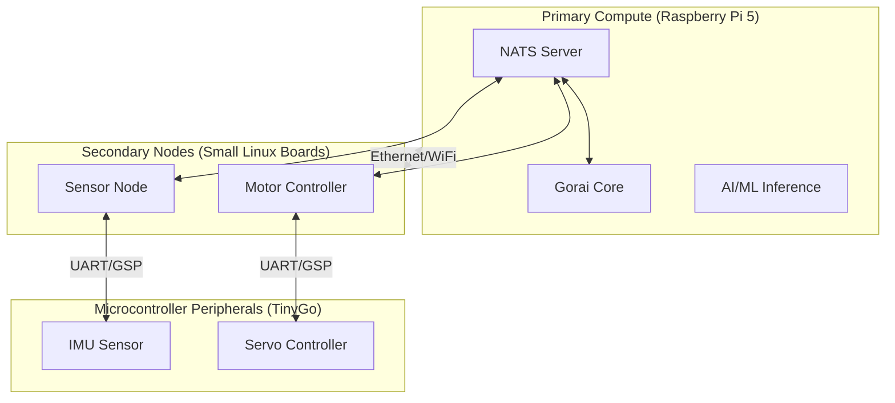
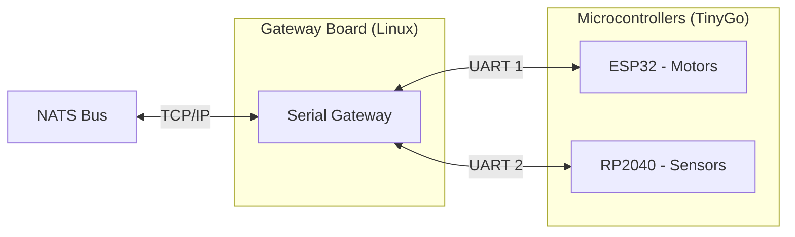
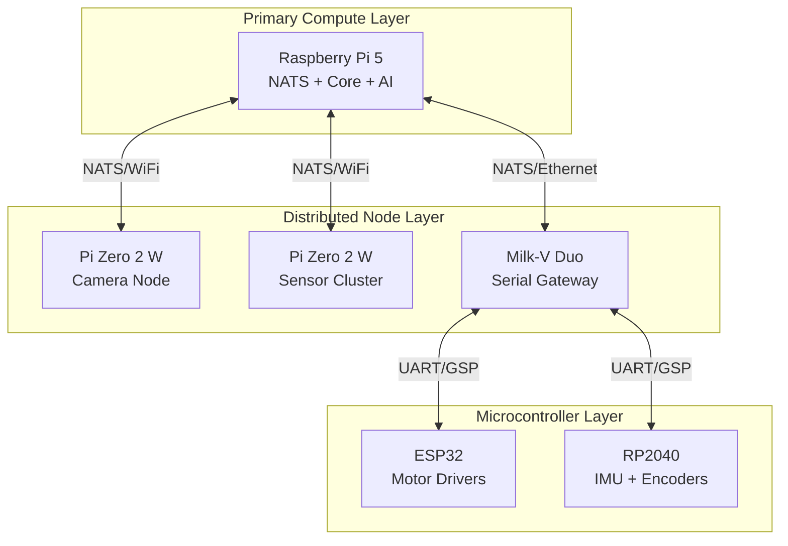

# Gorai Linux Boards Specification

**Version 0.1.0**

This specification defines the supported Linux single-board computers (SBCs) for the Gorai robotics platform.

---

## Table of Contents

1. [Overview](#overview)
2. [Reference Platform](#reference-platform)
3. [Primary Compute Boards](#primary-compute-boards)
4. [Secondary Node Boards](#secondary-node-boards)
5. [Small Gateway Boards](#small-gateway-boards)
6. [Distributed Architecture](#distributed-architecture)
7. [Board Selection Guide](#board-selection-guide)
8. [Requirements](#requirements)

---

## Overview

Gorai is a **Linux-based robotics platform**. Every Gorai robot **SHALL** include at least one network-capable Linux board as the primary compute node. This board:

- Runs the Gorai core framework (standard Go)
- Hosts or connects to the NATS message bus
- Coordinates all robot subsystems
- Optionally runs AI/ML inference workloads

As a distributed system, Gorai robots may include multiple Linux boards and microcontroller nodes working together:

---

## Reference Platform

### Raspberry Pi 5

The **Raspberry Pi 5** is the standard reference platform for Gorai development, testing, and verification.

| Attribute | Specification |
|-----------|---------------|
| **CPU** | Broadcom BCM2712, Quad-core Cortex-A76 @ 2.4GHz |
| **RAM** | 4GB or 8GB LPDDR4X |
| **GPU** | VideoCore VII |
| **Networking** | Gigabit Ethernet, WiFi 5, Bluetooth 5.0 |
| **USB** | 2× USB 3.0, 2× USB 2.0 |
| **GPIO** | 40-pin header (UART, I2C, SPI) |
| **PCIe** | 1× PCIe 2.0 (via HAT connector) |
| **Storage** | microSD, NVMe via HAT |
| **Power** | 5V/5A USB-C |
| **Price** | ~$60-80 |

### Why Raspberry Pi 5

1. **Ecosystem**: Largest community, most documentation, widest accessory support
2. **Availability**: Globally distributed, multiple suppliers
3. **Software**: Official Raspberry Pi OS (Debian-based), excellent Go support
4. **Performance**: Sufficient for most robotics workloads including vision
5. **GPIO**: Standard 40-pin header for hardware integration
6. **PCIe**: Enables NVMe storage and AI accelerators

### Reference Platform Requirements

All Gorai features **SHALL** be tested and verified on Raspberry Pi 5 before release.

All code examples and tutorials **SHALL** assume Raspberry Pi 5 unless otherwise noted.

---

## Primary Compute Boards

Primary compute boards run the main Gorai instance, including NATS server, core services, and AI/ML workloads.

### Recommended Primary Boards

| Board | CPU | RAM | NPU/GPU | Networking | Price | Notes |
|-------|-----|-----|---------|------------|-------|-------|
| **Raspberry Pi 5** | Cortex-A76 4× 2.4GHz | 4-8GB | VideoCore VII | GbE, WiFi 5 | $60-80 | Reference platform |
| **Orange Pi 5** | RK3588S 8-core | 4-16GB | 6 TOPS NPU | GbE, WiFi 6 | $90-150 | Best NPU support |
| **Radxa Rock 5B** | RK3588 8-core | 4-16GB | 6 TOPS NPU | 2.5GbE, WiFi 6 | $140-190 | Dual Ethernet |
| **NVIDIA Jetson Orin Nano** | Cortex-A78AE 6-core | 4-8GB | 20-40 TOPS | GbE | $200-500 | Best AI performance |
| **BeagleBone AI-64** | TDA4VM dual A72 | 4GB | 8 TOPS | GbE | $180 | TI ecosystem |

### Primary Board Minimum Requirements

| Requirement | Minimum | Recommended |
|-------------|---------|-------------|
| CPU | Quad-core Cortex-A53 @ 1.5GHz | Quad-core Cortex-A76 @ 2.0GHz |
| RAM | 2GB | 4GB+ |
| Storage | 16GB microSD | 32GB+ NVMe |
| Networking | 100Mbps Ethernet or WiFi | Gigabit Ethernet |
| UART | 1 available | 2+ available |

---

## Secondary Node Boards

In distributed Gorai systems, secondary nodes handle specific subsystems (sensor clusters, motor groups, etc.) and communicate with the primary via NATS over the network.

### Recommended Secondary Boards

| Board | CPU | RAM | Networking | GPIO | Price | Notes |
|-------|-----|-----|------------|------|-------|-------|
| **Raspberry Pi Zero 2 W** | Cortex-A53 4× 1GHz | 512MB | WiFi, BT | 40-pin | $15 | Best ecosystem |
| **Radxa Zero** | Amlogic S905Y2 4× 1.8GHz | 512MB-4GB | WiFi 5, BT | 40-pin | $20-45 | More powerful |
| **Orange Pi Zero 2** | Allwinner H616 4× 1.5GHz | 512MB-1GB | WiFi, BT, GbE | 26-pin | $20-30 | Ethernet option |
| **Milk-V Duo 256M** | RISC-V C906 @ 1GHz | 256MB | None (USB) | Headers | $9 | Ultra-compact |
| **Seeed reComputer** | Cortex-A55 4× 1.8GHz | 4GB | GbE, WiFi | Industrial | $100+ | Industrial grade |

### Secondary Node Use Cases

| Use Case | Recommended Board | Reason |
|----------|-------------------|--------|
| Remote sensor cluster | Pi Zero 2 W | WiFi, low power, ecosystem |
| Motor controller node | Orange Pi Zero 2 | Ethernet for reliability |
| Camera node | Radxa Zero | More RAM for image buffering |
| Serial gateway | Milk-V Duo 256M | Tiny, cheap, low power |

### Secondary Board Minimum Requirements

| Requirement | Minimum |
|-------------|---------|
| CPU | Single-core @ 500MHz |
| RAM | 128MB |
| Networking | WiFi or Ethernet |
| UART | 1 available |

---

## Small Gateway Boards

Small Linux boards serve as serial-to-NATS gateways, bridging microcontroller peripherals to the main robot network. These boards run the Gorai Serial Gateway (see [gorai-gsp](https://github.com/emergingrobotics/gorai-gsp) for the protocol specification and implementation).

### Gateway Architecture

### Recommended Gateway Boards

| Board | Size | RAM | UART | Power | Price | Notes |
|-------|------|-----|------|-------|-------|-------|
| **Milk-V Duo 256M** | 21×21mm | 256MB | 3 | 0.5W | $9 | Smallest, cheapest |
| **Milk-V Duo** | 21×21mm | 64MB | 3 | 0.5W | $5 | Ultra-budget |
| **Sipeed Lichee RV Nano** | 22×25mm | 256MB | 2 | 0.3W | $8 | RISC-V, has NPU |
| **Onion Omega2+** | 34×20mm | 128MB | 2 | 0.4W | $13 | Built-in WiFi |
| **Raspberry Pi Zero 2 W** | 65×30mm | 512MB | 1 | 1-2W | $15 | Easiest setup |

### Gateway Selection Guide

**If space and cost are critical:**
- **Milk-V Duo 256M** — 21×21mm, $9, 256MB RAM, 3 UARTs

**If you need built-in WiFi:**
- **Onion Omega2+** — Tiny, reliable, OpenWrt-based
- **Pi Zero 2 W** — Larger but best software support

**If you want the easiest development experience:**
- **Raspberry Pi Zero 2 W** — Debian-based, everything works out of the box

### Gateway Requirements

| Requirement | Specification |
|-------------|---------------|
| UART | At least 1, preferably 2+ |
| Baud rate | 115200 minimum, 921600 recommended |
| Networking | Ethernet or WiFi to reach NATS |
| RAM | 64MB minimum |
| Power | Under 2W recommended |

---

## Distributed Architecture

Gorai robots can combine multiple board types in a distributed architecture:

### Layer Responsibilities

| Layer | Boards | Responsibilities |
|-------|--------|------------------|
| **Primary Compute** | Pi 5, Jetson, Rock 5B | NATS server, core logic, AI/ML, planning |
| **Distributed Nodes** | Pi Zero, Orange Pi Zero | Remote sensing, motor control, data preprocessing |
| **MCU Peripherals** | ESP32, RP2040, STM32 | Real-time control, raw sensor interfacing |

### Communication

| Connection | Protocol | Use Case |
|------------|----------|----------|
| Linux ↔ Linux | NATS over TCP/IP | All inter-node messaging |
| Linux ↔ MCU | GSP over UART | Sensor data, motor commands |
| MCU ↔ Hardware | GPIO, I2C, SPI | Direct hardware control |

---

## Board Selection Guide

### By Budget

| Budget | Primary | Secondary | Gateway |
|--------|---------|-----------|---------|
| Minimal (<$100) | Pi 5 4GB ($60) | — | — |
| Moderate (<$200) | Pi 5 8GB ($80) | Pi Zero 2 W ($15) | Milk-V Duo ($9) |
| Performance (<$500) | Jetson Orin Nano ($200) | Pi Zero 2 W ($15) | Pi Zero 2 W ($15) |

### By Use Case

| Use Case | Recommended Setup |
|----------|-------------------|
| Learning/prototyping | Pi 5 only |
| Mobile robot | Pi 5 + MCU peripherals via serial |
| Multi-camera system | Pi 5 + multiple Pi Zero 2 W |
| Industrial/outdoor | Seeed reComputer + industrial MCUs |
| AI-heavy (SLAM, vision) | Jetson Orin or Rock 5B (RK3588) |

---

## Requirements

### Operating System

All Gorai Linux nodes **SHALL** run a Debian-based Linux distribution:

- Raspberry Pi OS (recommended for Pi boards)
- Ubuntu (22.04 LTS or newer)
- Armbian (for non-Pi boards)
- Debian (12 Bookworm or newer)

### Go Runtime

All nodes **SHALL** support Go 1.21 or newer.

### Networking

All Linux nodes **SHALL** have network connectivity to the NATS bus:

- Wired Ethernet preferred for reliability
- WiFi acceptable for mobile/remote nodes
- Static IP or mDNS for service discovery

### Power

Robots **SHALL** provide adequate power for all boards:

| Board Class | Typical Power | Peak Power |
|-------------|---------------|------------|
| Primary (Pi 5) | 5W | 12W |
| Secondary (Pi Zero) | 1W | 2W |
| Gateway (Milk-V) | 0.5W | 1W |

---

## Summary

| Aspect | Specification |
|--------|---------------|
| Reference platform | Raspberry Pi 5 |
| Primary compute | Pi 5, Jetson, Rock 5B |
| Secondary nodes | Pi Zero 2 W, Orange Pi Zero |
| Serial gateways | Milk-V Duo, Pi Zero 2 W |
| MCU peripherals | See TinyGo specification |
| OS | Debian-based Linux |
| Go version | 1.21+ |
| Networking | NATS over TCP/IP |
